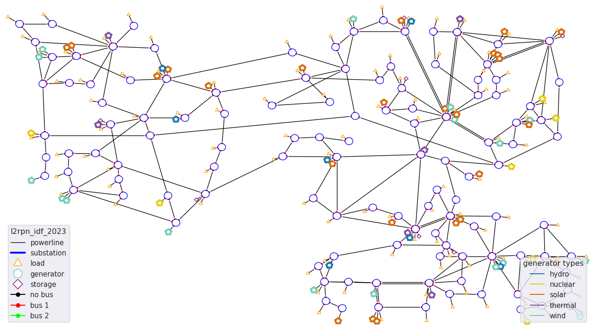
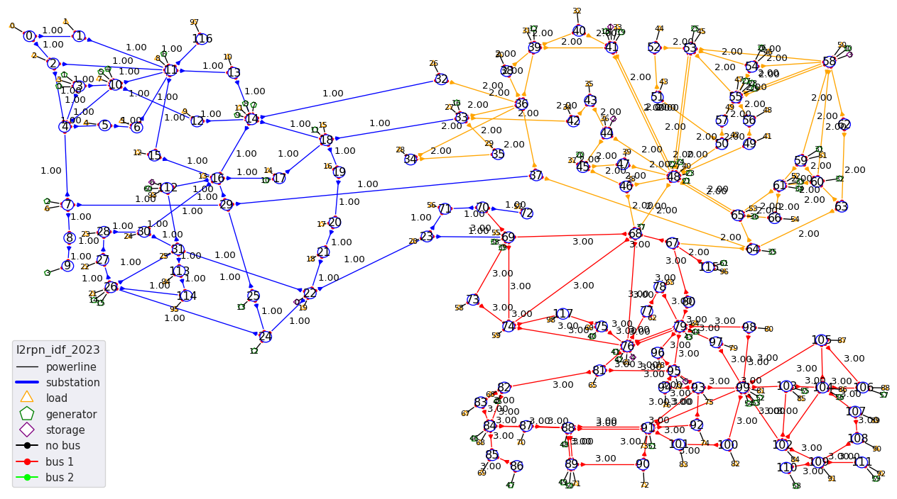
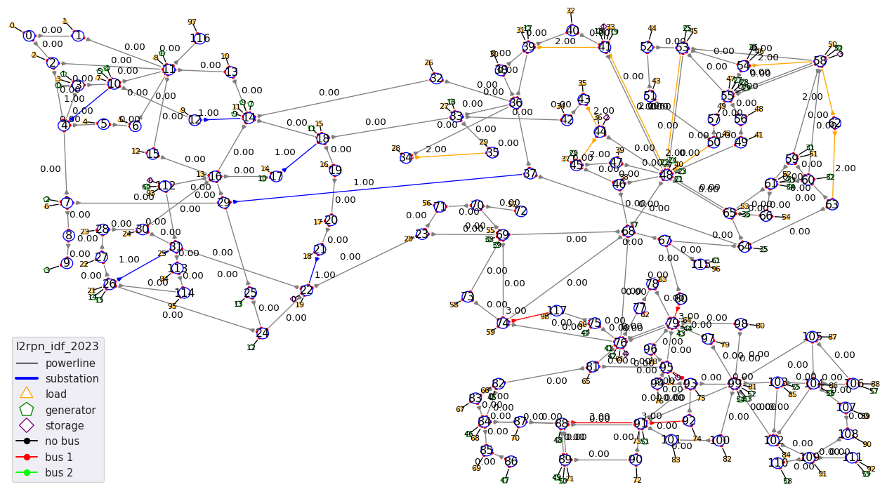
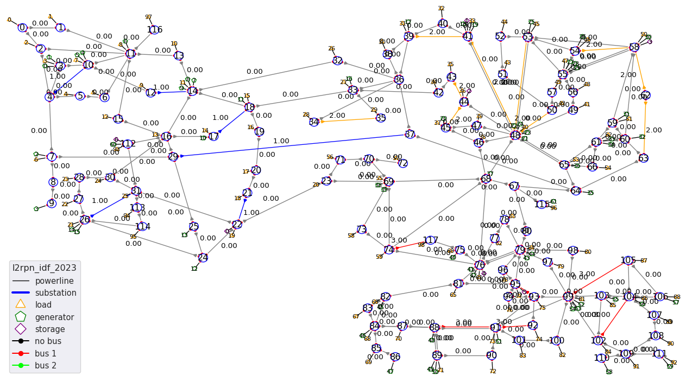

.. |l2rpn_case14_sandbox_layout| image:: ./img/l2rpn_case14_sandbox_layout.png
.. |R2_full_grid| image:: ./img/R2_full_grid.png
.. |l2rpn_neurips_2020_track1_layout| image:: ./img/l2rpn_neurips_2020_track1_layout.png
.. |l2rpn_neurips_2020_track2_layout| image:: ./img/l2rpn_neurips_2020_track2_layout.png
.. |l2rpn_wcci_2022_layout| image:: ./img/l2rpn_wcci_2022_layout.png

Available environments
===================================

This page is organized as follow:

.. contents:: Table of Contents
    :depth: 3

List of available environment
------------------------------

How to get the up to date list
~~~~~~~~~~~~~~~~~~~~~~~~~~~~~~~~~~~~

The complete list of **test** environments can be found using:

.. code-block:: python

    import grid2op
    grid2op.list_available_test_env()

And the list of environment that can be downloaded is given by:

.. code-block:: python

    import grid2op
    grid2op.list_available_remote_env()

In this case, remember that the data will be downloaded in:

.. code-block:: python

    import grid2op
    grid2op.get_current_local_dir()

Description of some environments
~~~~~~~~~~~~~~~~~~~~~~~~~~~~~~~~~~~~

The provided list has been updated early April 2021:

================================  ===========  =============  ==========  ===============  ============================
env name                          grid size     maintenance    opponent    redisp.           storage unit
================================  ===========  =============  ==========  ===============  ============================
:ref:`l2rpn_case14_sandbox`        14 sub.       ❌               ❌  ️         ✔️ ️                 ❌
:ref:`l2rpn_wcci_2020`             36 sub.       ✔️  ️         ❌  ️         ✔️ ️                ❌
:ref:`l2rpn_neurips_2020_track1`   36 sub.       ✔️  ️         ✔️ ️       ✔️ ️                 ❌
:ref:`l2rpn_neurips_2020_track2`   118 sub.      ✔️  ️         ❌   ️         ✔️ ️                 ❌
:ref:`l2rpn_icaps_2021`            36 sub.       ✔️  ️         ✔️ ️       ✔️ ️                 ❌
:ref:`l2rpn_wcci_2022`             118 sub.      ✔️  ️         ✔️ ️       ✔️ ️                 ✔️ ️
:ref:`l2rpn_idf_2023`              118 sub.      ✔️  ️         ✔️ ️       ✔️ ️                 ✔️ ️
\* educ_case14_redisp \*           14 sub.       ❌️             ❌  ️ ️       ✔️ ️                 ❌
\* educ_case14_storage \*          14 sub.       ❌️             ❌   ️         ✔️ ️                 ✔️
\* rte_case5_example \*            5 sub.        ❌️             ❌  ️ ️        ❌ ️ ️                  ❌
\* rte_case14_opponent \*          14 sub.       ❌️             ✔️ ️        ❌ ️ ️                  ❌
\* rte_case14_realistic \*         14 sub.       ❌️             ❌ ️  ️        ✔️      ️             ❌
\* rte_case14_redisp \*            14 sub.       ❌️             ❌ ️  ️        ✔️ ️                  ❌
\* rte_case14_test \*              14 sub.       ❌️             ❌ ️  ️        ❌ ️ ️                  ❌
\* rte_case118_example \*          118 sub.      ❌️             ❌   ️         ✔️ ️                  ❌
================================  ===========  =============  ==========  ===============  ============================

To create regular environment, you can do:

.. code-block:: python

    import grid2op
    env_name = ... # for example "educ_case14_redisp" or "l2rpn_wcci_2020"
    env = grid2op.make(env_name)

The first time an environment is called, the data for this environment will be downloaded from the internet. Make sure
to have an internet connection where you can access https website (such as https://github.com ). Afterwards, the data
are stored on your computer and you won't need to download it again.

.. warning::

    Some environment have different names. The only difference in this case will be the suffixes "_large" or "_small"
    appended to them.

    This is because we release different version of them. The "basic" version are for testing purpose,
    the "_small" are for making standard experiment. This should be enough with most use-case including training RL
    agent.

    And you have some "_large" dataset for larger studies. The use of "large" dataset is not recommended. It can create
    way more problem than it solves (for example, you can fit a small dataset entirely in memory of
    most computers, and having that, you can benefit from better performances - your agent will be able to perform
    more steps per seconds. See :ref:`environment-module-data-pipeline` for more information).
    These datasets were released to address some really specific use in case were "overfitting" were encounter, we are
    still unsure about their usefulness even in this case.

    This is the case for "l2rpn_neurips_2020_track1" and "l2rpn_neurips_2020_track2". To create them, you need to do
    `env = grid2op.make("l2rpn_neurips_2020_track1_small")` or `env = grid2op.make("l2rpn_neurips_2020_track2_small")`

So to create both the environment, we recommend:

.. code-block:: python

    import grid2op
    env_name = "l2rpn_neurips_2020_track1_small"  # or "l2rpn_neurips_2020_track2_small"
    env = grid2op.make(env_name)

.. warning::

    Environment with \* are reserved for testing / education purpose only. We do not recommend to perform
    extensive studies with them as they contain only little data.

For these testing environments (the one with \* around them in the above list):

.. code-block:: python

    import grid2op
    env_name = ... # for example "l2rpn_case14_sandbox" or "educ_case14_storage"
    env = grid2op.make(env_name, test=True)

.. note::

    More information about each environment is provided in each of the sub section below
    (one sub section per environment)

.. _l2rpn_case14_sandbox:

l2rpn_case14_sandbox
+++++++++++++++++++++

This dataset uses the IEEE case14 powergrid slightly modified (a few generators have been added).

It counts 14 substations, 20 lines, 6 generators and 11 loads. It does not count any storage unit.

We recommend to use this dataset when you want to get familiar with grid2op, with powergrid modeling  or RL. It is a
rather small environment where you can understand and actually see what is happening.

This grid looks like:

|l2rpn_case14_sandbox_layout|

.. _l2rpn_idf_2023:

l2rpn_idf_2023
++++++++++++++++

This environment is also based on the 118 grid. The original grid has been modified (mainly for generator and loads location) to 
accomodate for the "possible energy mix" of France in 2035.

It comes with 16 years worth of data, 1 year being divided in 52 weeks so 16 x 52 = 832 different scenarios and takes up around
~ 5.4 GB of space.

To create it you can : 

.. code-block:: python

    import grid2op
    env_name  = "lrpn_idf_2023"
    env = grid2op.make(env_name)

It counts 118 substations, 186 powerlines, 99 loads and 62 generators. It will be used for the L2RPN competitions funded by Region Ile De France:
"Paris Region AI Challenge Energy Transition" and is free to use for everyone.

You have the possibility, provided that you installed `chronix2grid` (with `pip install grid2op[chronix2grid]`), to generate as
much data as you want with the :func:`grid2op.Environment.Environment.generate_data` function. See its documentation for more information.

The environment can be seen:

|l2rpn_idf_2023_layout|

Compared to previous available environments there are some new features including:

- 12 steps ahead forecast: with any observation, you can now have access to forecast 12 steps ahead with, for example `obs.simulate(..., time_step=12)`
  or `obs.get_forecast_env()` which has a maximum duration of 12 steps (previously it was only 1 step ahead forecast). This could be used in
  `model based` strategy for example (see page :ref:`model_based_rl` for more examples)
- a more complex opponent: the opponent can attack 3 lines in 3 different areas of the grid at the same time (instead of 
  being limited to just 1 attack)
- more complex rules: in this environment to balance for the fact that the opponent can makes 3 attacks, the agent can also act on 3 different 
  powerlines and 3 different substation per step (one per area).

The grid is split in 3 disctinct areas:

|l2rpn_idf_2023_areas|

Like most grid2op environment, it also has maintenance. Lines that can be in maintenance are:

.. line_color_maint = np.zeros(env.n_line) 
.. line_in_maintenance = {'21_22_93', '39_41_121', '54_58_154', '17_18_88', '29_37_117',
..                                                             '91_92_37', '41_48_131', '80_79_175', '88_91_33', '48_50_136',
..                                                             '43_44_125', '12_14_68', '62_58_180', '44_45_126', '74_117_81',
..                                                             '26_31_106', '4_10_162', '93_95_43', '62_63_160', '48_53_141',
..                                                             '34_35_110'}
.. line_in_maintenance = list(line_in_maintenance)

.. line_color_maint[np.isin(env.name_line, line_in_maintenance) & np.isin(np.arange(env.n_line), lines_by_area[0])] = 1.0
.. line_color_maint[np.isin(env.name_line, line_in_maintenance) & np.isin(np.arange(env.n_line), lines_by_area[1])] = 2.0
.. line_color_maint[np.isin(env.name_line, line_in_maintenance) & np.isin(np.arange(env.n_line), lines_by_area[2])] = 3.0
.. plot_helper._line_color_scheme = ["gray", "blue", "orange", "red"]
.. _ = plot_helper.plot_info(line_values=line_color_maint, coloring="line")
.. plot_helper.restore_line_palette()

|l2rpn_idf_2023_maint|

And the lines that can be attacked by the opponent are:

.. attacked_lines = [106,  93,  88, 162,  68, 117, 180, 160, 136, 141, 131, 121, 125, 126, 110, 154,  81,  43,  33,  37,  62,  61]
.. line_color_att = np.zeros(env.n_line)
.. line_color_att[np.isin(np.arange(env.n_line), attacked_lines) & np.isin(np.arange(env.n_line), lines_by_area[0])] = 1.0
.. line_color_att[np.isin(np.arange(env.n_line), attacked_lines) & np.isin(np.arange(env.n_line), lines_by_area[1])] = 2.0
.. line_color_att[np.isin(np.arange(env.n_line), attacked_lines) & np.isin(np.arange(env.n_line), lines_by_area[2])] = 3.0
.. plot_helper._line_color_scheme = ["gray", "blue", "orange", "red"]
.. _ = plot_helper.plot_info(line_values=line_color_att, coloring="line")
.. plot_helper.restore_line_palette()

|l2rpn_idf_2023_att|

.. _l2rpn_wcci_2022:

l2rpn_wcci_2022
++++++++++++++++

This environment will come in two "variations":

- `l2rpn_wcci_2022_dev`: development version (might not be totally finished at time of writing), to be used for
  test only, only a few snapshots are available.
- `l2rpn_wcci_2022` : (equivalent of 32 years of powergrid data at 5 mins interval) weights ~1.7 GB

You have the possibility, provided that you installed `chronix2grid` (with `pip install grid2op[chronix2grid]`), to generate as
much data as you want with the :func:`grid2op.Environment.Environment.generate_data` function. See its documentation for more information.

.. code-block:: python

    import grid2op
    env_name  = "l2rpn_wcci_2022"
    env = grid2op.make(env_name)

It counts 118 substations, 186 powerlines, 91 loads and 62 generators. It will be used for the L2RPN competitions at WCCI in 2022.

|l2rpn_wcci_2022_layout|

You can add as many chronics as you want to this environment with the code:

.. code-block:: python

    import grid2op
    env_name  = "l2rpn_wcci_2022"
    env = grid2op.make(env_name)

    nb_year = 1 # or any postive integer
    env.generate_data(nb_year=nb_year)

It might take a while (so we advise you to get a nice cup of tea, coffee or anything)
and will only work if you installed chronix2grid package.

.. _l2rpn_icaps_2021:

l2rpn_icaps_2021
++++++++++++++++

This environment comes in 3 different "variations" (depending on the number of chronics available):

- `l2rpn_icaps_2021_small` (1 GB equivalent of 50 years of powergrid data at 5 mins interval,
  so `4 838 400` different steps !)
- `l2rpn_icaps_2021_large` (4.8 GB equivalent of ~250 years of powergrid data at 5 mins interval,
  so `23 804 928` different steps !)
- `l2rpn_icaps_2021` (use it for test only, only a few snapshots are available)

We recommend to create this environment with:

.. code-block:: python

    import grid2op
    env_name  = "l2rpn_icaps_2021_small"
    env = grid2op.make(env_name)

It is based on the same powergrid as the :ref:`l2rpn_neurips_2020_track1` environment
and was used for the L2RPN ICAPS 2021 competition. It counts 36 substations, 59
powerlines, 22 generators and 37 loads (some of which represents interconnection with 
another grid).

|l2rpn_neurips_2020_track1_layout|

.. _l2rpn_neurips_2020_track1:

l2rpn_neurips_2020_track1
+++++++++++++++++++++++++++

This environment comes in 3 different "variations" (depending on the number of chronics available):

- `l2rpn_neurips_2020_track1_small` (900 MB, equivalent of 48 years of powergrid data at 5 mins interval,
  so `4 644 864` different steps !)
- `l2rpn_neurips_2020_track1_large` (4.5 GB, equivalent of 240 years of powergrid data at 5 mins interval,
  so `23 22 4320` different steps.)
- `l2rpn_neurips_2020_track1` (use it for test only, only a few snapshots are available)

We recommend to create this environment with:

.. code-block:: python

    import grid2op
    env_name  = "l2rpn_neurips_2020_track1_small"
    env = grid2op.make(env_name)

It was the environment used as a training set of the neurips 2020 "L2RPN" competition, for the "robustness" track,
see https://competitions.codalab.org/competitions/25426 .

This environment is part of the IEEE 118 grid, where some generators have been added. It counts 36 substations, 59
powerlines, 22 generators and 37 loads (some of which represents interconnection with 
another grid). The grid is represented in the figure below:

|l2rpn_neurips_2020_track1_layout|

One of the specificity of this grid is that it is actually a subset of a bigger grid. Actually, it represents the grid
"circled" in red in the figure below:

|R2_full_grid|

This explains why there can be some "negative loads" in this environment. Indeed, this loads represent interconnection
with other part of the original grid (emphasize in green in the figure above).

.. _l2rpn_neurips_2020_track2:

l2rpn_neurips_2020_track2
+++++++++++++++++++++++++++

- `l2rpn_neurips_2020_track2_small` (2.5 GB, split into 5 different sub-environment - each being generated from
  slightly different distribution - with 10 years for each sub-environment. This makes, for each sub-environment
  `1 051 200` steps, so `5 256 000` different steps in total)
- `l2rpn_neurips_2020_track2_large` (12 GB, again split into 5 different sub-environment. It is 5 times as large
  as the "small" one. So it counts `26 280 000` different steps. Each containing all the information of all productions
  and all loads. This is a lot of data)
- `l2rpn_neurips_2020_track2` (use it for test only, only a few snapshots are available)

We recommend to create this environment with:

.. code-block:: python

    import grid2op
    env_name  = "l2rpn_neurips_2020_track2_small"
    env = grid2op.make(env_name)

It was the environment used as a training set of the neurips 2020 "L2RPN" competition, for the "robustness" track,
see https://competitions.codalab.org/competitions/25427 .

This environment is the IEEE 118 grid, where some generators have been added. It counts 118 substations, 186
powerlines, 62 generators and 99 loads. The grid is represented in the figure below:

|l2rpn_neurips_2020_track2_layout|

This grid is, as specified in the previous paragraph, a "super set" of the grid used in the other track. It does not
count any "interconnection" with other types of grid.

.. _l2rpn_wcci_2020:

l2rpn_wcci_2020
+++++++++++++++++++++++++++

This environment `l2rpn_wcci_2020`  weight 4.5 GB, representing 240 equivalent years of data at 5 mins resolution, so
`25 228 800` different steps. Unfortunately, you can only download the full dataset.

We recommend to create this environment with:

.. code-block:: python

    import grid2op
    env_name  = "l2rpn_wcci_2020"
    env = grid2op.make(env_name)

It was the environment used as a training set of the WII 2020 "L2RPN" competition
see https://competitions.codalab.org/competitions/24902 .

This environment is part of the IEEE 118 grid, where some generators have been added. It counts 36 substations, 59
powerlines, 22 generators and 37 loads. The grid is represented in the figure below:

|l2rpn_neurips_2020_track1_layout|

.. note::

    It is an earlier version than the `l2rpn_neurips_2020_track1`. In the `l2rpn_wcci_2020` it is not easy
    to identify which loads are "real" loads, and which are "interconnection" for example.

    Also, the names of some elements (substations, loads, lines, or generators) are different.
    In the `l2rpn_neurips_2020_track1` the names match the one in `l2rpn_neurips_2020_track2` which is not
    the case in `l2rpn_wcci_2020` which make it less obvious that is a subgrid of the IEEE 118.

educ_case14_redisp (test only)
+++++++++++++++++++++++++++++++

It is the same kind of data as the "l2rpn_case14_sandbox" (see above). It counts simply less data and allows
less different type of actions for easier "access". It do not require to dive deep into grid2op to use this environment.

We recommend to create this environment with:

.. code-block:: python

    import grid2op
    env_name  = "educ_case14_redisp"
    env = grid2op.make(env_name, test=True)

educ_case14_storage (test only)
++++++++++++++++++++++++++++++++

Uses the same type of actions as the grid above ("educ_case14_redisp") but counts 2 storage units. The grid on which
it is based is also the IEEE case 14 but with 2 additional storage unit.

We recommend to create this environment with:

.. code-block:: python

    import grid2op
    env_name  = "educ_case14_storage"
    env = grid2op.make(env_name, test=True)

rte_case5_example (test only)
+++++++++++++++++++++++++++++

.. warning::

    We dont' recommend to create this environment at all, unles you want to perform some specific dedicated tests.

A custom made environment, totally fictive, not representative of anything, mainly develop for internal tests and
for super easy representation.

The grid on which it is based has absolutely no "good properties" and is "mainly random" and is not calibrated
to be representative of anything, especially not of a real powergrid. Use at your own risk.

other environments (test only)
++++++++++++++++++++++++++++++++

Some other test environments are available:

- "rte_case14_realistic"
- "rte_case14_redisp"
- "rte_case14_test"
- "rte_case118_example"

.. warning::

    We don't recommend to create any of these environments at all,
    unless you want to perform some specific dedicated tests.

    This is why we don't detail them in this documentation.

    
Content of an environment
---------------------------

A grid2op "environment" is represented as a folder on your computer. There is one folder for each environment.

Inside each folder / environment there are a few files (as of writing):

- "**grid.json**" (a file): it is the file that describe the powergrid and that can be read by the default backend.
  It is today
  mandatory, but we could imagine a file in a different format. Note that in this case,
  this environment will not be compatible with the default backend.
- "**config.py**" (a file): this file is imported when the environment is loaded. It is used to parametrize the way
  the environment is made. It should define a "config" variable. This "config" is dictionary that is used to initialize
  the environment. They key should be variable names. See example of such "*config.py*" file in provided environment.

It can of course contain other information, among them:

- "**chronics**" (a folder) [recommended]: this folder contains the information to generate the production / loads at each steps.
  It can
  itself contain multiple folder, depending on the :class:`grid2op.Chronics.GridValue` class used. In most available
  environment, the class :class:`grid2op.Chronics.Multifolder` is used. This folder is optional, though it is present
  in most grid2op environment provided by default.
- "**grid_layout.json**" (a file) [recommended]: gives, for each substation its coordinate *(x,y)* when plotted. It is optional, but
  we
  strongly encourage to have such. Otherwise, some tools might not work (including all the tool to represent it, such
  as the renderer (`env.render`), the `EpisodeReplay` or even some other dependency package, such as Grid2Viz).
- "**prods_charac.csv**" (file): [see :func:`grid2op.Backend.Backend.load_redispacthing_data` for a
  description of this file]
  This contains all the information related to "ramps", "pmin / pmax", etc. This file is optional (grid2op can
  perfectly run without it). However, if absent, then the classes
  :attr:`grid2op.Space.GridObjects.redispatching_unit_commitment_available` will be set to ``False`` thus preventing
  the use of some feature that requires it (for example *redispatching* or *curtailment*)
- "**storage_units_charac.csv**" (file): [see :func:`grid2op.Backend.Backend.load_storage_data` for a description
  of this file]
  This file is used for a description of the storage units. It is a description of the storage units needed by grid2op.
  This is optional if you don't have any storage units on the grid but required if there are (otherwise a
  `BackendError` will be raised).
- "**difficulty_levels.json**" (file): This file is useful is you want to define different "difficulty" for your
  environment. It should be a valid json with keys being difficulty levels ("0" for easiest to "1", "2", "3", "4", "5"
  , ..., "10", ..., "100", ... or "competition" for the hardest / closest to reality difficulty).

And this is it for default environment.

You can highly customize everything. Only the "config.py" file is really mandatory:

- if you don't care about your environment to run on the default "Backend", you can get rid of the "grid.json"
  file. In that case you will have to use the "keyword argument" "backend=..." when you create your environment
  (*e.g* `env = grid2op.make(..., backend=...)` ) This is totally possible with grid2op and causes absolutely
  no issues.
- if you code another :class:`grid2op.Chronics.GridValue` class, you can totally get rid of the "chronics" repository
  if you want to. In that case, you will need to either provide "chronics_class=..." in the config.py file,
  or initialize with `env = grid2op.make(..., chronics_class=...)`
- if your grid data format contains enough information for grid2op to initialize the redispatching and / or storage
  data then you can freely use it and override the :func:`grid2op.Backend.Backend.load_redispacthing_data` or
  :func:`grid2op.Backend.Backend.load_storage_data` and read if from the grid file without any issues at all.