.. _name_load: ./space.html#grid2op.Space.GridObjects.name_load
.. _name_gen: ./space.html#grid2op.Space.GridObjects.name_gen
.. _name_line: ./space.html#grid2op.Space.GridObjects.name_line
.. _name_sub: ./space.html#grid2op.Space.GridObjects.name_sub
.. _n_line: ./space.html#grid2op.Space.GridObjects.n_line
.. _n_gen: ./space.html#grid2op.Space.GridObjects.n_gen
.. _n_load: ./space.html#grid2op.Space.GridObjects.n_load
.. _n_sub: ./space.html#grid2op.Space.GridObjects.n_sub
.. _sub_info: ./space.html#grid2op.Space.GridObjects.sub_info
.. _dim_topo: ./space.html#grid2op.Space.GridObjects.dim_topo
.. _load_to_subid: ./space.html#grid2op.Space.GridObjects.load_to_subid
.. _gen_to_subid: ./space.html#grid2op.Space.GridObjects.gen_to_subid
.. _line_or_to_subid: ./space.html#grid2op.Space.GridObjects.line_or_to_subid
.. _line_ex_to_subid: ./space.html#grid2op.Space.GridObjects.line_ex_to_subid
.. _load_to_sub_pos: ./space.html#grid2op.Space.GridObjects.load_to_sub_pos
.. _gen_to_sub_pos: ./space.html#grid2op.Space.GridObjects.gen_to_sub_pos
.. _line_or_to_sub_pos: ./space.html#grid2op.Space.GridObjects.line_or_to_sub_pos
.. _line_ex_to_sub_pos: ./space.html#grid2op.Space.GridObjects.line_ex_to_sub_pos
.. _load_pos_topo_vect: ./space.html#grid2op.Space.GridObjects.load_pos_topo_vect
.. _gen_pos_topo_vect: ./space.html#grid2op.Space.GridObjects.gen_pos_topo_vect
.. _line_or_pos_topo_vect: ./space.html#grid2op.Space.GridObjects.line_or_pos_topo_vect
.. _line_ex_pos_topo_vect: ./space.html#grid2op.Space.GridObjects.line_ex_pos_topo_vect

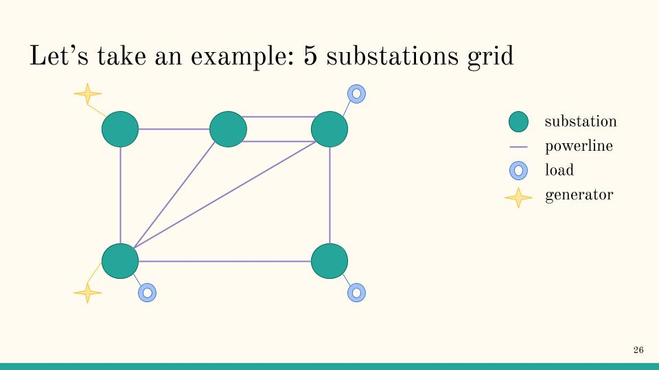
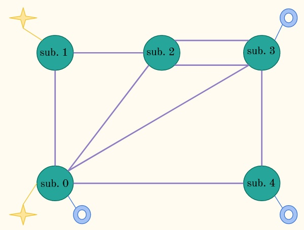
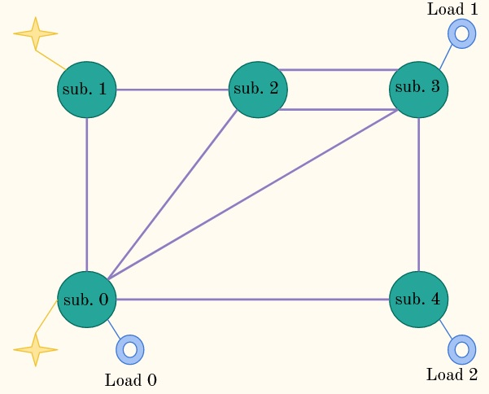
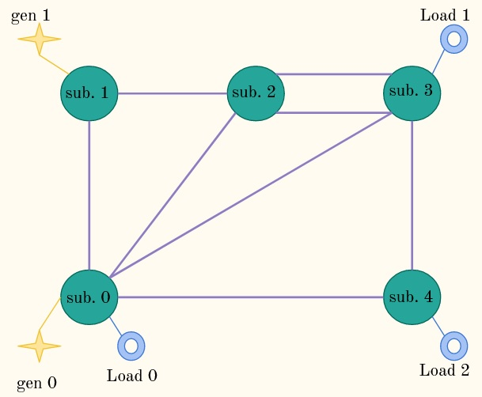
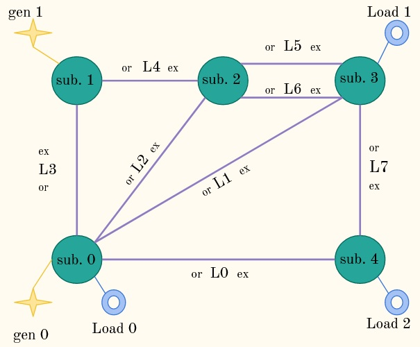

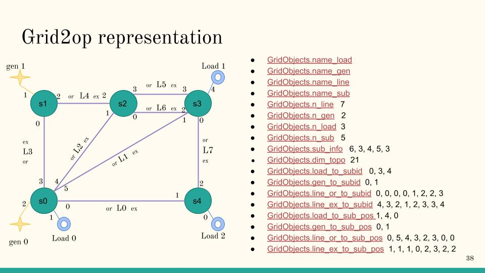
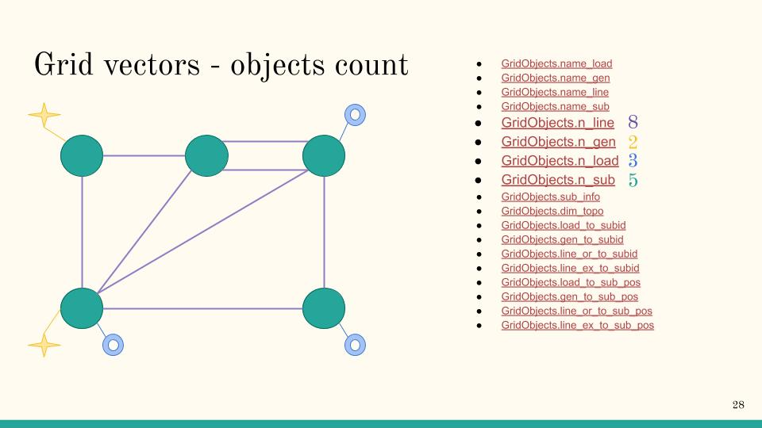
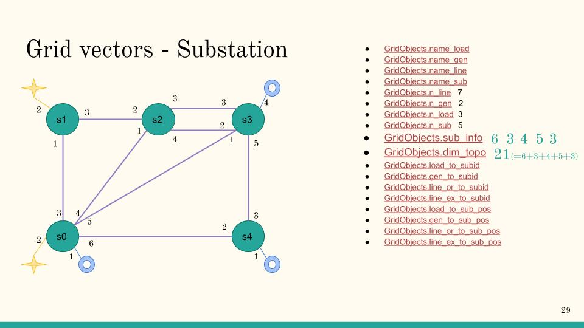
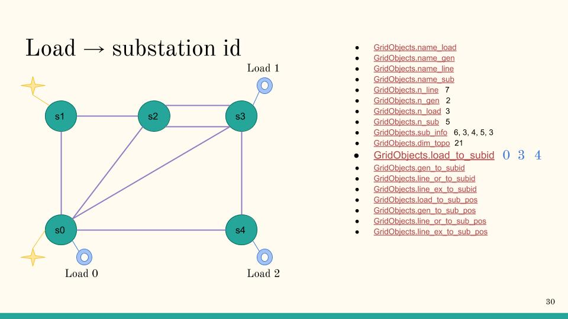
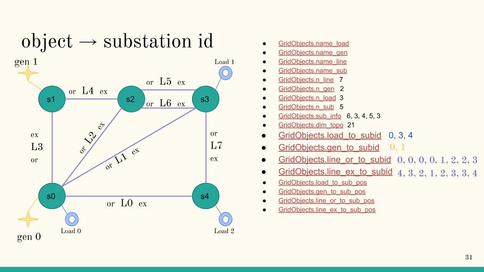
.. |5subs_grid_sub0| image:: ./img/5subs_grid_sub0.jpg
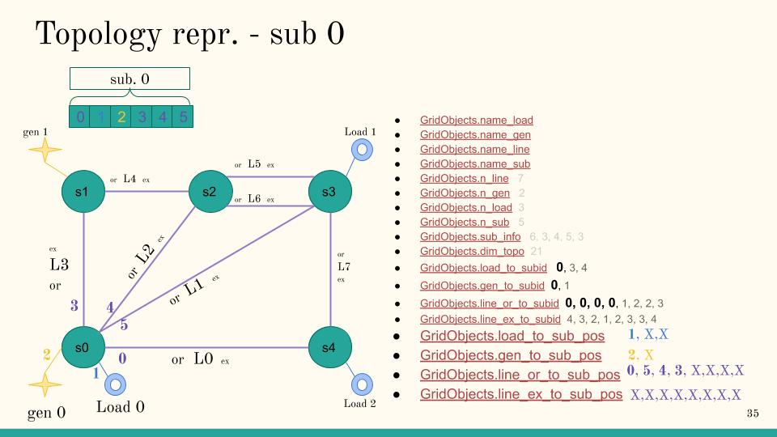
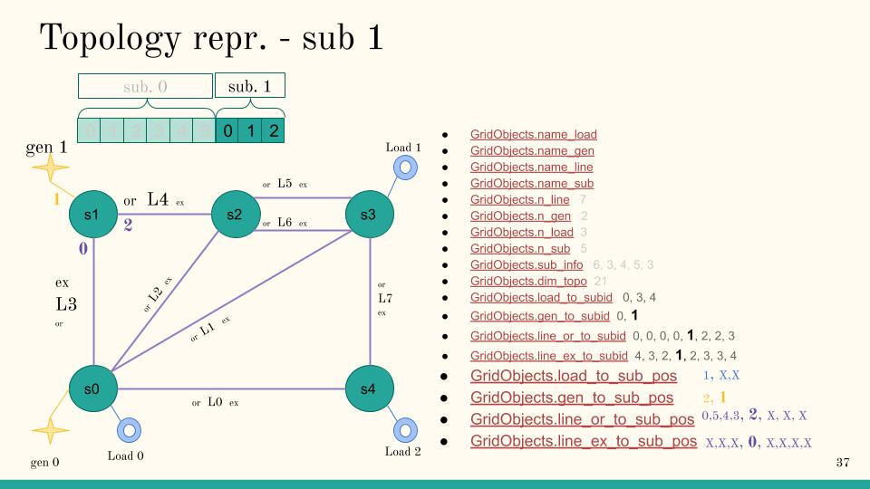
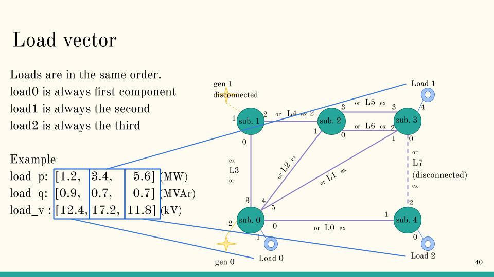
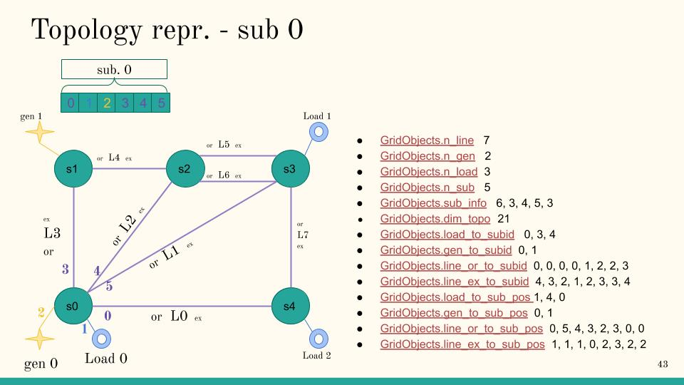
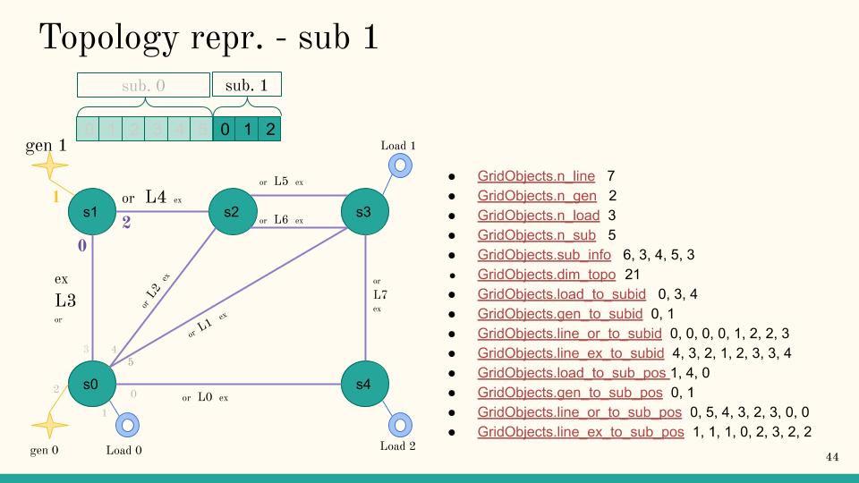
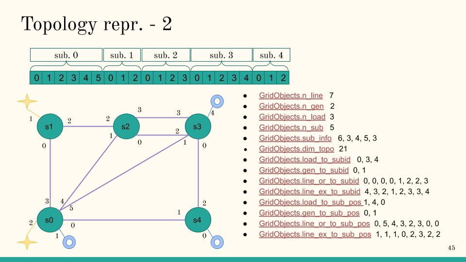
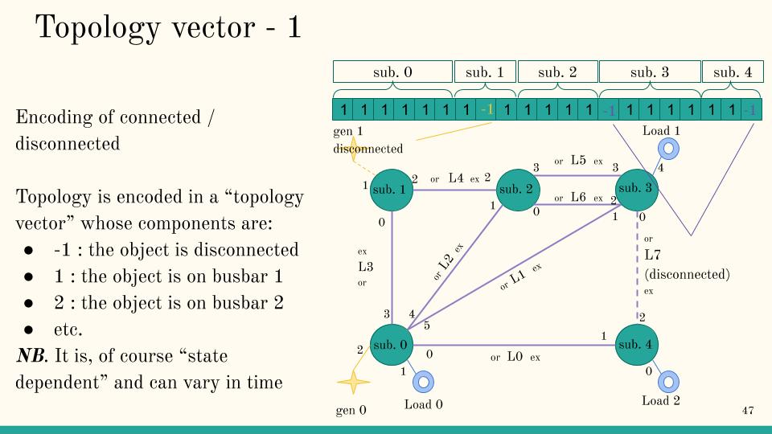
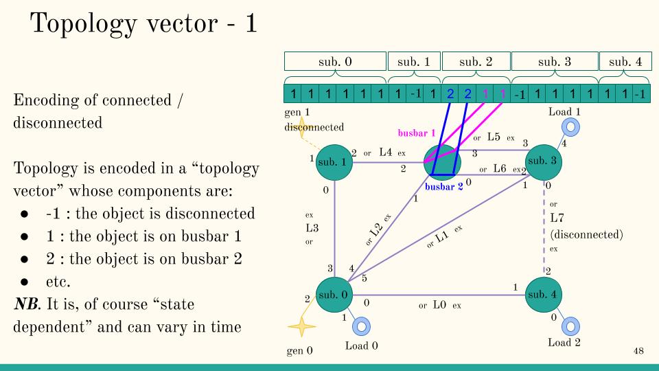

.. _create-backend-module:

Creating a new backend
===================================

This page is organized as follow:

.. contents:: Table of Contents
    :depth: 3

Objectives
-----------

.. warning:: Backends are internal to grid2op.

    This page details how to create a backend from an available
    solver (a "things" that is able to compute flows and voltages). This is an advanced usage.

    You will also find in this file the complete description on how the "powergrid" is represented in grid2op.

    Backend is an abstraction that represents the physical system (the powergrid). In theory every powerflow can be
    used as a backend. And example of a backend using `Pandapower <http://www.pandapower.org/>`_ is available with
    the :class:`grid2op.Backend.EducPandaPowerBackend.EducPandaPowerBackend` (only for demonstration purpose)

    If you want working backend, please use the :class:`grid2op.Backend.PandaPowerBackend` that
    uses `Pandapower <http://www.pandapower.org/>`_ and
    a port in c++ to a subset of pandapower called `LightSim2Grid <https://github.com/BDonnot/lightsim2grid>`_ .

To implement completely a backend, you should implement all the abstract function defined here :ref:`backend-module`.
This file is an overview of what is needed and aims at contextualizing these requirements to make them clearer and
easier to implement.

This section assume you have already a "code" that is able to compute some powerflow given a file stored somewhere,
typically on a hard drive representing a powergrid. If you have that, you can probably use it to implement
a grid2op backend and benefit from the whole grid2op ecosystem (code once a backend, reuse your "powerflow"
everywhere). This includes, but is not limited to:

- Save "logs" of your experiment in a standard format (with the runner) to be reused and analyzed graphically
  with grid2viz
- Save "logs" of your experiments and compare the results with "reference" solver available
- Act on your powergrid with a unified and "somewhat standard" fashion thanks to grid2op actions
- Reuse agents that other people have trained in the context of L2RPN competitions
- Train new grid controlers using the grid2op gym_compat module
- etc.

.. note:: Grid2Op do not care about the modeling of the grid (static / steady state or dyanmic / transient) and both
    types of solver could be implemented as backend. At time of writing (december 2020), only steady state powerflow are
    available.

.. note:: The previous note entails that grid2op is also independent on the format used to store a powergrid.
    It's expected that the "backend" fails to initialize if it cannot found any file to initialize the grid.

    At time of writing (december 2020), all environments are shipped with grid represented as "json" format, which is
    the default format for the default backend based on PandaPower. If you want your "Backend" to have support
    for all previous environment, you might need to initialize it from this format or convert the IEEE files to
    the representation that suits you.

.. note:: If your backend is somehow available in a c++ library (static or dynamic) and you can link program against it,
    you can use the interface "lightsim2grid" if you don't want to worry about grid2op representation (and skip this
    entire files)

    Indeed, lightsim2grid takes care of
    of exposing a model of the grid (Ybus and Sbus) from the grid2op data and is able to directly expose the results
    from the internal state to valid grid2op vectors.

    It has the advantage of being
    able to read the data from the default grid2op backend (based on PandaPower) and to allow to focus
    on the solver rather to focus on grid2op "representation" of the grid. It is also optimize for speed and
    (work in progress) aims at not copying any data from `python -> c++ -> python` when it can be avoided.

    The code is also relatively well organized in:

    - modification of the elements
    - generation of the Ybus (sparse) complex matrix and Sbus complex vector
    - solving for the complex voltage `V`  (and part of the `Sbus` vector) the equation `V.(Ybus.V)* = Sbus` with the
      "standard" "powerflow constraints"
    - computing the active power, reactive power, flow on powerllines etc. from the `V`

    So you if you have a solver that can somehow solves the equation `V.(Ybus.V)* = Sbus` (and meeting the
    constraints of a standard powerflow) then lightsim2grid might
    be a good way to make this solver available in grid2op easily.

    On the other hands, this "backend" also comes with a special model of each powersystem elements (loads, generators,
    lines, transformers or shunts for example) that you cannot modify and has some limitation to what it supports.

Main methods to implement
--------------------------
Typically, a backend has a internal "modeling" / "representation" of the powergrid
stored in the attribute `self._grid` that can be anything. An more detailed example, with some
"working minimal code" is given in the "example/backend_integration" of the grid2op repository.

There are 4 **__main__** types of method you need to implement if you want to use a custom powerflow
(*eg* from a physical solver, from a neural network, or any other methods):

- :func:`grid2op.Backend.Backend.load_grid` where the environment informs the instance of your backend of where
  the grid file is located. It is expected that this function defines all the attributes listed in
  :class:`grid2op.Space.GridObjects` (more information about these attributes are given in the :ref:`grid-description`
  section of this file. It should not return anything. Its main goal is to "inform" grid2op about
  relevant information of the current powergrid and to initialize the `_grid` attribute of the backend.
- :func:`grid2op.Backend.Backend.apply_action`: that modifies the internal state of the "Backend" you create
  properly (given the action taken by the agents, or the modifications of the data, or the emulation of some
  "automaton" of the environment etc.). More detail on how to "understand" a "BackendAction" is given in the
  :ref:`backend-action-create-backend` section of this document. This function should not return anything. Its
  main goal is to allow the modification of the underlying powergrid from the environment.
- :func:`grid2op.Backend.Backend.runpf` is called by the environment when a new "simulation" should be carried
  out. It should return ``True`` if it has converged, or ``False`` otherwise. In case of non convergence (this
  function returns ``False``),
  no flows can be inspected on the internal grid and the "environment" will interpret it as a "game over".
- the "readers" functions (*eg.* :func:`grid2op.Backend.Backend.get_topo_vect`,
  :func:`grid2op.Backend.Backend.generators_info`, :func:`grid2op.Backend.Backend.loads_info`,
  :func:`grid2op.Backend.Backend.lines_or_info`, :func:`grid2op.Backend.Backend.lines_ex_info` or
  :func:`grid2op.Backend.Backend.shunt_info`) that allows to "export" data from the internal backend representation
  to a format the environment understands (*ie* vectors). You can consult the section
  :ref:`vector-orders-create-backend` of this document for more information. The main goal of these "getters" is
  to export some internal value of the backend in a "grid2op compliant format".

.. warning::
    With grid2op version before <1.7.1, you were also required to implement the 
    :func:`grid2op.Backend.Backend.copy` method.

    As of grid2op >= 1.7.1 this is no longer required. Note however that if you 
    don't implement it, some features might not be available. This will
    be the case for *eg* :func:`grid2op.Observation.BaseObservation.simulate` or
    for :class:`grid2op.simulator.Simulator`.

.. _grid-description:

Grid description
------------------
In this section we explicit what attributes need to be implemented to have a valid backend instance. We focus on
the attribute of the `Backend` you have to set. But don't forget you also need to load a powergrid and store
it in the `_grid` attribute.

Basically the `load_grid` function would look something like:

.. code-block:: python

    def load_grid(self, path=None, filename=None):
        # simply handles different way of inputing the data
        if path is None and filename is None:
            raise RuntimeError("You must provide at least one of path or file to load a powergrid.")
        if path is None:
            full_path = filename
        elif filename is None:
            full_path = path
        else:
            full_path = os.path.join(path, filename)
        if not os.path.exists(full_path):
            raise RuntimeError("There is no powergrid at \"{}\"".format(full_path))

        # load the grid in your favorite format:
        self._grid = ... # the way you do that depends on the "solver" you use

        # and now initialize the attributes (see list bellow)
        self.n_line = ...  # number of lines in the grid should be read from self._grid
        self.n_gen = ...  # number of generators in the grid should be read from self._grid
        self.n_load = ...  # number of generators in the grid should be read from self._grid
        self.n_sub = ...  # number of generators in the grid should be read from self._grid

        # other attributes should be read from self._grid (see table below for a full list of the attributes)
        self.load_to_subid = ...
        self.gen_to_subid = ...
        self.line_or_to_subid = ...
        self.line_ex_to_subid = ...

        # and finish the initialization with a call to this function
        self._compute_pos_big_topo()

        # the initial thermal limit
        self.thermal_limit_a = ...

The grid2op attributes that need to be implemented in the :func:`grid2op.Backend.Backend.load_grid` function are
given in the table bellow:

=========================  ==============  ===========  =========  =========================================================
Name                       See paragraph   Type         Size       Description
=========================  ==============  ===========  =========  =========================================================
`n_line`_                   :ref:`n-el`    int          NA          Number of powerline on the grid (remember, in grid2op framework a `powerline` includes both "powerlines" and "transformer")
`n_gen`_                    :ref:`n-el`    int          NA          Number of generators on the grid
`n_load`_                   :ref:`n-el`    int          NA          Number of loads on the grid
`n_sub`_                    :ref:`n-el`    int          NA          Number of substations on the grid
`load_to_subid`_            :ref:`subid`   vect, int    `n_load`_   For each load, it gives the substation id to which it is connected
`gen_to_subid`_             :ref:`subid`   vect, int    `n_gen`_    For each generator, it gives the substation id to which it is connected
`line_or_to_subid`_         :ref:`subid`   vect, int    `n_line`_   For each powerline, it gives the substation id to which its **origin** end is connected
`line_ex_to_subid`_         :ref:`subid`   vect, int    `n_line`_   For each powerline, it gives the substation id to which its **extremity** end is connected
`name_load`_                               vect, str    `n_load`_  (optional) name of each load on the grid [if not set, by default it will be "load_$LoadSubID_$LoadID" for example "load_1_10" if the load with id 10 is connected to substation with id 1]
`name_gen`_                                vect, str    `n_gen`_   (optional) name of each generator on the grid [if not set, by default it will be "gen_$GenSubID_$GenID" for example "gen_2_42" if the generator with id 42 is connected to substation with id 2]
`name_line`_                               vect, str    `n_line`_  (optional) name of each powerline (and transformers !) on the grid [if not set, by default it will be "$SubOrID_SubExID_LineID" for example "1_4_57" if the powerline with id 57 has its origin end connected to substation with id 1 and its extremity end connected to substation with id 4]
`name_sub`_                                vect, str    `n_sub`_   (optional) name of each substation on the grid [if not set, by default it will be "sub_$SubID" for example "sub_41" for the substation with id 41]
`sub_info`_                 :ref:`sub-i`   vect, int    `n_sub`_    (can be automatically set if you don't initialize it) For each substation, it gives the number of elements connected to it ("elements" here denotes: powerline - and transformer- ends, load or generator)
`dim_topo`_                 :ref:`sub-i`   int          NA          (can be automatically set if you don't initialize it) Total number of elements on the grid ("elements" here denotes: powerline - and transformer- ends, load or generator)
`load_to_sub_pos`_          :ref:`subpo`   vect, int    `n_load`_   (can be automatically set if you don't initialize it) See the description for more information ("a picture often speaks a thousand words")
`gen_to_sub_pos`_           :ref:`subpo`   vect, int    `n_gen`_    (can be automatically set if you don't initialize it) See the description for more information ("a picture often speaks a thousand words")
`line_or_to_sub_pos`_       :ref:`subpo`   vect, int    `n_line`_   (can be automatically set if you don't initialize it) See the description for more information ("a picture often speaks a thousand words")
`line_ex_to_sub_pos`_       :ref:`subpo`   vect, int    `n_line`_   (can be automatically set if you don't initialize it) See the description for more information ("a picture often speaks a thousand words")
`load_pos_topo_vect`_       :ref:`subtv`   vect, int    `n_load`_   Automatically set with a call to `self._compute_pos_big_topo`
`gen_pos_topo_vect`_        :ref:`subtv`   vect, int    `n_gen`_    Automatically set with a call to `self._compute_pos_big_topo`
`line_or_pos_topo_vect`_    :ref:`subtv`   vect, int    `n_line`_   Automatically set with a call to `self._compute_pos_big_topo`
`line_ex_pos_topo_vect`_    :ref:`subtv`   vect, int    `n_line`_   Automatically set with a call to `self._compute_pos_big_topo`
=========================  ==============  ===========  =========  =========================================================

**TODO** storage doc and shunts doc !

Example on how to set them
+++++++++++++++++++++++++++
Some concrete example on how to create a backend are given in the :class:`grid2op.Backend.PandaPowerBackend`
(for the default Backend) and in the "lightsim2grid" backend (available at
`https://github.com/BDonnot/lightsim2grid <https://github.com/BDonnot/lightsim2grid>`_ ). Feel free to consult
any of these codes for more information.

In this example, we detail what is needed to create a backend and how to set the required attributes.

We explain step by step how to proceed with this powergid:

|5subs_grid_layout|

.. _pre-req-backend:

Prerequisite: Order and label everything
*****************************************
The first step is to give names and order to every object on the loaded grid.

For example, you can first assign order to substations this way:

|5subs_grid_1_sub|

.. warning:: To be consistent with python ecosystem, index are 0 based. So the first element should have id 0 (and not 1)

Then you decide an ordering of the loads:

|5subs_grid_2_loads|

Then the generators:

|5subs_grid_3_gens|

And then you deal with the powerlines. Which is a bit more "complex" as you need also to "assign side" (
"extremity" or "origin") to
each powerline end which is to define an "origin" end and and "extremity" end. This result in a possible
ordering this way:

|5subs_grid_4_lines|

**Optionally** you also need to come up with a way of assign to each "element" an order in the substation. This is an
extremely complex way to say you have to do this:

|5subs_grid_5_obj_in_sub|

Note the number for each element in the substation.

In this example, for substaion with id 0 (bottom left) you decided
that the powerline with id 0 (connected at this substation at its origin end) will be the "first object of this
substation". Then the "Load 0" is the second object [remember index a 0 based, so the second object has id 1],
generator 0 is the third object of this substation (you can know it with the "3" near it) etc.

.. note:: Grid2op assumes that if the same files is loaded multiple times, then the same grid is defined by the
    backend. This entails that the loads are in the same order, substations are in the same order, generators are
    in the same order, powerline are in the same order (and for each powerrline is oriented the same way: same "origin"
    and same "extremity").

This powergrid will be used throughout this example. And in the next sections, we suppose that you have chosen
a way to assign all these "order".

.. note:: The order of the elements has absolutely no impact whatsoever on the solver and the state of the grid. In
    other words flows, voltages etc. do not depend on this (arbitrary) order.

    We could have chosen a different representation of this data
    (for example by identifying objects with names instead of ID in vector) but it turns out this "index based
    representation" is extremely fast as it allows manipulation of most data using the `numpy` package.

    This is a reason why grid2op is relatively fast in most cases: very little time is taken to map objects to
    there properties.

.. note:: This can be done automatically if you don't want to take care of this
    labelling.

If you chose to adopt the "automatic" way it will result in the following ordering:

- load (if any is connected to this substation) will be labeled first
- gen will be labeled just after
- then origin side of powerline
- then extremity side of powerline

This will result in a **different** labelling that the one we adopted here! So the vector `*_to_sub_pos` will be
different, and so will the `*_to_pos_topo_vect`

Final result
******************
For the most impatient readers, the final representation is :

|5subs_grid_layout_with_repr|

In the next paragraphs we detail step by step why this is this way.

.. _n-el:

Number of elements (n_line, n_load, n_gen, n_sub)
**************************************************
Nothing much to say here, you count each object and assign the right val to the attributes. This gives:

|5subs_grid_n_el|

For example, `n_line` is 8 because there are 8 lines on the grid, labeled from 0 to 7.

.. _subid:

Substation id (\*_to_subid)
***************************

The attribute explained in this section are `load_to_subid`, `gen_to_subid`, `line_or_to_subid` and `line_ex_to_subid`.

Again, for each of these vector, you specify to which substation the objects are connected. For example, for the
loads this gives:

|5subs_grid_load_to_subid|

Indeed, the load with id 0 is connected to substation with id 0, load with id 1 is connected to substation with id 3
and load with id 2 is connected to substation with id 4.

For the other attributes, you follow the same pattern:

|5subs_grid_el_to_subid|

.. _sub-i:

(optional) Substation information (sub_info, dim_topo)
*******************************************************
.. versionadded:: 1.3.2
    This is now done automatically if the user do not set it.

For these attributes too, there is nothing really surprising (we remember that these can be set automatically if
you don't do it). We show how to set them mainly to explain grid2op "encoding" for these attributes that
you might want to reuse somewhere else.

For each component of `sub_info` you tell grid2op of the number of elements connected to it. And then you sum
up each of these elements in the `dim_topo` attributes.

|5subs_grid_5_sub_i|

.. note:: Only the loads, line ends ("origin" or "extremity") and generators are counted as "elements".

.. _subpo:

(optional) Position in substation (\*_to_sub_pos)
***************************************************
.. versionadded:: 1.3.2
    This is now done automatically if the user do not set it.

These are the least common (and "most complicated") attributes to set.
This is why we implemented a function that takes care of computing it if you need. This function will make
this choice, for each substation:

- load (if any is connected to this substation) will be labeled first
- gen will be labeled just after
- then origin side of powerline
- then extremity side of powerline

You are free to chose any other ordering, and this is why we explain in detail how this feature works here.

.. note:: It's a "take all or nothing" feature. It means that you either take the full ordering detailed above
   or you need to implement a complete ordering yourself.

This values allow to uniquely identified, inside each substation. These were represented by the "small" number
near each element in the last image of the introductory paragraph :ref:`pre-req-backend`. If you have that
image in mind, it's simple: you set the number of each elements into its vector. And that is it.

If you are confused, we made a detailed example below.

First, have a look at substation 0:

|5subs_grid_sub0|

You know that, at this substation 0 there are `6` elements connected. In this example, these are:

- origin end of Line 0
- Load 0
- gen 0
- origin end of line 1
- origin end of line 2
- origin end of line 3

Given that, you can fill:

- first component of `line_or_to_sub_pos`  [origin of line 0 is connected at this substation]
- first component of `load_to_sub_pos` [Load 0 is connected at this substation]
- first component of `gen_to_sub_pos`  [gen 0 is connected at this substation]
- second component of `line_or_to_sub_pos` [origin of line 1 is connected at this substation]
- third component of `line_or_to_sub_pos`  [origin of line 2 is connected at this substation]
- fourth component of `line_or_to_sub_pos`  [origin of line 2 is connected at this substation]

These are indicated with the "??" on the figure above. (note that the `XX` cannot be set right now)

Once you know that, you just have to recall that you already give an order to each of these objects.
You defined (in a purely arbitrary manner):

- the element 0 of this substation to be "origin of line 0"
- the element 1 of this substation to be "load 0"
- the element 2 of this substation to be "gen 0"
- the element 3 of this substation to be "origin of line 3"
- the element 4 of this substation to be "origin of line 2"
- the element 5 of this substation to be "origin of line 1"

So you get:

- first component of `line_or_to_sub_pos` is 0 [because "origin end of line 0" is "element 0" of this substation]
- first component of `load_to_sub_pos` is 1 [because "load 0" is "element 1" of this substation]
- first component of `gen_to_sub_pos` is 2 [because "gen 0" is "element 2" of this substation]
- fourth component of `line_or_to_sub_pos` is 3 [because "origin end of line 3" is "element 3" of this substation]
- third component of `line_or_to_sub_pos` is 4 [because "origin end of line 2" is "element 4" of this substation]
- second component of `line_or_to_sub_pos` is 5 [because "origin end of line 1" is "element 5" of this substation]

This is showed in the figure below:

|5subs_grid_sub0_final|

Then you do the same process with substation 1 which will result in the vectors showed in the following plot:

|5subs_grid_sub1_final|

When writing this, we realize it's really verbose. But really, it simply consist on assigning, at each object, a unique
ID to be able to retrieved it when querying something like "set the object of id 2 in subtation 0 to busbar 2".

Finally, you proceed in the same manner for all substation and you get:

|5subs_grid_layout_with_repr|

.. _subtv:

(optional) Position in the topology vector (\*_pos_topo_vect)
****************************************************************

This information is redundant with the other vector. It can be initialized with
a call to the function :func:`grid2op.Space.GridObjects._compute_pos_big_topo` that you will need to perform after
having initialized all the other vectors as explained above (simply call `self._compute_pos_big_topo()` at the end
of your implementation of `load_grid` function)

.. note::
    Shunts are not "part of" the topology vector.

.. _backend-action-create-backend:

BackendAction: modification
----------------------------------------------
In this section we detail step by step how to understand the specific format used by grid2op to "inform" the backend
on how to modify its internal state before computing a powerflow.

A `BackendAction` will tell the backend on what is modified among:

- the active value of each loads (see paragraph :ref:`change-inj`)
- the reactive value of each loads (see paragraph  :ref:`change-inj`)
- the amount of power produced by each generator (setpoint) (see paragraph  :ref:`change-inj`)
- the voltage "setpoint" of each generator (see paragraph  :ref:`change-inj`)
- the status (connected / disconnected) of each element (see paragraph :ref:`change-topo`)
- at which busbar each object is connected  (see paragraph :ref:`change-topo`)

.. note:: Typically the `apply_action` function is called once per `step` of the environment. The implementation of
    this function should be rather optimized for the best performance.

In this section we detail the format of these particular "actions". We assume in the following that
`backendAction` is the action you need to perform.

At the end, the `apply_action` function of the backend should look something like:

.. code-block:: python

    def apply_action(self, backendAction=None):
        if backendAction is None:
            return
        active_bus, (prod_p, prod_v, load_p, load_q), _, shunts__ = backendAction()

        # modify the injections [see paragraph "Modifying the injections (productions and loads)"]
        for gen_id, new_p in prod_p:
            # modify the generator with id 'gen_id' to have the new setpoint "new_p" for production
            ...  # the way you do that depends on the `internal representation of the grid`
        for gen_id, new_v in prod_v:
            # modify the generator with id 'gen_id' to have the new value "new_v" as voltage setpoint
            # be careful here ! new_v are given in kV and NOT in pu. So you need to convert them accordingly
            ...  # the way you do that depends on the `internal representation of the grid`
        for load_id, new_p in load_p:
            # modify the load with id 'load_id' to have the new value "new_p" as consumption
            ...  # the way you do that depends on the `internal representation of the grid`
        for load_id, new_p in load_p:
            # modify the load with id 'load_id' to have the new value "new_p" as consumption
            ...  # the way you do that depends on the `internal representation of the grid`

        # modify the topology [see paragraph "Modifying the topology (status and busbar)"]
        loads_bus = backendAction.get_loads_bus()
        for load_id, new_bus in loads_bus:
            # modify the "busbar" of the loads
            if new_bus == -1:
                # the load is disconnected in the action, disconnect it on your internal representation of the grid
                ... # the way you do that depends on the `internal representation of the grid`
            else:
                # the load is moved to either busbar 1 (in this case `new_bus` will be `1`)
                # or to busbar 2 (in this case `new_bus` will be `2`)
                ... # the way you do that depends on the `internal representation of the grid`
        gens_bus = backendAction.get_gens_bus()
        for gen_id, new_bus in gens_bus:
            # modify the "busbar" of the generators
            if new_bus == -1:
                # the gen is disconnected in the action, disconnect it on your internal representation of the grid
                ... # the way you do that depends on the `internal representation of the grid`
            else:
                # the gen is moved to either busbar 1 (in this case `new_bus` will be `1`)
                # or to busbar 2 (in this case `new_bus` will be `2`)
                ... # the way you do that depends on the `internal representation of the grid`
        lines_or_bus = backendAction.get_lines_or_bus()
        for line_id, new_bus in lines_or_bus:
            # modify the "busbar" of the origin end of powerline line_id
            if new_bus == -1:
                # the origin end of powerline is disconnected in the action, disconnect it on your internal representation of the grid
                ... # the way you do that depends on the `internal representation of the grid`
            else:
                # the origin end of powerline is moved to either busbar 1 (in this case `new_bus` will be `1`)
                # or to busbar 2 (in this case `new_bus` will be `2`)
                ... # the way you do that depends on the `internal representation of the grid`
        lines_ex_bus = backendAction.get_lines_ex_bus()
        for line_id, new_bus in lines_ex_bus:
            # modify the "busbar" of the extremity end of powerline line_id
            if new_bus == -1:
                # the extremity end of powerline is disconnected in the action, disconnect it on your internal representation of the grid
                ... # the way you do that depends on the `internal representation of the grid`
            else:
                # the extremity end of powerline is moved to either busbar 1 (in this case `new_bus` will be `1`)
                # or to busbar 2 (in this case `new_bus` will be `2`)
                ... # the way you do that depends on the `internal representation of the grid`

.. versionadded:: 1.3.2
    Before version 1.3.2, you could not use the `get_loads_bus`, `get_gens_bus`, `get_lines_or_bus`
    or `get_lines_ex_bus` method. Please upgrade to grid2op 1.3.2 or later to use these.

.. _modif-backend:

Retrieve what has been modified
++++++++++++++++++++++++++++++++

This is the first step you would need to perform to retrieve what are the modifications you need to implement
in the backend. This is achieved with:

.. code-block:: python

    active_bus, (prod_p, prod_v, load_p, load_q), _, shunts__ = backendAction()

And all information needed to set the state of your backend is now available. We will explain them step by step in the
following paragraphs.

.. _change-inj:

Modifying the injections (productions and loads)
+++++++++++++++++++++++++++++++++++++++++++++++++

The new setpoints for the injections are given in the vectors `(prod_p, prod_v, load_p, load_q)`  retrieved in the
above paragraph (see :ref:`modif-backend` for more information).

Each of the `prod_p`, `prod_v`, `load_p` and  `load_q` are specific types of "iterable" that stores which values
have been modified and what is the new value associated.

The first way to retrieve the modification is with a simple for loop:

.. code-block:: python

    for gen_id, new_p in prod_p:
        # modify the generator with id 'gen_id' to have the new setpoint "new_p"
        ...  # the way you do that depends on the `internal representation of the grid`

.. note::  If no changes have affected the "active production setpoint of generator" then it will not be
    "looped through": only
    generators that have been modified between the steps will be showed here. So if you need to passe the values of
    all generators (for example) you need to remember these values yourself.

Of course it works the same way with the other "iterables":

.. code-block:: python

    for gen_id, new_v in prod_v:
        # modify the generator with id 'gen_id' to have the new value "new_v" as voltage setpoint
        ...  # the way you do that depends on the `internal representation of the grid`
    for load_id, new_p in load_p:
        # modify the load with id 'load_id' to have the new value "new_p" as consumption
        ...  # the way you do that depends on the `internal representation of the grid`
    for load_id, new_p in load_p:
        # modify the load with id 'load_id' to have the new value "new_p" as consumption
        ...  # the way you do that depends on the `internal representation of the grid`

.. _change-topo:

Modifying the topology (status and busbar)
++++++++++++++++++++++++++++++++++++++++++

This is probably the most "difficult" part of implementing a new backend based on your solver. This is because
modification of topology is probably not as common as modifying the the production or consumption.

For this purpose we recommend to use the `get_loads_bus`, `get_gens_bus`, `get_lines_or_bus` and `get_lines_ex_bus`
functions of the `backendAction`.

These functions can be used in the following manner:

.. code-block:: python

        # modify the topology
        loads_bus = backendAction.get_loads_bus()
        for load_id, new_bus in loads_bus:
            # modify the "busbar" of the loads
            if new_bus == -1:
                # the load is disconnected in the action, disconnect it on your internal representation of the grid
                ... # the way you do that depends on the `internal representation of the grid`
            else:
                # the load is moved to either busbar 1 (in this case `new_bus` will be `1`)
                # or to busbar 2 (in this case `new_bus` will be `2`)
                ... # the way you do that depends on the `internal representation of the grid`

And of course you do the same for generators and both ends of each powerline.

.. note:: About powerline, grid2op adopts the following convention: a powerline **cannot** be connected on one side
    and disconnected on the other.

    That being said, it's still possible to connect the extremity of a powerline "alone" on a busbar, which will have
    the same effect of having it "disconnected at one ends only".

.. _vector-orders-create-backend:

Read back the results (flows, voltages etc.)
-----------------------------------------------
This last "technical" part concerns what can be refer to as "getters" from the backend. These functions allow to
read back the state of the grid and expose its results to grid2op in a standardize manner.

The main functions are:

- :func:`grid2op.Backend.Backend.generators_info` : that allows to export the information related to generators
  (more detail in subsection :ref:`get-flow`)
- :func:`grid2op.Backend.Backend.loads_info` : enabling to read the state of the loads
  (more detail in subsection :ref:`get-flow`)
- :func:`grid2op.Backend.Backend.lines_or_info` : export information about the "origin" side of the powerlines
  (more detail in subsection :ref:`get-flow`)
- :func:`grid2op.Backend.Backend.lines_ex_info` : export information about the "extremity" side of the powerlines
  (more detail in subsection :ref:`get-flow`)
- :func:`grid2op.Backend.Backend.get_topo_vect` : represent information about the topology of the grid after the
  solver has run (for each element, it says on which busbar it's connected) (more detail in subsection :ref:`get-topo`)

.. _get-flow:

Retrieving injections and flows
++++++++++++++++++++++++++++++++++++++++++
In this subsection we detail how we retrieve the information about the flows (at each side of all the powerlines
and transformers) and how to retrieve the value associated with each "element" of the grid.

The functions you need to implement are described in the table below:

==================================================  ==================  ================================================
Name                                                 Number of vectors    Description
==================================================  ==================  ================================================
:func:`grid2op.Backend.Backend.generators_info`      3                   active setpoint, reactive absorption / production and voltage magnitude at the bus to which it's connected
:func:`grid2op.Backend.Backend.loads_info`           3                   active consumption, reactive consumption and voltage magnitude of the bus to which it's connected
:func:`grid2op.Backend.Backend.lines_or_info`        4                   active flow, reactive flow, voltage magnitude of the bus to which it's connected and current flow
:func:`grid2op.Backend.Backend.lines_ex_info`        4                   active flow, reactive flow, voltage magnitude of the bus to which it's connected and current flow
==================================================  ==================  ================================================

It follows the same "*representation*" as anything else in grid2op : each of these values are represented as vectors.
Vector should have fixed size, and each element (*eg* origin side of powerline L0) should be always at the same place
in the vectors. For example, if you implement :func:`grid2op.Backend.Backend.lines_or_info`, it should return
4 vectors:

- `p_or`: represents the active flows on each powerline (origin side)
- `q_or`: represents the ractive flows on each powerline (origin side)
- `v_or`: represents the voltage magnitude of each powerline (origin side)
- `a_or`: represents the current flows on each powerline (origin side)

The first element of `p_or` vector expose the active flow on origin side of powerline l0, first component
of `a_or` represents the current flow on origin side of l0.

This is further illustrated in the figure below (that concerns the the loads, but it's the same ideas for all the
other elements):

|5subs_grid_loads_info|

.. note:: The values that should be retrieved here are what is considered as "if i had placed a (perfect) sensor
    on this element
    what would this sensor display.

    This is what is considered as "real world data" by grid2op. If you want to model delay in the measurements or
    some lack of precision in the sensors (for example) we don't advise to do it on the Backend side, but rather to
    code a different types of "Observation" that would add some noise to the values returned by grid2op.

.. note:: Depending on the capacity of the Backend and its precision in modeling "real systems" the values returned
    in these vector may, or may not be different from their setpoint.

    For example, if the backend do not model that "real" generators have limit for the reactive power they can
    absorb / produce then it's likely that the "prod_v" you get from the backend is the same as the "prod_v" that has
    been used when the "apply_action" has been called.

    Grid2Op is independent from the "model of grid" you are using. So grid2op itself will not be affected (and
    nothing will check) whether "prod_v" after a powerflow is the same as "prod_v" before.

.. _get-topo:

Retrieving the topology
++++++++++++++++++++++++++

The last information you need to provide for your backend is tha ability to retrieve the internal topology of
the powergrid.

This function is especially important if your solver is able to simulate the behaviour of some complex automatons on
the grid. In this case, the topology after the powerflow (and the possible trigger of these automatons) can
be different from the initial topology of the grid as provided by the backend action (see section
:ref:`grid-description` for more information).

Remember that to interface with grid2op, you needed to define orders of object in all the substation. To know
the position of each element in the topology vector, grid2op simply concatenate all vectors of all substation.

Let's start by substation 0:

|5subs_grid_sub1_topo|

Then you concatenate to it the vector representing substation 1:

|5subs_grid_sub1_2_topo|

And you do chat for all substations, giving:

|5subs_grid_suball_topo|

So in this simple example, the first element of the topology vector will represent the origin of powerline 0,
the second element will represent the load 0, the 7th element (id 6, remember python index are 0 based) represent
first element of substation 1, so in this case extremity end of powerline 3, the 8th element the generator 1, etc.
up to element with id 20 whith is the last element of the last substation, in this case extremity of powerline 7.

Once you know the order, the encoding is pretty straightforward:

- -1 means "the element is disconnected"
- 1 means "the element is connected on busbar 1"
- 2 means "the element is connected on busbar 2"
- etc.

So, for example, we have, in our grid, if generator 1 is disconnected and powerline l7 is disconnected:

|5subs_grid_ex_disco|

And to represent a substation with multiple "nodes" (buses) you can encode it this way:

|5subs_grid_ex_2buses|

In this case, at substation 2 there are 2 connected busbars:

- *busbar 1* connects extremity of powerline 4 and origin of powerline 5
- *busbar 2* connects extremity of powerline 1 and origin of powerline 6

But there is no direct connection between busbar 1 and busbar 2.

Automatic testing and "Test Driven Programming"
--------------------------------------------------

.. versionadded:: 1.9.6
    Before this is was not specified in the code but only on some description what was expected from a backend.

In grid2op was added some convenience class to "make sure" that a backend candidate was working as expected, following the
grid2op "expectation" in terms of grid representation and all. This test suite has been made independant of the solver used, you can 
use it directly if your backend can read pandapower "json" format but can also be used (thanks to some customization) even 
if it's not the case.

The only requirement is that you install grid2op FROM SOURCE and in "editable" mode. You can do that (using a python
virtual environment is a good idea and is not covered here):

.. code-block::

    git clone https://github.com/rte-france/grid2op.git grid2op_dev
    cd grid2op_dev
    pip install -e .

.. warning::
    If it fails with some error like `AttributeError: module 'grid2op' has no attribute '__version__'` 
    or equivalent, you can remove the "pyproject.toml" file:
    
    .. code-block::

        cd grid2op_dev  # same repo as above
        rm -rf pyproject.toml
        pip install -e .

Most simple way
++++++++++++++++

Write a script (say "test_basic_api.py") with this in your code:

.. code-block:: python

    from grid2op._create_test_suite import create_test_suite

    def this_make_backend(self, detailed_infos_for_cascading_failures=False):
        # the function that will create your backend
        # do not put "PandaPowerBackend" of course, but the class you coded as a backend !
        return PandaPowerBackend(
                detailed_infos_for_cascading_failures=detailed_infos_for_cascading_failures
            ) 
    add_name_cls = "test_PandaPowerBackend"  # h

    res = create_test_suite(make_backend_fun=this_make_backend,
                            add_name_cls=add_name_cls,
                            add_to_module=__name__,
                            extended_test=False,  # for now keep `extended_test=False` until all problems are solved
                            )

    if __name__ == "__main__":
        unittest.main()

Then you can run your test with:

.. code-block::

    python -m unittest test_basic_api.py

If all tests pass then you are done.

More verbose, but easier to debug
++++++++++++++++++++++++++++++++++++++++++++++++

You can also do the equivalent script:

.. code-block:: python

    import unittest
    from grid2op.tests.aaa_test_backend_interface import AAATestBackendAPI
    
    class TestBackendAPI_PandaPowerBackend(AAATestBackendAPI, unittest.TestCase):        
        def make_backend(self, detailed_infos_for_cascading_failures=False):
            # the function that will create your backend
            # do not put "PandaPowerBackend" of course, but the class you coded as a backend !
            return PandaPowerBackend(detailed_infos_for_cascading_failures=detailed_infos_for_cascading_failures)

    if __name__ == "__main__":
        unittest.main()

Advantages: 

1) you can tell to python which test you want to run exactly, for example with 
   `python -m unittest test_basic_api.TestBackendAPI_PandaPowerBackend.test_01load_grid` which
   makes it easier to debug (you can run only the failed test)
2) it's more clear what is being done and the name of everything
3) it's easier to customized

Drawbacks:

1) Only tests in `AAATestBackendAPI` will be performed. Some other tests (integration test, backend more in depth tests) 
   will not be performed

More customization
+++++++++++++++++++

If you don't have a backend that reads pandapower file format (or if you want to test part of your backend 
when initialized from another data format) it is also easy to customize it.

You need to:

1) make a repo somewhere on you machine (say `my_path_for_test` which would be located at `/home/user/Documents/my_path_for_test` or
   `C:\\users\\Documents\\my_path_for_test` or anywhere else)
2) put there a grid with your specific format, for example `grid.json` or `grid.xiidm` or `grid.xml`. Two things are important here
   
   i) the file name should be `grid` and nothing else. `Grid.json` or `my_grid.json` or `case14.xml` will NOT work
   ii) the extension should be set in the `self.supported_grid_format`, for example if you want your backend to 
       be able to read `grid.xml` then the object you create in `def make_backend(...)` should have `xml` somewhere
       in its `supported_grid_format` attribute
3) Write a python script similar to this one:

.. code-block:: python

    import unittest
    from grid2op.tests.aaa_test_backend_interface import AAATestBackendAPI
    FILE_FORMAT = "xiidm"  # for this example, put whatever here !

    class TestBackendAPI_PandaPowerBackend(AAATestBackendAPI, unittest.TestCase):   
        def get_path(self):
            return "my_path_for_test"  # or /home/user/Documents/my_path_for_test
        
        def get_casefile(self):
            return "grid.xiidm"   # or `grid.xml` or any other format

        def make_backend(self, detailed_infos_for_cascading_failures=False):
            # the function that will create your backend
            # do not put "PandaPowerBackend" of course, but the class you coded as a backend !
            backend = PandaPowerBackend(detailed_infos_for_cascading_failures=detailed_infos_for_cascading_failures)
            assert FILE_FORMAT in backend.supported_grid_format, f"your backend does not recognize the '{FILE_FORMAT}' extension, grid2op will not work"
            return backend

    if __name__ == "__main__":
        unittest.main()

TODO there are ways to use the `create_test_suite` but they have not been tested at the moment.

Advanced usage and speed optimization
--------------------------------------
TODO this will be explained "soon".

Detailed Documentation by class
-------------------------------
.. autoclass:: grid2op.Backend.EducPandaPowerBackend.EducPandaPowerBackend
    :members:
    :private-members:
    :special-members:
    :autosummary:

.. include:: final.rst