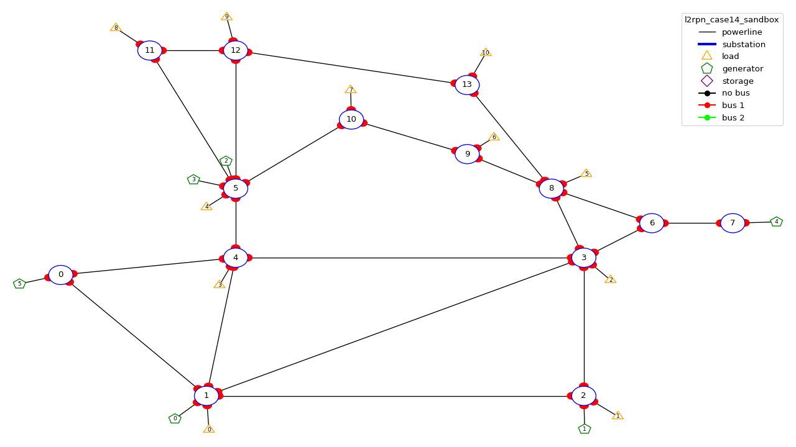
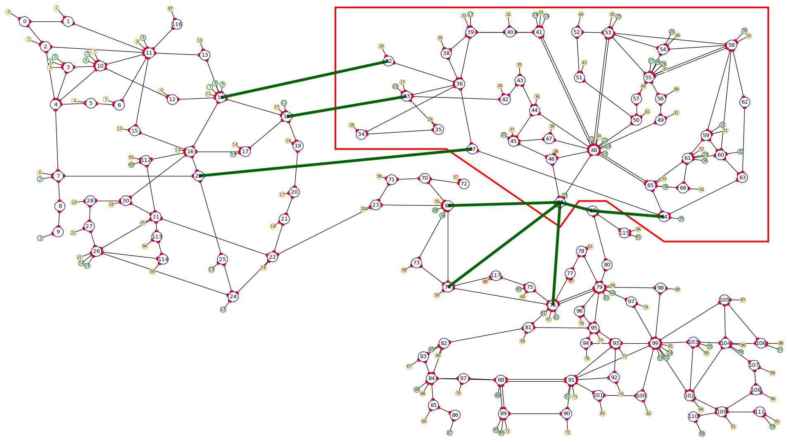
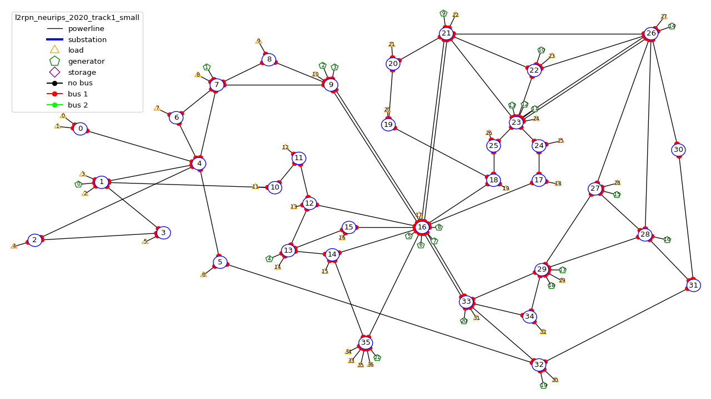
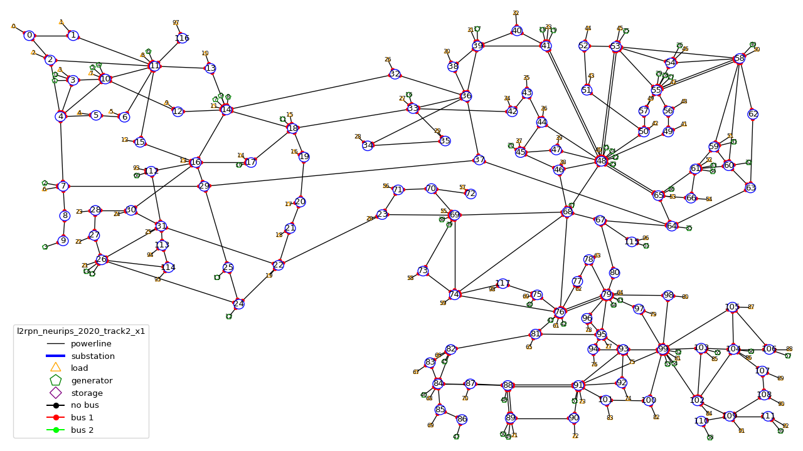
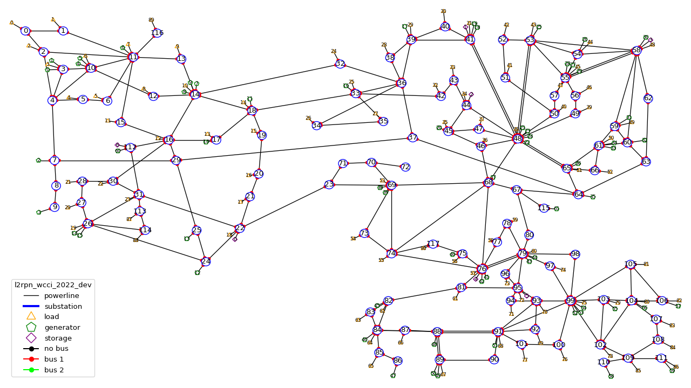

Content of an environment
===================================

A grid2op "environment" is represented as a folder on your computer. There is one folder for each environment.

Inside each folder / environment there are a few files (as of writing):

- "**grid.json**" (a file): it is the file that describe the powergrid and that can be read by the default backend.
  It is today
  mandatory, but we could imagine a file in a different format. Note that in this case,
  this environment will not be compatible with the default backend.
- "**config.py**" (a file): this file is imported when the environment is loaded. It is used to parametrize the way
  the environment is made. It should define a "config" variable. This "config" is dictionary that is used to initialize
  the environment. They key should be variable names. See example of such "*config.py*" file in provided environment.

It can of course contain other information, among them:

- "**chronics**" (a folder) [recommended]: this folder contains the information to generate the production / loads at each steps.
  It can
  itself contain multiple folder, depending on the :class:`grid2op.Chronics.GridValue` class used. In most available
  environment, the class :class:`grid2op.Chronics.Multifolder` is used. This folder is optional, though it is present
  in most grid2op environment provided by default.
- "**grid_layout.json**" (a file) [recommended]: gives, for each substation its coordinate *(x,y)* when plotted. It is optional, but
  we
  strongly encourage to have such. Otherwise, some tools might not work (including all the tool to represent it, such
  as the renderer (`env.render`), the `EpisodeReplay` or even some other dependency package, such as Grid2Viz).
- "**prods_charac.csv**" (file): [see :func:`grid2op.Backend.Backend.load_redispacthing_data` for a
  description of this file]
  This contains all the information related to "ramps", "pmin / pmax", etc. This file is optional (grid2op can
  perfectly run without it). However, if absent, then the classes
  :attr:`grid2op.Space.GridObjects.redispatching_unit_commitment_available` will be set to ``False`` thus preventing
  the use of some feature that requires it (for example *redispatching* or *curtailment*)
- "**storage_units_charac.csv**" (file): [see :func:`grid2op.Backend.Backend.load_storage_data` for a description
  of this file]
  This file is used for a description of the storage units. It is a description of the storage units needed by grid2op.
  This is optional if you don't have any storage units on the grid but required if there are (otherwise a
  `BackendError` will be raised).
- "**difficulty_levels.json**" (file): This file is useful is you want to define different "difficulty" for your
  environment. It should be a valid json with keys being difficulty levels ("0" for easiest to "1", "2", "3", "4", "5"
  , ..., "10", ..., "100", ... or "competition" for the hardest / closest to reality difficulty).

And this is it for default environment.

You can highly customize everything. Only the "config.py" file is really mandatory:

- if you don't care about your environment to run on the default "Backend", you can get rid of the "grid.json"
  file. In that case you will have to use the "keyword argument" "backend=..." when you create your environment
  (*e.g* `env = grid2op.make(..., backend=...)` ) This is totally possible with grid2op and causes absolutely
  no issues.
- if you code another :class:`grid2op.Chronics.GridValue` class, you can totally get rid of the "chronics" repository
  if you want to. In that case, you will need to either provide "chronics_class=..." in the config.py file,
  or initialize with `env = grid2op.make(..., chronics_class=...)`
- if your grid data format contains enough information for grid2op to initialize the redispatching and / or storage
  data then you can freely use it and override the :func:`grid2op.Backend.Backend.load_redispacthing_data` or
  :func:`grid2op.Backend.Backend.load_storage_data` and read if from the grid file without any issues at all.

.. include:: final.rst