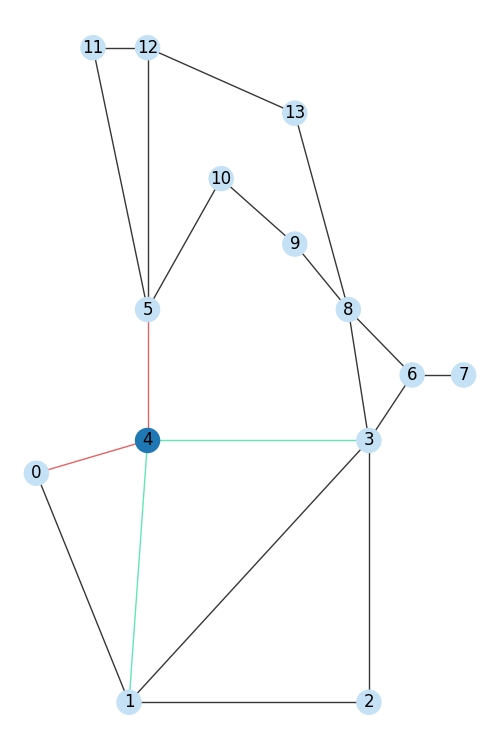
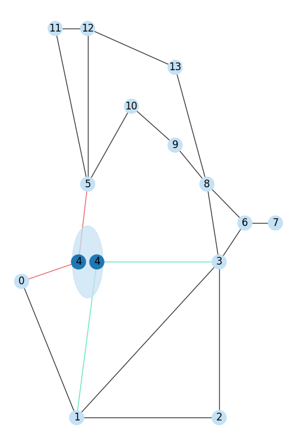

.. _gridgraph-module:

A grid, a graph: grid2op representation of the powergrid
===================================================================

This page is organized as follow:

.. contents:: Table of Contents
    :depth: 3

Objectives
----------------

In this section of the documentation, we will dive a deeper into the "modeling" on which grid2op is based and
especially how the underlying graph of the powergrid is represented and how it can be easily retrieved.

.. note::

    This whole page is a work in progress, and any contribution is welcome !

First, we detail some concepts from the power system community in section
:ref:`powersystem-desc-gridgraph`. Then we explain how this graph is coded in grid2op in section
:ref:`graph-encoding-gridgraph`. Finally, we show some code examples on how to retrieve this graph in
section :ref:`get-the-graph-gridgraph`.

.. _powersystem-desc-gridgraph:

Description of a powergrid adopting the "energy graph" representation
---------------------------------------------------------------------------

A powergrid is traditionally represented as a "graph" (in the mathematical meaning) where:

- nodes / vertices are represented by "buses" (or "busbars"): that is the place that different elements of the grid
  are interconnected. Only "connected" buses are represented in this graph. This means that if no element (*eg* no lines, 
  no loads, no generators, no storage units etc.) is connected to a busbar, then it will not be present in this graph.
- links / edges are represented by "powerlines". Usually, for a graph, it is convenient that there is no "parallel edges".
  This is a property we want to ensure here and this is why when there is 2 powerlines connecting the same buses, they are 
  merged into one edges in this graph.

This graph will be called the "physical graph". It the graph that allows the energy
to be transmitted from the producers to the consumers thanks to the grid.

In the "model" where the electrons transmit the energy (classical model of a
grid where the electrons move), this is the graph on which the electrons can move.

It can be accessed with the function :func:`grid2op.Observation.BaseObservation.get_energy_graph` 
and it is represented as a "networkx" graph.

Nodes attributes
~~~~~~~~~~~~~~~~~~

The nodes of this graph have attributes:

- they have "active power" injected at them. Adopting the "generator" convention, if power injected is positive then some
  power is produced at this node, otherwise power is consumed. This active power is the sum of all power produced /
  consumed for every load, generator, storage units (and optionally shunts) that are connected at this nodes.
  In grid2op (to be consistent with the notations in power system literature) active power is noted "`p`"
- they have "reactive power" injected at them. This "reactive power" is the similar to the active power. Reactive
  power (out of consistency with power system literature) is noted "`q`".
- they have a "voltage magnitude" which is more commonly known as "voltage" in "every day" use. As in the power system
  literature, this "voltage magnitude" is noted "`v`". **NB** For reader mainly familiar with the power system
  notations, "`v`" is a real number here, it is not the "complex voltage" but the voltage magnitude (module of
  the complex voltage)
- they have a "voltage angle" which is the "angle" of the "complex angle" denoted above and is denoted
  "`theta`" and is given in degree (and not in radian!).
  **NB** Depending on the solver that you are using, this might not be available.
- "sub_id": the id of the substation to which this bus belongs.
- "cooldown": if 0 it means you can split or merge this nodes with other nodes at the same substation, otherwise it
  gives the number of steps you need to wait before being able to split / merge it.

.. note::
  See documentation of :func:`grid2op.Observation.BaseObservation.get_energy_graph` for an updated list
  of all available attributes.

Edges attributes
~~~~~~~~~~~~~~~~~~

The edges of this graph have attributes:

- "status": a powerline can be either connected (at both sides) or disconnected. Grid2op does not support, at the moment
  a powerline connected at only one side.
- "thermal_limit": the maximum current (measured in amps) that can flow on the powerline
- "timestep_overflow": the number of steps the powerlines sees a current higher that the maximum flows. It is reset
  to 0 each time the flow falls bellow the thermal limit.
- "cooldown": same concept as the substations, but for powerline. You cannot change its status as frequently as you
  want.
- "rho": which is the relative flow. It is defined as the flow in amps (by default flows are measured on the origin side
  divided by the thermal limit)
- "p_or": the active flow at the origin side of the powerline
- "p_ex": the active flow at the extremity side of the powerline
- "q_or": the reactive flow at the origin side of the powerline
- "q_ex": the reactive flow at the extremity side of the powerline
- "a_or": the current flow at the origin side of the powerline
- "a_ex": the current flow at the extremity side of the powerline
- "v_or": (optional) the voltage magnitude at the origin side of the powerline
- "V_ex": (optional) the voltage magnitude at the extremity side of the powerline
- "theta_or": (optional) the voltage angle at the origin side of the powerline
- "theta_ex": (optional) the voltage angle at the extremity side of the powerline

.. note::
  See documentation of :func:`grid2op.Observation.BaseObservation.get_energy_graph` for an updated list
  of all available attributes.

.. warning::
  The size of this graph (both numuber of edges and number of nodes) can change during the same episode. This will be
  the case if you perform a topological action (for example assigning some elements to the busbar 2 of a substation and
  no elements were connected to this busbar beforehand): in this case, the graph will count one more node.

.. warning::
  By convention, if the observation corresponds to a "game over", then this graph will have only one node and no edge at all.

  This is a convention made in grid2op to ensure some properties about the returned value of the function `obs.get_energy_graph()`.
  Mathematically speaking, in such case, the graph would be empty (no connected bus).

Some clarifications
~~~~~~~~~~~~~~~~~~~~~~~~~~~~~~~~~~~~

Redundant attributes
++++++++++++++++++++++

Some of these variables are redundant, for example:

- if a powerline connects bus `j` with bus `k` (with `j < k`) then `v_or = nodes[j]["v"]`, `theta_or = nodes[j]["v"]`,
  same for the extremity side: `v_ex = nodes[k]["v"]`, `theta_ex = nodes[k]["v"]`
- if two powerlines are connected at the same bus. For example:

    - the powerline id `l_1` is connected (origin side) at the
      bus `j` and the powerline `l_2` is connected (origin side) at this same bus `j` then `v_or (l_1) = v_or (l_2)` and
      `theta_or (l_1) = theta_or (l_2)`
    - if `l_1` is connected on the extremity side at bus `k` and line `l_3` is connected at its origin side
      at the same bus `k` then `v_ex (l_1) = v_or (l_2)` and
      `theta_ex (l_1) = theta_or (l_2)`
    - of course a similar relation holds if `l_1` and `l_2` are both connected at the extremity side on the
      same bus.

Physical equations
+++++++++++++++++++++
All these variables are not independant from one another regardless of the "power system modeling" adopted.

Generally speaking, the graph meets the KCL (Kirchhoff Current Law):

- if you know "v" and "theta" at both sides of the powerline, you can deduce all the "p_or", "q_or",
  "v_or", "theta_or", "p_ex", "q_ex", "v_ex" and "theta_ex" (knowing some "physical" parameters of the powerlines 
  that are not known directly in the grid2op observation but are "somewhere" in the backend.)
- at each bus, the sum of all the "p_or" and "p_ex" and "p" is equal to 0.
- at each bus, the sum of all the "q_or" and "q_ex" and "q" is equal to 0.

Actually, it is by solving these constraints that "everything" is computed by the backend.

.. note::

    Grid2op itself does not compute anything. The task of computing a given consistent state (from a power system point
    of view) is carried out by the `Backend` and only by it.

    This means that nowhere, in grid2op code, you will find anything related to how these variables are linked to
    one another.

    This modularity is really important, because lots of sets of equations can represent a powergrid depending on
    the problem studied. Grid2op does not assume anything regarding the set of equations implemented in the backend.

    Actually, the same grid can be modeled with different sets of equations, leading to different results (in terms
    of flows notably). This is perfectly possible in grid2op: only the backend needs to be changed. All the rest
    can stay the same (*e.g.,* the agent does not need to be changed at all).

The grid is immutable
+++++++++++++++++++++++
Grid2op aims at modeling grid2op operation close to real time.

This is why the powergrid is considered as "fixed" or "immutable" (in the sense that you cannot build new equipment). 
For example, if for a given environment load
with id `j` is connected to substation with id `k` then for all the episodes on this environment, this will
be the case (load cannot be magically connected to another substation), but of course, in this case, this load 
can be switched to either busbar 1 or busbar 2 of its substation `k`. 

This is a property of power system: a load representing a city, in real time, it is not possible to move completly
a city from one place of a State to another. And even if it was possible, it is definitely not desirable (imagine the 
situation: you get back from work to your home, but your house has moved 250km / 200 miles North ...)

This applies to all elements of the grid. For the same environment:

- no load will appear / disappear on the grid (=> `type(env).n_load` never change)
- load will always be connected at the same substation (=> `type(env).load_to_subid` never change)
- no generator will appear / disappear on the grid (=> `type(env).n_gen` never change)
- generator will always be connected at the same substation  (=> `type(env).gen_to_subid` never change)
- no storage units will appear / disappear on the grid (=> `type(env).n_storage` never change)
- storage units will always be connected at the same substation (=> `type(env).storage_to_subid` never change)
- no powerline will appear / disappear on the grid (=> `type(env).n_line` never change)
- powerlines will always connects the same substations, and in this case, grid2op also offer the guarantee that
  origin side will always be connected at the same substation AND extremity side will always be connected at
  the same substation. In other words, the orientation convention adopted to define "origin side" and
  "extremity side" is part of the environment. (=> `type(env).line_or_to_subid` and `type(env).line_ex_to_subid` never change)

.. warning::

    If you decide to code a new `Backend` class, then you need to meet this property. Otherwise things might break.

Not everything can be connected together
+++++++++++++++++++++++++++++++++++++++++++
There are also constraints on what can be done, and what cannot.

For example, it is not possible to connect directly (without powerline) a city in the North East of a State to a
production unit at the South West of the same sate.

To adopt a more precise vocabulary, only elements (load, generator, storage unit, origin side of a powerline,
extremity side of a powerline) that are at the same substation can be directly connected together.

If an element of the grid is connected at substation `j` and another one at substation `k` (with `j` different `k`) 
for a given environment, in absolutely no circumstances these two objects can be directly connected together, 
they will never be connected at the same bus.

To state this constraint a bit differently, a substation can be split in independent buses (multiple nodes
at the same substation) but a bus can only connect elements of the same substation: substation `j` and 
substation `k` (with `j` different `k`) will never have a "bus" in common.

.. note::

    For simplicity (in the problem exposed) grid2op does not allow to have more than 2 independent buses at a
    given substation at time of writing (April 2021).

    Changing this would not be too difficult on grid2op side, but would make the action space even bigger. If you
    really need to use more than 2 buses at the same substation, do not hesitate to fill a feature request: 
    https://github.com/rte-france/Grid2Op/issues/new?assignees=&labels=enhancement&template=feature_request.md&title=

The graph is dynamic
++++++++++++++++++++++
Even though an element is always, under all circumstances, connected at the same substation, it can be connected
at different buses (of its substation) at different step. This is even the main "flexibility" that is studied
with grid2op.

This implies that "the" graph representing the powergrid does not always have the same number of nodes depending
on the step, nor the same number of edges, for example if powerlines are disconnected.

.. note::

    For real powergrid, this is possible to perform such changes in real time without the need to install new
    infrastructure. This is because substations are full of "breakers" and other "switches" that can be opened or
    closed.

    Again, for the sake of simplicity, breakers / switches are not directly modeled in grid2op. An agent /
    environment only needs to know what is connected to what without giving the details on how its done.

    Manipulating breakers / switches is not an easy task and not everything can be done every time in real
    powergrid. The removal of breaker is another simplification made for clarity.

    If you want to model these, it is perfectly possible without too much trouble. You can fill a feature request
    for this if that is interesting to you :
    https://github.com/rte-france/Grid2Op/issues/new?assignees=&labels=enhancement&template=feature_request.md&title=

.. warning::

    The graph of the grid has also the property that more than one powerline can connect the same pair of buses (it is
    the case for parallel powerlines). In this case, these powerlines are "merged" together to get a graph without 
    parralel edges.

Wrapping it up
~~~~~~~~~~~~~~~~~~~~~~~~~~~~~~~~~~~~
The "sequential decision making" modeled by the grid2op aims then at finding good actions to keep the grid in safety
(`flows <= thermal limits` on all powerlines) while allowing consumer to consume as much power as they want.

The possible actions are:

- connecting / disconnecting powerlines
- changing the "topology" of some substations, which consists in merging or splitting buses at some substations
- changing the amount of power some storage units produce / absorb
- changing the production setpoint of the generators (aka redispatching or curtailment)
- producing or absorbing power from storage units.

For more information, technical details are provided in page :ref:`action-module`

.. _graph-encoding-gridgraph:

How the graph of the grid is encoded in grid2op
----------------------------------------------------------------

In computer science, there are lots of way to represent a graph structure, each solution having advantages and drawbacks.
In grid2op, a drastic choice have been made: the graph of the grid will not be explicitly represented (but it can
be computed on request, see section :ref:`get-the-graph-gridgraph`).

Instead, the "graph" of the grid is stored in different vectors:

One set of vectors (fixed, immutable) gives to which substation each element is connected, they are
the `env.load_to_subid`, `env.gen_to_subid`, `env.line_or_to_subid`, `env.line_ex_to_subid` or `env.storage_to_subid`
vectors.

As an example, `env.load_to_subid` is vector that has as many components as there are loads on the grid,
and for each load, it gives the id of the substation to which it is connected. More concretely, if
`env.load_to_subid[load_id] = sub_id` it means that the load of id `load_id` is connected (and will always be!) at
the substation of id `sub_id`

Now, remember (from the previous section) that each object can either be connected on busbar 1 or on busbar 2.
To know the completely graph of the grid, you simply need to know if the element is connected or not, and if
it's connected, whether it is connected to bus 1 or bus 2.

This is exactly how it is represented in grid2op. All objects are assigned (by the Backend, again, this
is immutable and will always be the same for a given environment) to a position.

These positions are given by the `env.load_pos_topo_vect`, `env.gen_pos_topo_vect`, `env.line_or_pos_topo_vect`,
`env.line_ex_pos_topo_vect` or `env.storage_pos_topo_vect`
(see :attr:`grid2op.Space.GridObjects.load_pos_topo_vect` for more information).

And then, in the observation, you can retrieve the state of each object in the "topo_vect" vector: `obs.topo_vect`
(see :attr:`grid2op.Observation.BaseObservation.topo_vect` for more information).

As an exemple, say `obs.topo_vect[42] = 2` it means that the "42nd" element (remember in python index are 0 based,
this is why I put quote on "42nd", this is actually the 43rd... but writing 43rd is more confusing, so we will
stick to "42nd") of the grid is connected to busbar 2 at its substation.

To know what element of the grid is the "42nd", you can:

1) look at the `env.load_pos_topo_vect`, `env.gen_pos_topo_vect`, `env.line_or_pos_topo_vect`,
   `env.line_ex_pos_topo_vect` or `env.storage_pos_topo_vect` and find where there is a "42" there. For example if
   `env.line_ex_pos_topo_vect[line_id] = 42` then you know for sure that the "42nd" element of the grid is, in that
   case the extremity side of powerline `line_id`.
2) look at the table  :attr:`grid2op.Space.GridObjects.grid_objects_types` and especially the line 42 so
   `env.grid_objects_types[42,:]` which contains this information as well. Each column of this table encodes
   for one type of element (first column is substation, second is load, then generator, then origin end of
   powerline then extremity end of powerline and finally storage unit. Each will have "-1" if the element
   is not of that type, and otherwise and id > 0. Taking the same example as for the above bullet point!
   `env.grid_objects_types[42,:] = [sub_id, -1, -1, -1, line_id, -1]` meaning the "42nd" element of the grid
   if the extremity end (because it's the 5th column) of id `line_id` (the other element being marked as "-1").
3) refer to the :func:`grid2op.Space.GridObject.topo_vect_element` for an "easier" way to retrieve information
   about this element. 

.. note::
  As of a few versions of grid2op, if you are interested at the busbar to which (say) load 5 is connected, then Instead
  of having to write `obs.topo_vect[obs.load_pos_topo_vect[5]]` you can directly call `obs.load_bus[5]` (the same applies
  naturally to the other types of objects: *eg* `obs.gen_bus[...]`, `obs.line_or_bus` etc.).

.. _get-the-graph-gridgraph:

How to retrieve "the" graph in grid2op
----------------------------------------------------------------

As of now, we only presented a single graph that could represent the powergrid. This was to simplify the language. In
fact the graph of the grid can be represented in different manners. Some of them will detailed in this section.

A summary of the types of graph that can be used to (sometimes partially) represent a powergrid is:

========================  ======================  =====================================================================
Type of graph             described in            grid2op method
========================  ======================  =====================================================================
"energy graph"            :ref:`graph1-gg`        :func:`grid2op.Observation.BaseObservation.get_energy_graph`
"elements graph"          :ref:`elmnt-graph-gg`   :func:`grid2op.Observation.BaseObservation.get_elements_graph`
"connectivity graph"      :ref:`graph3-gg`        :func:`grid2op.Observation.BaseObservation.connectivity_matrix`
"bus connectivity graph"  :ref:`graph4-gg`        :func:`grid2op.Observation.BaseObservation.bus_connectivity_matrix`
"flow bus graph"          :ref:`graph5-gg`        :func:`grid2op.Observation.BaseObservation.flow_bus_matrix`
========================  ======================  =====================================================================

.. note::

    None of the name of the graph are standard... It's unlikely that searching for "flow bus graph" on google
    will lead to interesting results. Sorry about that.

    We are, however, really interested in having better names there. So if you have some, don't hesitate to
    write an issue on the official grid2op github.

And their respective properties:

========================  ===================  ====================  =======================  =====================
Type of graph             same number of node  same number of edges  encode all observation   has flow information
========================  ===================  ====================  =======================  =====================
"energy graph"            no                   no                     almost                    yes
"elements graph"          yes                  no                     yes                       yes
"connectivity graph"      yes                  no                     no                        no
"bus connectivity graph"  no                   no                     no                        no
"flow bus graph"          no                   no                     no                        yes
========================  ===================  ====================  =======================  =====================

.. _graph1-gg:

Graph1: the "energy graph"
~~~~~~~~~~~~~~~~~~~~~~~~~~~~~~~~~~~~

This graph is the one defined at the top of this page of the documentation. It is the graph "seen" by the energy
when it "flows" from the producers to the consumers.

Each edge is "a" powerline (one or more) and each node is a "bus" (remember: by definition two objects are directly
connected together if they are connected at the same "bus").

.. note:: 
  As stated in the first paragraph of this page:
  
  - an edge of this graph is actually made of multiple powerline "fused" together to avoid issues with "parallele edge"
  - if a bus is disconnected, it is not present on this graph. The number of nodes can change.
  - this graph should be "empty" if the observation comes from a "game over", but it is actually a graph with no
    edge and one single node.
     

This graph can be retrieved using the `obs.get_energy_graph()` command that returns a networkx graph for the entire
observation, that has all the attributes described in :ref:`powersystem-desc-gridgraph`.

You can retrieve it with:

.. code-block:: python

    import grid2op
    env_name = ...  # for example "l2rpn_case14_sandbox"
    env = grid2op.make(env_name)

    # retrieve the state, as a grid2op observation
    obs = env.reset()
    # the same state, as a graph
    state_as_graph = obs.get_energy_graph()

    # attributes of node 0
    print(state_as_graph.nodes[0])

    # print the "first" edge
    first_edge = next(iter(state_as_graph.edges))
    print(state_as_graph.edges[first_edge])

This graph varies in size: the number of nodes on this graph is the number of bus on the grid !

Now, let's do a topological action on this graph, and print the results:

.. code-block:: python

    import grid2op
    import networkx
    import matplotlib.pyplot as plt

    env_name = "l2rpn_case14_sandbox"
    env = grid2op.make(env_name)
    col_no_change = "#c4e1f5"
    col_change = "#1f78b4"
    line_no_change = "#383636"
    line_1 = "#e66363"
    line_2 = "#63e6b6"
    sub_id = 4

    # retrieve the state, as a grid2op observation
    obs = env.reset()
    # the same state, as a graph
    state_as_graph = obs.get_energy_graph()

    ##############################################################################
    # now plot this first graph (use some pretty color and layout...)
    fig, ax = plt.subplots(1, 1, figsize=(5, 7.5))
    # ax = axs[0]
    node_color = [col_no_change for _ in range(env.n_sub)]
    node_color[sub_id] = col_change
    edge_color = [line_no_change for _ in range(env.n_line)]
    edge_color[1] = line_1
    edge_color[9] = line_1
    edge_color[6] = line_2
    edge_color[4] = line_2
    networkx.draw(state_as_graph,
                  pos={i: env.grid_layout[env.name_sub[i]] for i in range(env.n_sub)},
                  node_color=node_color,
                  edge_color=edge_color,
                  labels={i: state_as_graph.nodes[i]["sub_id"] for i in range(env.n_sub)},
                  ax=ax)
    plt.tight_layout()
    plt.show()
    ##############################################################################

    # perform an action to split substation 4 on two buses
    action = env.action_space({"set_bus": {"substations_id": [(sub_id, [1, 2, 2, 1, 1])]}})
    new_obs, *_ = env.step(action)
    new_graph = new_obs.get_energy_graph()

    ##############################################################################
    # now pretty plot it
    fig, ax = plt.subplots(1, 1, figsize=(5, 7.5))
    # ax = axs[0]
    dict_pos = {i: env.grid_layout[env.name_sub[i]] for i in range(env.n_sub)}
    dict_pos[sub_id] = env.grid_layout[env.name_sub[4]][0] - 30, env.grid_layout[env.name_sub[4]][1]
    dict_pos[env.n_sub] = env.grid_layout[env.name_sub[4]][0] + 30, env.grid_layout[env.name_sub[4]][1]
    node_color = [col_no_change for _ in range(env.n_sub + 1)]
    node_color[sub_id] = col_change
    node_color[env.n_sub] = col_change

    edge_color = [line_no_change for _ in range(env.n_line)]
    edge_color[1] = line_1
    edge_color[9] = line_1
    edge_color[8] = line_2
    edge_color[4] = line_2
    circle1 = plt.Circle(env.grid_layout[env.name_sub[4]], 50, color=col_no_change, alpha=0.7)
    ax.add_patch(circle1)
    networkx.draw(new_graph,
                  pos=dict_pos,
                  node_color=node_color,
                  edge_color=edge_color,
                  labels={i: new_graph.nodes[i]["sub_id"] for i in range(env.n_sub+1)},
                  ax=ax)
    plt.tight_layout()
    plt.show()
    ##############################################################################

And this gives:

|grid_graph_1| |grid_graph_2|

As you see, this action have for effect to split the substation 4 on 2 independent buses (one where there are
the two red powerlines, another where there are the two green)

.. note::

    On this example, for this visualization, lots of elements of the grid are not displayed. This is the case
    for the loads, generators and storage units for example.

    For an easier to read representation, feel free to consult the :ref:`grid2op-plot-module`

.. _elmnt-graph-gg:

Graph2: the "elements graph"
~~~~~~~~~~~~~~~~~~~~~~~~~~~~~~~~~~~~

As opposed to the previous graph, this one has a fixed number of **nodes**: each
nodes will represent an "element" of the powergrid. In this graph, there is
`n_sub` nodes each representing a substation and `env.n_busbar_per_sub * n_sub` nodes, each 
representing a "busbar" and `n_load`  nodes each representing a load etc. 
In total, there is then: 
`n_sub + env.n_busbar_per_sub*n_sub + n_load + n_gen + n_line + n_storage + n_shunt` nodes.

Depending on its type, a node can have different properties. 

In this graph, each **edge** represent a link between two elements. The edges
are directed and at time of writing, each "edge" represent the 
"origin node is connected to extremity node". For example, 
if an edge connects nodes `18` to nodes `0` it means that whatever element is 
represented by the node `18` is connected to the element
represented by the node `0`. This is why the number of edges can vary. For 
example if an element is diconnected, then there will not be any "edge"
outgoing from the node represented by this element.

You have access to this graph when you call the :func:`grid2op.Observation.BaseObservation.get_elements_graph` 
function *eg* `elmnt_graph = obs.get_elements_graph()` .
From this graph, you can retrieve every properties of the underlying `Observation` (
if you notice a property missing, please fill a github issue)

Nodes and edges have different attributes depending on their type. The tables bellow show, depending on the value of 
`type` in the nodes (or edges) what will be the attributes.

========================  =========================
Type of the node          described in     
========================  =========================
"substation"              :ref:`sub-elem-g-gg`
"bus"                     :ref:`bus-elem-g-gg`
"load"                    :ref:`load-elem-g-gg`
"gen"                     :ref:`gen-elem-g-gg`
"line"                    :ref:`line-elem-g-gg`
"storage"                 :ref:`storage-elem-g-gg`
"shunt"                   :ref:`shunt-elem-g-gg`
========================  =========================

========================  =========================
Type of the edge          described in     
========================  =========================
"bus_to_substation"       :ref:`bus-elem-g-gg`
"load_to_bus"             :ref:`load-elem-g-gg`
"gen_to_bus"              :ref:`gen-elem-g-gg`
"line_to_bus"             :ref:`line-elem-g-gg`
"storage_to_bus"          :ref:`storage-elem-g-gg`
"shunt_to_bus"            :ref:`shunt-elem-g-gg`
========================  =========================

Graph level properties
+++++++++++++++++++++++

The graph itself has different attributes (accessible by calling `elmnt_graph.graph`):

- `max_step`: represents :attr:`grid2op.Observation.BaseObservation.max_step`
- `current_step`: represents :attr:`grid2op.Observation.BaseObservation.current_step`
- `delta_time`: represents :attr:`grid2op.Observation.BaseObservation.delta_time`
- `year`: represents :attr:`grid2op.Observation.BaseObservation.year`
- `month`: represents :attr:`grid2op.Observation.BaseObservation.month`
- `day`: represents :attr:`grid2op.Observation.BaseObservation.day`
- `hour_of_day`: represents :attr:`grid2op.Observation.BaseObservation.hour_of_day`
- `minute_of_hour`: represents :attr:`grid2op.Observation.BaseObservation.minute_of_hour`
- `day_of_week`: represents :attr:`grid2op.Observation.BaseObservation.day_of_week`
- `time_stamp`: represents :func:`grid2op.Observation.BaseObservation.get_time_stamp`
- `substation_nodes_id`: a numpy array indicating for each substation of the grid, which node 
  of this graph represents it. So `elmnt_graphnodes.nodes[elmnt_graph.graph["substation_nodes_id"][sub_id]]` 
  is the node representing substation `sub_id`
- `bus_nodes_id`: a numpy array indicating for each bus of the grid, which node 
  of this graph represents it. So `elmnt_graphnodes.nodes[elmnt_graph.graph["bus_nodes_id"][bus_id]]` 
  is the node representing bus `bus_id`
- `load_nodes_id`: a numpy array indicating for each load of the grid, which node 
  of this graph represents it. So `elmnt_graphnodes.nodes[elmnt_graph.graph["load_nodes_id"][load_id]]` 
  is the node representing load `load_id`
- `gen_nodes_id`: a numpy array indicating for each generators of the grid, which node 
  of this graph represents it. So `elmnt_graphnodes.nodes[elmnt_graph.graph["gen_nodes_id"][gen_id]]` 
  is the node representing generator `gen_id`
- `line_nodes_id`: a numpy array indicating for each powerlines of the grid, which node 
  of this graph represents it. So `elmnt_graphnodes.nodes[elmnt_graph.graph["line_nodes_id"][line_id]]` 
  is the node representing powerline `line_id`
- `storage_nodes_id`: a numpy array indicating for each storage unit of the grid, which node 
  of this graph represents it. So `elmnt_graphnodes.nodes[elmnt_graph.graph["storage_nodes_id"][sto_id]]` 
  is the node representing storage unit `sto_id`
- `shunt_nodes_id`: a numpy array indicating for each shunts of the grid, which node 
  of this graph represents it. So `elmnt_graphnodes.nodes[elmnt_graph.graph["shunt_nodes_id"][shunt_id]]` 
  is the node representing shunt `shunt_id`

.. _sub-elem-g-gg:

Substations properties
+++++++++++++++++++++++

The first `n_sub` nodes of the graph represent the "substation". The substation have the attributes:

- `id`: which substation does this node represent
- `type`: always "substation"
- `name`: the name of this substation (equal to `obs.name_sub[id]`)
- `cooldown`: corresponds to `obs.time_before_cooldown_sub[id]`

There are no outgoing edges from substation.

.. _bus-elem-g-gg:

Bus properties
+++++++++++++++++++++++

The next `env.n_busbar_per_sub * n_sub` nodes of the "elements graph" represent the "buses" of the grid. They have the attributes:

- `id`: which bus does this node represent (global id: `0 <= id < env.n_busbar_per_sub*env.n_sub`)
- `global_id`: same as "id" 
- `local_id`: which bus (in the substation) does this busbar represents (local id: `1 <= local_id <= env.n_busbar_per_sub`)
- `type`: always "bus"
- `connected`: whether or not this bus is "connected" to the grid.
- `v`: the voltage magnitude of this bus (in kV, optional only when the bus is connected)
- `theta`: the voltage angle of this bus (in deg, optional only when the bus is connected and
  if the backend supports it)

The outgoing edges from the nodes representing buses tells at which substation this bus is connected. These edges are "fixed": 
if they are present (meaning the bus is connected) they always connect the bus to the same substation. They have only
one attribute:

- `type`: always "bus_to_substation"

.. _load-elem-g-gg:

Load properties
++++++++++++++++++++++++

The next `n_load` nodes of the "elements graph" represent the "loads" of the grid. They have attributes:

- `id`: which load does this node represent (between 0 and `n_load - 1`)
- `type`: always "loads"
- `name`: the name of this load (equal to `obs.name_load[id]`)
- `connected`: whether or not this load is connected to the grid
- `local_bus`: (from version 1.9.9) the id (local, so between `1, 2, ..., obs.n_busbar_per_sub`)
  of the bus to which this load is connected
- `global_bus`: (from version 1.9.9) the id (global, so between `0, 1, ..., obs.n_busbar_per_sub * obs.n_sub`)
  of the bus to which this load is connected
- `bus_node_id`: (from version 1.9.9) the id of the node of this graph representing the bus to which the 
  load is connected. This means that if the load is connected, then (node_load_id, bus_node_id) is the
  outgoing edge in this graph.

The outgoing edges from the nodes representing loads tell at which bus this load is connected (for each load,
there is only one outgoing edge). They have attributes:

- `id`: the id of the load concerned
- `type`: always "load_to_bus"
- `p`: the active power going from the bus to the load (corresponds to `obs.load_p[id]`, load convention, in MW)
- `q`: the reactive power going from the bus to the load (corresponds to `obs.load_q[id]`, load convention, in MVAr)
- `v`: voltage magnitude of the bus to which the load is connected (corresponds to `obs.load_v[id]`, in kV )
- `theta`: (optional, only if the backend supports it) the voltage angle of the bus to which the load is connected (corresponds to `obs.load_theta[id]`, in deg)

.. _gen-elem-g-gg:

Generator properties
++++++++++++++++++++++++

The next `n_gen` nodes of the "elements graph" represent the "generators" of the grid. They have attributes:

- `id`: which generator does this node represent (between 0 and `n_gen - 1`)
- `type`: always "gen"
- `name`: the name of this generator (equal to `obs.name_gen[id]`)
- `connected`: whether or not this generator is connected to the grid.
- `target_dispatch`: same as `obs.target_dispatch[id]`, see :attr:`grid2op.Observation.BaseObservation.target_dispatch`
- `actual_dispatch`: same as `obs.actual_dispatch[id]`, see :attr:`grid2op.Observation.BaseObservation.actual_dispatch`
- `gen_p_before_curtail`: same as `obs.gen_p_before_curtail[id]`, see :attr:`grid2op.Observation.BaseObservation.gen_p_before_curtail`
- `curtailment_mw`: same as `obs.curtailment_mw[id]`, see :attr:`grid2op.Observation.BaseObservation.curtailment_mw`
- `curtailment`: same as `obs.curtailment[id]`, see :attr:`grid2op.Observation.BaseObservation.curtailment`
- `curtailment_limit`: same as `obs.curtailment_limit[id]`, see :attr:`grid2op.Observation.BaseObservation.curtailment_limit`
- `gen_margin_up`: same as `obs.gen_margin_up[id]`, see :attr:`grid2op.Observation.BaseObservation.gen_margin_up`
- `gen_margin_down`: same as `obs.gen_margin_down[id]`, see :attr:`grid2op.Observation.BaseObservation.gen_margin_down`
- `local_bus`: (from version 1.9.9) the id (local, so between `1, 2, ..., obs.n_busbar_per_sub`)
  of the bus to which this generator is connected
- `global_bus`: (from version 1.9.9) the id (global, so between `0, 1, ..., obs.n_busbar_per_sub * obs.n_sub`)
  of the bus to which this generator is connected
- `bus_node_id`: (from version 1.9.9) the id of the node of this graph representing the bus to which the 
  generator is connected. This means that if the generator is connected, then (node_gen_id, bus_node_id) is the
  outgoing edge in this graph.

The outgoing edges from the nodes representing generators tell at which bus this generator is connected (for each generator,
there is only one outgoing edge). They have attributes:

- `id`: the id of the generator concerned
- `type`: always "gen_to_bus"
- `p`: the active power going from the bus to the generator (corresponds to `- obs.gen_p[id]`, load convention, in MW)
- `q`: the reactive power going from the bus to the generator (corresponds to `obs.gen_q[id]`, load convention, in MVAr)
- `v`: voltage magnitude of the bus to which the generator is connected (corresponds to `obs.gen_v[id]`, in kV )
- `theta`: (optional, only if the backend supports it) the voltage angle of the bus to which the generator is connected (corresponds to `obs.gen_theta[id]`, in deg)

.. warning::
  For consistency, all data in the "elements graph" uses the same convention (the "load convention"). This means that most of the generator will
  have edges with negative "p" as usually such elements inject power to the grid. So the total power going from the bus to them is negative.

.. _line-elem-g-gg:

Line properties
++++++++++++++++++++++++

The next `n_line` nodes represent the powerlines (including transformers). They have attributes:

- `id`: which line does this node represent (between 0 and `n_line - 1`)
- `type`: always "line"
- `name`: the name of this line (equal to `obs.name_line[id]`)
- `connected`: whether or not this line is connected to the grid (equal to `obs.line_status[id]`)
- `rho`: same as `obs.rho[id]`, see :attr:`grid2op.Observation.BaseObservation.rho`
- `timestep_overflow`: same as `obs.timestep_overflow[id]`, see :attr:`grid2op.Observation.BaseObservation.timestep_overflow`
- `time_before_cooldown_line`: same as `obs.time_before_cooldown_line[id]`, see :attr:`grid2op.Observation.BaseObservation.time_before_cooldown_line`
- `time_next_maintenance`: same as `obs.time_next_maintenance[id]`, see :attr:`grid2op.Observation.BaseObservation.time_next_maintenance`
- `duration_next_maintenance`: same as `obs.duration_next_maintenance[id]`, see :attr:`grid2op.Observation.BaseObservation.duration_next_maintenance`

There are 2 outgoing edges for each powerline, each edge represent a "side" of the powerline. Both these edges have the properties:

- `id`: which line does this node represent (between 0 and `n_line - 1`)
- `type`: always "line_to_bus"
- `side`: "or" or "ex" which side do you have to look at to get this edge. For example, if `side=="or"` 
  then `p` will corresponds to `obs.p_or[id]`, `q` to `obs.q_or[id]` etc.
  and if `side=="ex"` then `p` will corresponds to `obs.p_ex[id]` etc.
- `p`: the active power going from the bus to this side of the line (corresponds to `obs.p_or[id]`
  or `obs.p_ex[id]`, load convention, in MW)
- `q`: the reactive power going from the bus to this side of the line (corresponds to `obs.q_or[id]` 
  or `obs.q_ex[id]`, load convention, in MVAr)
- `v`: voltage magnitude of the bus to which this side of the line is connected (corresponds to `obs.v_or[id]` 
  or `obs.v_ex[id]`, in kV )
- `a`: the current flow on this side of the line (corresponds to `obs.a_or[id]` or `obs.a_or[id]`, in A)
- `theta`: (optional, only if the backend supports it) the voltage angle of the bus to which this side 
  of the line is connected 
  (corresponds to `obs.theta_or[id]` or `obs.theta_ex[id]`, in deg)

.. _storage-elem-g-gg:

Storage properties
++++++++++++++++++++++++

The next `n_storage` nodes represent the storage units. They have attributes:

- `id`: which storage does this node represent (between 0 and `n_storage - 1`)
- `type`: always "storage"
- `name`: the name of this storage unit (equal to `obs.name_storage[id]`)
- `connected`: whether or not this storage unit is connected to the grid2op
- `storage_charge`: same as `obs.storage_charge[id]`, see :attr:`grid2op.Observation.BaseObservation.storage_charge`
- `storage_power_target`: same as `obs.storage_power_target[id]`, see :attr:`grid2op.Observation.BaseObservation.storage_power_target`
- `local_bus`: (from version 1.9.9) the id (local, so between `1, 2, ..., obs.n_busbar_per_sub`)
  of the bus to which this storage unit is connected
- `global_bus`: (from version 1.9.9) the id (global, so between `0, 1, ..., obs.n_busbar_per_sub * obs.n_sub`)
  of the bus to which this storage unit is connected
- `bus_node_id`: (from version 1.9.9) the id of the node of this graph representing the bus to which the 
  storage unit is connected. This means that if the storage unit is connected, 
  then (node_storage_id, bus_node_id) is the
  outgoing edge in this graph.

The outgoing edges from the nodes representing storage units tells at which bus this load is connected (for each load,
there is only one outgoing edge). They have attributes:

- `id`: the id of the storage unit concerned
- `type`: always "storage_to_bus"
- `p`: the active power going from the bus to this side of the line (corresponds to `obs.storage_power[id]`, load convention, in MW)

.. _shunt-elem-g-gg:

Shunt properties
++++++++++++++++++++++++

The next `n_shunt` nodes represent the storage units. They have attributes:

- `id`: which shunt does this node represent (between 0 and `n_shunt - 1`)
- `type`: always "shunt"
- `name`: the name of this shunt (equal to `obs.name_shunt[id]`)
- `connected`: whether or not this shunt is connected to the grid2op
- `local_bus`: (from version 1.9.9) the id (local, so between `1, 2, ..., obs.n_busbar_per_sub`)
  of the bus to which this shunt is connected
- `global_bus`: (from version 1.9.9) the id (global, so between `0, 1, ..., obs.n_busbar_per_sub * obs.n_sub`)
  of the bus to which this shunt is connected
- `bus_node_id`: (from version 1.9.9) the id of the node of this graph representing the bus to which the 
  shunt is connected. This means that if the shunt is connected, 
  then (node_shunt_id, bus_node_id) is the
  outgoing edge in this graph.

The outgoing edges from the nodes representing sthuns tell at which bus this shunt is connected (for each load,
there is only one outgoing edge). They have attributes:

- `id`: the id of the load concerned
- `type`: always "load_to_bus"
- `p`: the active power going from the bus to the shunt (corresponds to `obs._shunt_p[id]`, load convention, in MW)
- `q`: the reactive power going from the bus to the shunt (corresponds to `obs._shunt_q[id]`, load convention, in MVAr)
- `v`: voltage magnitude of the bus to which the shunt is connected (corresponds to `obs._shunt_v[id]`, in kV )

.. _graph3-gg:

Graph3: the "connectivity graph"
~~~~~~~~~~~~~~~~~~~~~~~~~~~~~~~~~~~~
This graph is represented by a matrix (numpy 2d array or sicpy sparse matrix) of
floating point: `0.` means there are no connection between the elements and `1.`.

Each row / column of the matrix represent an element modeled in the `topo_vect` vector. To know
more about the element represented by the row / column, you can have a look at the 
:func:`grid2op.Space.GridObjects.topo_vect_element` function. 

In short, this graph gives the information of "this object" and "this other object" are connected
together: either they are the two side of the same powerline or they are connected to the same bus
in the grid.

In other words the `node` of this graph are the element of the grid (side of line, load, gen and storage)
and the `edge` of this non oriented (undirected / symmetrical) non weighted graph represent the connectivity
of the grid.

It has a fixed number of nodes (number of elements is fixed) but the number of edges can vary.

You can consult the documentation of the :func:`grid2op.Observation.BaseObservation.connectivity_matrix`
for complement of information an some examples on how to retrieve this graph.

.. note::

    This graph is not represented as a networkx graph, but rather as a symmetrical (sparse) matrix.

    It has no informations about the flows. It is a simple graph that indicates whether or not two objects
    are on the same bus or not.

.. _graph4-gg:

Graph4: the "bus connectivity graph"
~~~~~~~~~~~~~~~~~~~~~~~~~~~~~~~~~~~~

This graph is represented by a matrix (numpy 2d array or sicpy sparse matrix) of
floating point: `0.` means there are no connection between the elements and `1.`.

As opposed to the previous "graph" the row / column of this matrix has as many elements as the number of
independant buses on the grid. There are 0. if no powerlines connects the two buses
or one if at least a powerline connects these two buses.

In other words the `nodes` of this graph are the buse of the grid
and the `edges` of this non oriented (undirected / symmetrical) non weighted graph represent the presence 
of powerline connected two buses (basically if there are line with one of its side connecting one of the bus
and the other side connecting the other).

It has a variable number of nodes and edges. In case of game over we chose to represent this graph as
an graph with 1 node and 0 edge.

You can consult the documentation of the :func:`grid2op.Observation.BaseObservation.bus_connectivity_matrix`
for complement of information an some examples on how to retrieve this graph.

.. note::

    This graph is not represented as a networkx graph, but rather as a symmetrical (sparse) matrix.

    It has no information about flows, but simply about the presence / abscence of powerlines between two buses. 
    
    Its size can change.

.. _graph5-gg:

Graph5: the "flow bus graph"
~~~~~~~~~~~~~~~~~~~~~~~~~~~~~~~~~~~~
This graph is also represented by a matrix (numpy 2d array or scipy sparse matrix) of float. It is quite similar 
to the graph described in :ref:`graph4-gg`. The main difference is that instead of simply giving
information about connectivity (0. or 1.) this one gives information about flows 
(either active flows or reactive flows).

It is a directed graph (matrix is not symmetric) and it has weights. The weight associated to each node 
(representing a bus) is the power (in MW for active or MVAr for reactive) injected at this bus 
(generator convention: if the power is positive the power is injected at this graph). The weight associated
at each edge going from `i` to `j` is the sum of the active (or reactive) power of all
the lines connecting bus `i` to bus `j`.

It has a variable number of nodes and edges. In case of game over we chose to represent this graph as
an graph with 1 node and 0 edge.

You can consult the documentation of the :func:`grid2op.Observation.BaseObservation.flow_bus_matrix`
for complement of information an some examples on how to retrieve this graph.

It is a simplified version of the :ref:`graph1-gg` described previously.

.. note::

    This graph is not represented as a networkx graph, but rather as a (sparse) matrix.

    Its size can change.

.. include:: final.rst
  