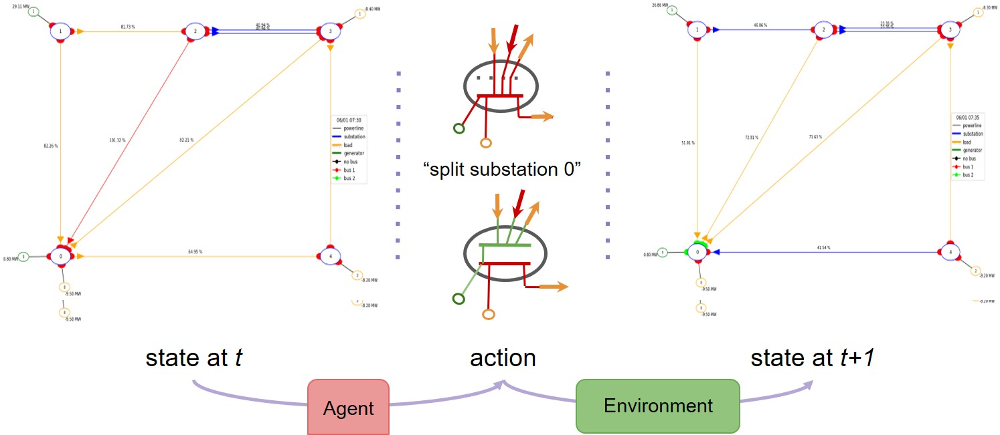

.. Grid2Op documentation master file, created by
   sphinx-quickstart on Wed Jul 24 15:07:20 2019.
   You can adapt this file completely to your liking, but it should at least
   contain the root `toctree` directive.

===============================================
Welcome to Grid2Op's documentation
===============================================

Grid2Op is a pythonic, easy to use framework, to be able to develop, train or evaluate performances of "agent" or
"controller" that acts on a powergrid.

It is modular and can be use to train reinforcement learning agent or to assess the performance of any kind of
agent controlling powergrids (heuristic, machine learning, optimization, mix of everything etc.)

It is highly flexible and can be modified in different ways.

Grid2Op philosophy
--------------------
Grid2Op is a python module that aims to make easier the research on sequential decision making applied to power systems.

This package adopt the "sequential decision making" point of view, for example suited
for training and evaluation "reinforcement learning" agents.

It is made of 4 main blocks:

- a module that will embed all the "external" / "exogenous" data, called the "time series" (formelly call "chronics"). 
  This module for example contain the variation of each and generators.
- a module that will compute the "powerflows", called "backend". It is important to note that grid2op itself 
  assumes nothing on the powergrid. And in theory you can use any solver that you want to compute the state of 
  the grid (static / steady state or dynamic / transient or DC modeling or AC modeling etc. with trafo being modled in `T` or in `Pi`)
- a module that "takes decision", called "action" on the grid based on the current grid state, called "observation" and 
  possible future forecasted grid states
- a module that wrap all the above together and implements a few other feature such as making sure provided actions are "legal"
  (meet certain rules) or even emulating (if the module that compute the grid states does not do it) the behaviour of some 
  "protections".

The goal of grid2op is to model "sequential decision making" that could be made by 
human operators, for example changing the configuration of some "substations" 
as demonstrate in the figure below:

|episode_example|

.. note::
   Any kind of "controller" can be implemented using this framework even though it has been inspired by the
   "reinforcement learning" community. You can implement some heuristic "controllers" (some examples are available in the
   :ref:`agent-module` module description), "controllers" that comes from the Optimization community
   (for example "Optimal Power Flow") or
   "Model Predictive Control". One of the goal of Grid2Op is to allow everyone to contribute to closing the gap
   between all these research communities.

.. note::
   Consecutive steps are "correlated" in the sense that the action taken
   at time `t` is part of the process that defines the state observed at 
   step `t+1`. More information on this is given in the 
   :ref:`mdp-doc-module` for example.

Main module content
---------------------

This is where you can go if you want some quick introduction about grid2op 
or overall view of what is happing when you "run" a scenario using in grid2op.

.. toctree::
   :maxdepth: 1
   :caption: Overview

   quickstart
   grid2op

Usage examples
---------------------

On this part of the documentation we focus on some usage of grid2op in different 
context, for example using optimization or when "wrapping" grid2op into 
a gymnsium compatible environment (with only subset of grid2op capabilities)
to ease training of reinforcement learning agents.

.. toctree::
   :maxdepth: 1
   :caption: Learn with examples

   optimization
   gym
   model_free
   model_based

Modeling
----------

This part of the documentation focuses on the different 
"model" in grid2op. You can find the formal definition
(or at least an attempt at such) for the "Markov Decision Process"
(a mathematical framework used to model sequential decisions making) and 
the how the elements accessible in the observation or modifiable in 
the action of the agent are represented.

You can also find some discussion about the topology of the grid (one 
of the focus of grid2op) and the representation of the grid as a 
graph.

.. toctree::
   :maxdepth: 1
   :caption: Models

   mdp
   modeled_elements
   grid_graph
   topology

Environments
---------------

Here we try to explain rapidly how to load pre existing environment and how some 
customization can make grid2op faster (depending on the context)

.. toctree::
   :maxdepth: 1
   :caption: Focus on an "environment"

   available_envs
   makeenv
   dive_into_time_series
   data_pipeline
   troubleshoot

Plotting capabilities
----------------------

Some plotting capabilities of grid2op. 

.. warning::
   This has not been updated
   for a long time and is maybe not up to date.

.. toctree::
   :maxdepth: 1
   :caption: Plot

   plot

Technical documentation for grid2op users
-------------------------------------------

This part of the documentation is dedicated to grid2op users. It 
covers detailed description of all the modules, classes and their main method
that you, as a user, can use in grid2op.

The documentation there is mainly descirptive. It explains what is done but 
avoid (in general) getting in "too much gory details" on how these 
things are done.

As a starting point, we suggest you first look here before diving more
deeply into the other section of the documentation.

.. toctree::
   :maxdepth: 1
   :caption: Technical documentation for grid2op users

   user

Technical documentation for grid2op "external" contributions
----------------------------------------------------------------

This part of the documentation is focued on external contribution.
It is best suited if you want to use grid2op as a "core" and extend / modify
it with different elements.

For example, you might want to :

- use a different solver to compute powerflows 
  (called :class:`grid2op.Backend.Backend` in grid2op)
- create a new environment
- load time series from a different format than the grid2op default csv
- have an opponent that act differently than the provided ones
- evaluate the performance of the agent differently (change the reward / score function)
- use a different way to control the voltages
- etc.
 
The main focuse of these pages of the documentation is put on the 
interface and still avoid getting into too much detail on how things
are done internally whenever possible.

This is the type of documentation you should be looking at if the 
current grid2op modelling statisfies you in its vast majority 
but if you want to slightly modify one of its component.

.. note::
   This type of contribution can be developed and hosted in a different 
   github repository than grid2op (*eg* lightsim2grid, another faster backend
   is hosted on https://github.com/bdonnot/lightsim2grid.git)

   Feel free to contact us if you have done such an "external contribution" so 
   that we can at least reference it in the documentation.

.. toctree::
   :maxdepth: 1
   :caption: Technical documentation for grid2op "external" contributions

   developer

Technical documentation for grid2op developers
-------------------------------------------------

This part of the documentation also focuses on external contribution. It
focuses on the core of grid2op. If you want to :

- change the grid2op internal representation
- add a functionality to grid2op (*eg* a new type of actions or a new attribute to the observation)
- change the representatino of this or this elements
- etc.

We encourage you to get in touch with us for such development. 

.. note::
   Most of the work falling into this category should probably be 
   integrated into the main grid2op repository.

.. warning:: 
   DOC IN PROGRESS...

.. toctree::
   :maxdepth: 1
   :caption: Technical documentation for grid2op developers

   grid2op_dev

.. include:: final.rst
