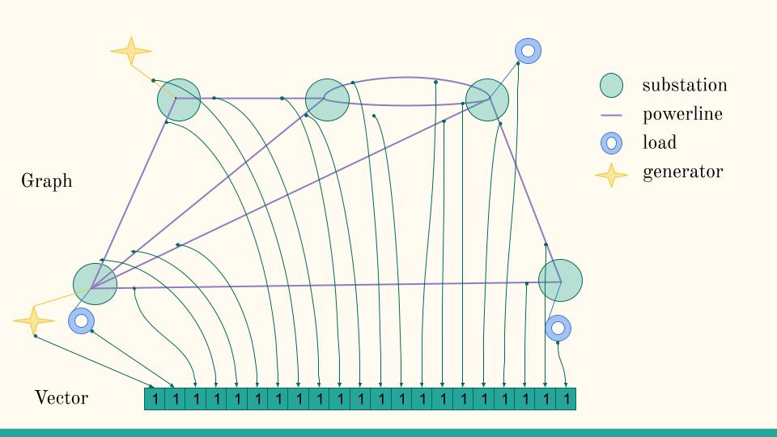
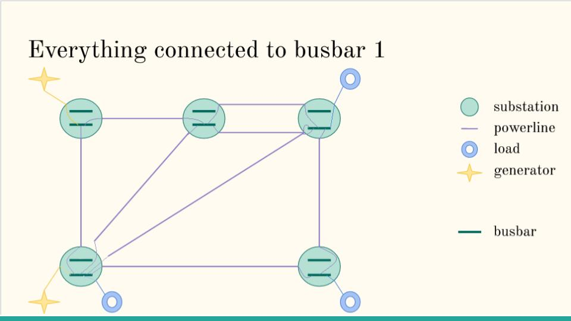
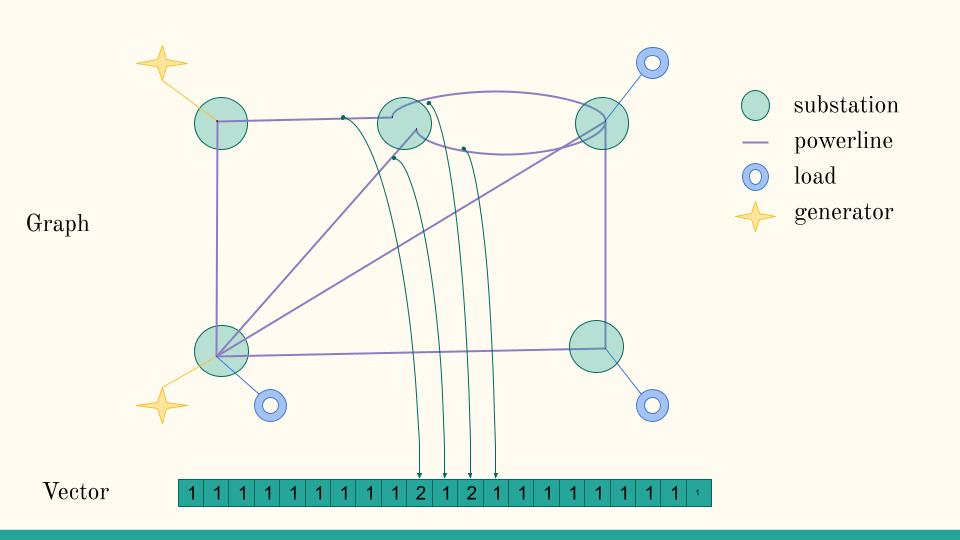

.. |5subs_grid_layout| image:: ./img/5subs_grid_layout.jpg

.. _modeled-elements-module:

Elements modeled in this environment and their main properties
===============================================================

Any grid2op environment model different elements. In this section, we explain what is modeled and what is not. This
page can be usefull:

- if you want to better understand an element of grid. For example you don't really know
  how to access the "production of a generator", in this case you can visit the :ref:`generator-mod-el` section
- or if you are not sure what does "something" refer to. For example, you had a look at the
  "topo_vect" somewhere, but are not really sure what it means. In this case, you can use the
  "search" function of your browser (often "ctrl+f") and search for "topo_vect" that you might find here.
  For this specific example, you can directly go to :ref:`substation-mod-el`.

.. note:: Grid2Op do not assume any "power system" modeling. The backend is the only one responsible
    of maintaining the data it generates consistent from a power system point of view.

    The "modeling" here is to be understood as "data you can receive, and what they mean" and also time
    dependencies when it makes sense.

    It do not presume anything about any powersystem modeling.

The elements modeled are (work in progress):

- :ref:`generator-mod-el`
- :ref:`load-mod-el`
- :ref:`powerline-mod-el`
- :ref:`shunt-mod-el`
- :ref:`storage-mod-el`
- :ref:`substation-mod-el`

Each type of elements will be described in the same way:

- `Description` will present a short description of what is the element
- `Static properties` is the subsection dedicated to the explanation about the properties of the
  given element that are static (same during all the episode) and acessible from all major grid2op
  class. For example "gen_pmin" is a static property of the "generators" and it can be accessed
  with `env.gen_pmin`, `env.action_space.gen_pmin`, `env.observation_space.gen_pmin`, `act.gen_pmin`
  or even `obs.gen_pmin` for example. We do not recommend to alter them.
- `Modifiable attributes` are the attributes than can be modified by the `action`
- `Observable attributes` are the attributs that can be read from the observation. We do not recommend
  to alter them.
- `Equations satisfied` explains the "constraint" of all of the above

This page is organized as follow:

.. contents:: Table of Contents
    :depth: 3

.. _generator-mod-el:

Generators
-----------

Description
~~~~~~~~~~~~~~~~~~
Generators are elements connected to the powergrid who's role mainly consist in producing prower and
maintaining the safety of grid in some conditions (voltage collapse).

An a positive production means the generator produce something, so power is injected from the generator
to the grid.

Grid2op implements different information, available at different level that concerns generators.
A summary of these information is available in the table below:

==========================   =============  ============================================================
Name                         Type            Described in
==========================   =============  ============================================================
n_gen                         int           static, :ref:`generator-stat`
name_gen                      vect, string  static, :ref:`generator-stat`
gen_to_subid                  vect, int     static, :ref:`generator-stat`
gen_to_sub_pos                vect, int     (internal) static, :ref:`generator-stat`
gen_pos_topo_vect             vect, int     static, :ref:`generator-stat`
\* gen_type                   vect, string  static, :ref:`generator-stat`
\* gen_renewable              vect, bool    static, :ref:`generator-stat`
\* gen_pmin                   vect, float   static, :ref:`generator-stat`
\* gen_pmax                   vect, float   static, :ref:`generator-stat`
\* gen_redispatchable         vect, bool    static, :ref:`generator-stat`
\* gen_max_ramp_up            vect, float   static, :ref:`generator-stat`
\* gen_max_ramp_down          vect, float   static, :ref:`generator-stat`
\* gen_min_uptime             vect, int     (currently unused) static, :ref:`generator-stat`
\* gen_min_downtime           vect, int     (currently unused) static, :ref:`generator-stat`
\* gen_cost_per_MW            vect, float   (will change in the near future) static, :ref:`generator-stat`
\* gen_startup_cost           vect, float   (currently unused) static, :ref:`generator-stat`
\* gen_shutdown_cost          vect, float   (currently unused) static, :ref:`generator-stat`
gen_set_bus                   vect, int     action, :ref:`generator-act`
gen_change_bus                vect, bool    action, :ref:`generator-act`
redispatch                    vect, float   action, :ref:`generator-act`
curtail                       vect, float   action, :ref:`generator-act`
prod_p                        vect, float   (internal) action, :ref:`generator-act`
prod_v                        vect, float   (internal) action, :ref:`generator-act`
gen_p                         vect, float   observation, :ref:`generator-obs`
gen_q                         vect, float   observation, :ref:`generator-obs`
gen_v                         vect, float   observation, :ref:`generator-obs`
target_dispatch               vect, float   observation, :ref:`generator-obs`
actual_dispatch               vect, float   observation, :ref:`generator-obs`
gen_bus                       vect, int     observation, :ref:`generator-obs`
curtailment                   vect, float   observation, :ref:`generator-obs`
gen_p_before_curtail          vect, float   observation, :ref:`generator-obs`
curtailment_limit             vect, float   observation, :ref:`generator-obs`
==========================   =============  ============================================================

.. _generator-stat:

Static properties
~~~~~~~~~~~~~~~~~~
Their static properties are:

==========================   =============  =============================================================================================================================================================================================
Name                         Type            Description
==========================   =============  =============================================================================================================================================================================================
n_gen                         int           Total number of generators on the grid
name_gen                      vect, string  Names of all the generators
gen_to_subid                  vect, int     To which substation each generator is connected
gen_to_sub_pos                vect, int     Internal, see :ref:`create-backend-module`
gen_pos_topo_vect             vect, int     Internal, see :ref:`create-backend-module`
\* gen_type                   vect, string  Type of generator, among "nuclear", "hydro", "solar", "wind" or "thermal"
\* gen_renewable              vect, bool    Is the generator "renewable"
\* gen_pmin                   vect, float   Minimum production physically possible for each generator, in MW
\* gen_pmax                   vect, float   Maximum production physically possible for each generator, in MW
\* gen_redispatchable         vect, bool    For each generator, indicates if it can be "dispatched" see the subsection about the action for more information on dispatch
\* gen_max_ramp_up            vect, float   For each generator, indicates the maximum values the power can vary (upward) between two consecutive steps in MW. See the subsection about the equations for more information
\* gen_max_ramp_down          vect, float   For each generator, indicates the maximum values the power can vary (downward) between two consecutive steps in MW. See the subsection about the equations for more information
\* gen_min_uptime             vect, int     (currently unused) For each generator, indicates the minimum time a generator need to be "on" before being turned off.
\* gen_min_downtime           vect, int     (currently unused) For each generator, indicates the minimum time a generator need to be "off" before being turned on again.
\* gen_cost_per_MW            vect, float   (will change in the near future) Cost of production, in $ / MWh (in theory) but in $ / (MW . step) (each step "costs" `prod_p * gen_cost_per_MW`)
\* gen_startup_cost           vect, float   (currently unused) Cost to turn on each generator (in $)
\* gen_shutdown_cost          vect, float   (currently unused) Cost to turn off each generator (in $)
==========================   =============  =============================================================================================================================================================================================

(\* denotes optional properties available only for some environments)

.. warning:: These attributes are static, and we do not recommend to alter them in any way. They are loaded at the
    start of the environment and should not be modified.

    Static attributes are accessible from most grid2op classes, including, but not limited to :
    `env.n_gen`, `act.n_gen`, `obs.n_gen`, `env.action_space.n_gen`, `env.observation_space.n_gen`

.. _generator-act:

Modifiable attributes
~~~~~~~~~~~~~~~~~~~~~~

You can modify the generator in different manner, from an **action** (NB some action do not allow the modification
of some of these attributes). Generators can be affected by both continuous and discrete actions.

- `gen_set_bus`: set the bus to which the generator is connected. Usage: `act.gen_set_bus = [(gen_id, new_bus)]`
  where `gen_id` is the
  id of the generator you want to modify and `new_bus` the bus to which you want to connect it.
- `gen_change_bus`: change the bus to which the generator is connected. Usage: `act.gen_change_bus = gen_id`
  to change the bus of the
  generator with id `gen_id`.
- `redispatch`: will apply some redispatching a generator. Usage: `act.redispatch = [(gen_id, amount)]` to
  apply a redispatching action of `amount` MW on generator `gen_id`
- (internal) change the active production of a generator. Usage `act.update({"injection": {"prod_p": vect}}`
- (internal) change the voltage setpoint of a generator. Usage `act.update({"injection": {"prod_v": vect}}`
- `curtail`: will apply some curtailment on a generator. Usage: `act.curtail = [(gen_id, amount)]` to
  apply a curtailment action of `amount` on generator `gen_id` (**NB** you can also use `curtail_MW` to apply
  some curtailment of a certain MW instead of expressing it as a ratio of `gen_pmax`)

.. note:: See the :ref:`action-module` and in particular the section
    :ref:`action-module-examples` for more information about how to manipulate these properties.

.. _generator-obs:

Observable attributes
~~~~~~~~~~~~~~~~~~~~~~

In this section we explain the generators attributes you can access from an **observation**. These
attributes are:

- `gen_p`: the current active production of each generators, in MW. Usage: `obs.gen_p[gen_id]` will retrieve the
  active production of generator with id `gen_id`
- `gen_q`: the current reactive production of each generators, in MVAr. Usage: `obs.gen_q[gen_id]` will
  get the reactive production of generator with id `gen_id`
- `gen_v`: the voltage of the bus at which the generator is connected, in kV. Usage `obs.gen_v[gen_id]` will
  get the voltage magnitude of the bus at which generator with id `gen_id` is connected.
- `gen_bus`: the bus to which each generators is connected. Usage `obs.gen_bus[gen_id]` will
  get the bus to which generator with id `gen_id` is connected (typically -1, 1 or 2).
- `target_dispatch`: the target values given by the agent to the environment (*eg* using
  `act.redispatch`), in MW. Usage: `obs.target_dispatch[gen_id]`. More information in the "Equations" section.
- `actual_dispatch`: actual dispatch: the values the environment was able to provide as redispatching, in MW.
  Usage: `obs.actual_dispatch[gen_id]`. More information in the "Equations" section.
- `gen_p_before_curtail`: give the amount of production for each renewable generators if no curtailment were applied.
  **NB** by convention it will be 0.0 for non renewable generator
- `curtailment`: give the ratio of curtailment for each generator. **NB** it will always be 0.0 for non
  renewable generator. **NB** the property `curtailment_mw` also exists if you want to convert the curtailment,
  normally expressed in ratio of `gen_pmax` as a curtailment in MW.
- `gen_p_before_curtail`: give the generation that would occur if there is not curtailment
- `curtailment_limit`: add the limits of all the past curtailment actions. (This is given in ration of gen_pmax,
  if you want it in MW you can use `curtailment_limit_mw`)

Satisfied equations
~~~~~~~~~~~~~~~~~~~~~~

Notations
+++++++++++
Let's denote by:

.. math::
    :nowrap:

    \begin{align*}
    \overline{\mathbf{g}} &: \text{maximum active production of all generators (vector)} \\
    \underline{\mathbf{g}} &: \text{minimum active production of all generators (vector)} \\
    \mathbf{\overline{\delta p}} &: \text{maximum ramp up for all generators}  \\
    \mathbf{\underline{\delta p}} &: \text{maximum ramp up for all generators} \\
    \mathbf{r}_t &: \text{vector of all redispatching asked by the agent at step t}  \\
    \mathbf{u}_t &: \text{vector of all active setpoint of all generators at step t}  \\
    \mathbf{h}_t &: \text{vector of all "target dispatch" at step t}  \\
    \mathbf{v}_t &: \text{vector of all "target curtailment" at step t}  \\
    \mathbf{g}_t &: \text{vector of all active productions at step t} \\
    \mathbf{d}_t &: \text{vector of all actual redispatching at step t}  \\
    \mathbf{c}_t &: \text{applied curtailment at step t in MW}  \\
    \mathbf{e}_t &: \text{production of renewable generator if no curtailment is applied}  \\
    \end{align*}

Using the above notation, these vector are accessible in grid2op with:

- :math:`\overline{\mathbf{g}}` = `env.gen_pmax`
- :math:`\underline{\mathbf{g}}` = `env.gen_pmin`
- :math:`\mathbf{\overline{\delta p}}` = `env.gen_max_ramp_up`
- :math:`\mathbf{\underline{\delta p}}` = `env.gen_max_ramp_down`
- :math:`\mathbf{r}_t` = `act.redispatch`
- :math:`\mathbf{u}_t` = `act.prod_p` [typically read from the chronics]
- :math:`\mathbf{h}_t` = `obs.target_dispatch`
- :math:`\mathbf{v}_t` = `act.curtail_mw`
- :math:`\mathbf{g}_t` = `obs.prod_p`  [the production in the observation]
- :math:`\mathbf{d}_t` = `obs.actual_dispatch`
- :math:`\mathbf{c}_t` = `obs.curtailment_mw`
- :math:`\mathbf{e}_t` = `obs.gen_p_before_curtail`

.. note:: Vector are denoted with bold font, like :math:`\mathbf{g}_t` and we will denote the ith component
    of this vector with :math:`g^i_t` (here representing then the active production of generator i at step t).
    We adopt the same naming convention for all the vectors.

    **NB** bold font might not work for some greek letters.

.. warning:: Unless told otherwise, the letters used here to write the equation are only relevant for the
    generators.

    The same letter is used multiple times for different elements described.

Equations
++++++++++
Generators have limit in the maximum / minimum power they can produce, this entails that:

.. math::
    :nowrap:
    :label: pmax

    \[\forall t, \underline{\mathbf{g}} \leq \mathbf{g}_t \leq \overline{\mathbf{g}}\]

Generators are also limited in the maximum / minimum varying power between consecutive steps, this
entails that:

.. math::
    :nowrap:
    :label: ramps

    \[\forall t , - \mathbf{\underline{\delta p}} \leq \mathbf{g}_{t+1} - \mathbf{g}_t \leq \mathbf{\overline{\delta p}}\]

Non dispatchable generators cannot be dispatched:

.. math::
    :nowrap:
    :label: nondispatchable

    \[\forall t, \forall \text{generator } i, "\text{gen. } i \text{ non dispatchable}" \Rightarrow d^i_t = 0\]

Non renewable generators cannot be curtailed:

.. math::
    :nowrap:
    :label: nonrenewable

    \[\forall t, \forall \text{generator } i, "\text{gen. } i \text{ non renewable}" \Rightarrow c^i_t = 0\]

The dispatch actions are added in the "target_dispatch":

.. math::
    :nowrap:
    :label: targetdisp

    \[ \forall t,
        \left\{
        \begin{aligned}
            \mathbf{h}_{t+1} &= \mathbf{h}_t + \mathbf{r}_{t+1} \\
                             &= \sum_{v \leq t+1} \mathbf{r}_{v}
        \end{aligned}
        \right.
    \]

The total generation is the generation decided by the market (or a central authority) which
the agent modified with redispatching (for example because what the market / central authority decided
violate some security rules) or by curtailment:

.. math::
    :nowrap:
    :label: updateg

    \[\forall t, \mathbf{g}_t = \mathbf{u}_t + \mathbf{d}_t\]

The production of a renewable generator takes into account the curtailment that will limit its production. So the
equation :eq:`updateg` is modified as followed:

.. math::
    :nowrap:
    :label: curtailment_limit

    \[ \forall t,  \forall i,  g^i_t = min \{ v^i_t, g^i_t \} \]

And it is possible to retrieve the amount of MW that has been "curtailed" with:

.. math::
    :nowrap:
    :label: curtailmentamount2

    \[ \forall t,  \forall i,  "\text{gen. } i \text{ non renewable}" \Rightarrow
        g^i_t + c^i_t = e^i_t
    \]

The redispatching is not supposed to impact the balancing between production and loads, which is supposed
to be ensured optimally (if the grid had an infinite capacity, by either a market or a central authority) and
neither should this equilibrium be affected by the curtailment. This is why:

.. math::
    :nowrap:
    :label: zerosum

    \[\forall t, \sum_{\text{gen } i} d^i_t - \sum_{\text{gen } i} c^i_t = 0\]

.. _gen_comp_redisp-mod-el:

Compute the redispatching vector
+++++++++++++++++++++++++++++++++

Because the agent do not know :math:`\mathbf{u}_t`, the redispatching action proposed by the agent
:math:`\mathbf{r}_{t}` is unlikely to meet equations :eq:`pmax`, :eq:`ramps`, :eq:`updateg` and
:eq:`zerosum`. This is why there is a difference between what is actually provided as redispatching
by the environment :math:`\mathbf{d}_{t}` and what the agent wanted to get :math:`\mathbf{r}_{t}`.

Currently, the way :math:`\mathbf{d}_{t}` is computed is by minimizing a distance
(based on the ramps) between the target dispatch "desired by the agent" :math:`\mathbf{h}_{t}` and
what is possible to get while satisfying the equations :eq:`pmax`, :eq:`ramps`, :eq:`updateg` and
:eq:`zerosum`. The routine to compute this 'actual dispatch' :math:`\mathbf{d}_{t}` uses the
"SLSQP" method of the `minimize` routine in the `scipy.optimize` module.

.. note:: Equation :eq:`zerosum` holds when they are no storage units on the grid. Please see the
    :ref:`storage-mod-el` section to get the "constraints" effectively implemented on the grid.

.. note:: The variable that can be modified wby the optimisation routine are only the turned on dispatchable
    generators. The other generators (typically solar and ind) but also the storage units,
    are not modified when solving for this problem.

.. _load-mod-el:

Loads
-----------

Description
~~~~~~~~~~~~~~~~~~
A load is an element that consumes power from a powergrid. They are given in the following "sign convention": if a
load is positive, it means power is consumed, if a load is negative it means power is being produced.

.. note:: In case of a grid interconnected with other grids (as of writing, this is the case for the
    "*l2rpn_neurips_2020_track1*" environment), some loads might represent "interconnection powerline". Basically,
    we only represent the "side" of each powerline interconnecting the powergrid from "*l2rpn_neurips_2020_track1*"
    with another non modeled powergrid as a load. This is why in some cases loads can be negative.

    We plan on adding another dedicated element for that in the future, but for now this is how this is.

Grid2op implements different information, available at different level that concerns loads.
A summary of these information is available in the table below:

==========================   =============  ============================================================
Name                         Type            Described in
==========================   =============  ============================================================
n_load                        int           static, :ref:`load-stat`
name_load                     vect, string  static, :ref:`load-stat`
load_to_subid                 vect, int     static, :ref:`load-stat`
load_to_sub_pos               vect, int     (internal) static, :ref:`load-stat`
load_pos_topo_vect            vect, int     (internal) static, :ref:`load-stat`
load_set_bus                  vect, int     action, :ref:`load-act`
load_change_bus               vect, bool    action, :ref:`load-act`
load_p                        vect, float   (internal) action, :ref:`load-act`
load_q                        vect, float   (internal) action, :ref:`load-act`
load_p                        vect, float   observation, :ref:`load-obs`
load_q                        vect, float   observation, :ref:`load-obs`
load_v                        vect, float   observation, :ref:`load-obs`
load_bus                      vect, int     observation, :ref:`load-obs`
==========================   =============  ============================================================

.. _load-stat:

Static properties
~~~~~~~~~~~~~~~~~~
Their static properties are:

===========================  =============  =======================================
Name                          Type           Description
===========================  =============  =======================================
n_load                        int           Total number of loads on the grid
name_load                     vect, string  Names of all the loads
load_to_subid                 vect, int     To which substation each load is connected
load_to_sub_pos               vect, int     Internal, see :ref:`create-backend-module`
load_pos_topo_vect            vect, int     Internal, see :ref:`create-backend-module`
===========================  =============  =======================================

(\* denotes optional properties available only for some environments)

.. warning:: These attributes are static, and we do not recommend to alter them in any way. They are loaded at the
    start of the environment and should not be modified.

    Static attributes are accessible from most grid2op classes, including, but not limited to :
    `env.n_load`, `act.n_load`, `obs.n_load`, `env.action_space.n_load`, `env.observation_space.n_load`

.. _load-act:

Modifiable attributes
~~~~~~~~~~~~~~~~~~~~~~

You can modify the loads in different manner, from an **action** (NB some action do not allow the modification
of some of these attributes). Loads can be affected by both continuous and discrete actions, though the
continous action on loads is for now non accessible to the agent.

- `load_set_bus`: set the bus to which the load is connected. Usage: `act.load_set_bus = [(load_id, new_bus)]`
  where `load_id` is the
  id of the load you want to modify and `new_bus` the bus to which you want to connect it.
- `load_change_bus`: change the bus to which the load is connected. Usage: `act.load_change_bus = load_id`
  to change the bus of the
  load with id `load_id`.
- (internal) change the active consumption of a load. Usage `act.update({"injection": {"load_p": vect}}`
- (internal) change the reactive consumption of a load. Usage `act.update({"injection": {"load_q": vect}}`

.. note:: See the :ref:`action-module` and in particular the section
    :ref:`action-module-examples` for more information about how to manipulate these "properties".

.. _load-obs:

Observable attributes
~~~~~~~~~~~~~~~~~~~~~~

In this section we explain the loads attributes you can access from an **observation**. These
attributes are:

- `load_p`: the current active consumption of each load, in MW. Usage: `obs.load_p[load_id]` will retrieve the
  active production of load with id `load_id`
- `load_q`: the current reactive consumption of each load, in MVAr. Usage: `obs.load_q[load_id]` will
  get the reactive consumption of load with id `load_id`
- `load_v`: the voltage of the bus at which the load is connected, in kV. Usage `obs.load_v[load_id]` will
  get the voltage magnitude of the bus at which load with id `load_id` is connected.
- `load_bus`: the bus to which each load is connected. Usage `obs.load_bus[load_id]` will
  get the bus to which load with id `load_id` is connected (typically -1, 1 or 2).

Equations satisfied
~~~~~~~~~~~~~~~~~~~~~~

The main objective of TSO (:math:`\approx` companies operating powergrids) is to make sure the demand is met at all
times. This is why there are no constraints on the loads. Loads can vary as much as they "want". Agents can only
observe the variation of loads, without being able to perform any intervention on them.

.. note:: More recently, some "new" methods have been developed that could allow TSO, to some extend, to have some
    control on the demand. These methods, known as "*demand side management*" are not available yet in grid2op. Do
    not hesitate to fill a "feature request" if this topic is relevant for you.

.. _powerline-mod-el:

Powerlines
-----------

Description
~~~~~~~~~~~~~~~~~~
Powerlines are "elements" of the grid that allow the power to flow from one part of the grid to another. They
are connecting two different substations.

In grid2op, a powerline is represented by two side: an "origin" side, in the `\*\_line_or\_\*` vectors and an
"extremity" side whose information will be given in the `\*\_line_ex\_\*` vectors.

One of the main objective of TSO, in real time, is to make sure the flows on the powerline do not exceed its capacity.
In grid2op, two "maximum capacties" are modeled. Grid2op will (depending on the
:class:`Parameters.Parameters` used) disconnect automatically powerlines:

- if there are on overflow for too long (known as "time overcurrent (TOC)" see
  this article for more information
  `overcurrent <https://en.wikipedia.org/wiki/Power_system_protection#Overload_and_back-up_for_distance_(overcurrent)>`_ )
  Conceptually this means the environment remember for how long a powergrid is in "overflow" and disconnects it
  if needed. **NB** This is an **emulation** of what happen on the grid, in case you use a Backend that do not have
  this feature (for example if you use static / steady state powerflow). This emulation might not be necessary (and
  less "realistic" if you use a time domain simulator)
- if the overflow is too high (known as "instantaneous overcurrent" see the same
  wikipedia article). This means from one step to another, a given powerline can be disconnected if too much
  flow goes through it. **NB** This is an **emulation** of what happen on the grid, in case you use a Backend that
  do not have
  this feature (for example if you use static / steady state powerflow). This emulation might not be necessary (and
  less "realistic" if you use a time domain simulator)

Grid2op implements different information, available at different level that concerns loads.
A summary of these information is available in the table below:

==========================   =============  ============================================================
Name                         Type            Described in
==========================   =============  ============================================================
n_line                        int           static, :ref:`powerline-stat`
name_line                     vect, string  static, :ref:`powerline-stat`
line_or_to_subid              vect, int     static, :ref:`powerline-stat`
line_ex_to_subid              vect, int     static, :ref:`powerline-stat`
line_or_to_sub_pos            vect, int     static, :ref:`powerline-stat`
line_ex_to_sub_pos            vect, int     static, :ref:`powerline-stat`
line_or_pos_topo_vect         vect, int     static, :ref:`powerline-stat`
line_ex_pos_topo_vect         vect, int     static, :ref:`powerline-stat`
line_or_set_bus               vect, int     action, :ref:`powerline-act`
line_ex_set_bus               vect, int     action, :ref:`powerline-act`
line_ex_change_bus            vect, int     action, :ref:`powerline-act`
line_or_change_bus            vect, int     action, :ref:`powerline-act`
line_set_status               vect, int     action, :ref:`powerline-act`
line_change_status            vect, int     action, :ref:`powerline-act`
a_or                          vect, float   observation, :ref:`powerline-obs`
a_ex                          vect, float   observation, :ref:`powerline-obs`
p_or                          vect, float   observation, :ref:`powerline-obs`
p_ex                          vect, float   observation, :ref:`powerline-obs`
q_or                          vect, float   observation, :ref:`powerline-obs`
q_ex                          vect, float   observation, :ref:`powerline-obs`
v_or                          vect, float   observation, :ref:`powerline-obs`
v_ex                          vect, float   observation, :ref:`powerline-obs`
rho                           vect, float   observation, :ref:`powerline-obs`
line_status                   vect, bool    observation, :ref:`powerline-obs`
timestep_overflow             vect, int     observation, :ref:`powerline-obs`
time_before_cooldown_line     vect, int     observation, :ref:`powerline-obs`
time_next_maintenance         vect, int     observation, :ref:`powerline-obs`
duration_next_maintenance     vect, int     observation, :ref:`powerline-obs`
thermal_limit                 vect, float   observation, :ref:`powerline-obs`
line_or_bus                   vect, int     observation, :ref:`powerline-obs`
line_ex_bus                   vect, int     observation, :ref:`powerline-obs`
==========================   =============  ============================================================

.. note:: A "grid2op powerlines" includes both "powerlines" **and** "transformers" in power system terminology. For
    grid2op, transformers are powerlines.

.. _powerline-stat:

Static properties
~~~~~~~~~~~~~~~~~~
Their static properties are:

===========================  =============  =======================================
Name                          Type           Description
===========================  =============  =======================================
n_line                        int           Total number of lines on the grid
name_line                     vect, string  Names of all the lines
line_or_to_subid              vect, int     To which substation each line (origin side) is connected
line_ex_to_subid              vect, int     To which substation each line (extremity side) is connected
line_or_to_sub_pos            vect, int     Internal, see :ref:`create-backend-module`
line_ex_to_sub_pos            vect, int     Internal, see :ref:`create-backend-module`
line_or_pos_topo_vect         vect, int     Internal, see :ref:`create-backend-module`
line_ex_pos_topo_vect         vect, int     Internal, see :ref:`create-backend-module`
===========================  =============  =======================================

(\* denotes optional properties available only for some environments)

.. warning:: These attributes are static, and we do not recommend to alter them in any way. They are loaded at the
    start of the environment and should not be modified.

    Static attributes are accessible from most grid2op classes, including, but not limited to :
    `env.n_line`, `act.n_line`, `obs.n_line`, `env.action_space.n_line`, `env.observation_space.n_line`

.. _powerline-act:

Modifiable attributes
~~~~~~~~~~~~~~~~~~~~~~

You can modify the powerlines in different manner, from an **action** (NB some action do not allow the modification
of some of these attributes). Powerlines can be affected only by discrete actions.

- `line_or_set_bus`: set the bus to which the origin side of the powerline is connected.
  Usage: `act.line_or_set_bus = [(line_id, new_bus)]`
  where `line_id` is the id of the line (origin side) you want to modify and `new_bus` the bus
  to which you want to connect it.
- `line_ex_set_bus`: set the bus to which the extremity side of the powerline is connected.
  Usage: `act.line_ex_set_bus = [(line_id, new_bus)]`
  where `line_id` is the
  id of the line (extremity side) you want to modify and `new_bus` the bus to which you want to connect it.
- `line_or_change_bus`: change the bus to which the origin side of a powerline is connected.
  Usage: `act.line_or_change_bus = line_id`
  to change the bus of the origin side of line with id `line_id` is connected
- `line_ex_change_bus`: change the bus to which the extremity side of a powerline is connected.
  Usage: `act.line_ex_change_bus = line_id`
  to change the bus of the extremity side of line with id `line_id` is connected
- `line_set_status`: set the status (connected / disconnected) of a powerline.
  Usage: `act.line_set_status = [(line_id, new_status)]`
  where `line_id` is the id of the powerline you want to modify, and `new_status` (-1 or 1) is the the new target
  status. (**NB** when a powerline is disconnected, both its "origin side" and "extremity side" are also disconnected)
- `line_change_status`: change the status of a powerline.
  Usage: `act.line_change_status = line_id`  where `line_id` is the id of the powerline you want to modify.

.. note:: See the :ref:`action-module` and in particular the section
    :ref:`action-module-examples` for more information about how to manipulate these properties.

.. _powerline-obs:

Observable attributes
~~~~~~~~~~~~~~~~~~~~~~

Lots of information concerning powerlines are available in the observation:

- `a_or`: intensity flows (also known as current flows) at the "origin side" of the powerlines, measured
  in Amps (A). Usage: `obs.a_or[line_id]`.
- `a_ex`: intensity flows (also known as current flows) at the "extremity side" of the powerlines, measured
  in Amps (A). Usage: `obs.a_ex[line_id]`.
- `p_or`: active flows at the "origin side" of the powerlines, measured
  in Mega Watt (MW). Usage: `obs.p_or[line_id]`.
- `p_ex`: active flows at the "extremity side" of the powerlines, measured
  in Mega Watt (MW). Usage: `obs.p_ex[line_id]`.
- `q_or`: reactive flows at the "origin side" of the powerlines, measured
  in Mega Volt Amps reactive (MVAr). Usage: `obs.q_or[line_id]`.
- `q_ex`: reactive flows at the "extremity side" of the powerlines, measured
  in Mega Volt Amps reactive (MVAr). Usage: `obs.q_ex[line_id]`.
- `v_or`: voltage magnitude at the bus to which the "origin side" of the powerline is connected, measured
  in kilo Volt (kV). Usage: `obs.v_or[line_id]`.
- `v_ex`: voltage magnitude at the bus to which the "extremity side" of the powerline is connected, measured
  in kilo Volt (kV). Usage: `obs.v_ex[line_id]`.
- `rho`: relative flows on each powerlines. It is the ratio of the flow on the powerline divided by
  its thermal limit. It has no unit (usually between 0. and 1.0. When the powerline is on overflow, then rho > 1.0)
  Usage: `obs.rho[line_id]`.
- `line_status`: gives the status (connected / disconnected) of each powerlines. This is a vector of boolean.
  Usage: `obs.line_status[line_id]`.
- `timestep_overflow`: for each powerline, returns the number of steps since this powerline is on overflow. This is
  given in number of steps (no units). Most of the time it will be 0 meaning the powerline is not on overflow.
  When there is an overflow, this number will increase. If it exceeds
  :attr:`grid2op.Parameters.Parameters.NB_TIMESTEP_OVERFLOW_ALLOWED` then the powerline is automatically disconnected
  by the environment. Usage: `obs.timestep_overflow[line_id]`.
- `time_before_cooldown_line`: number of steps you need to wait before being able to change the status of powerline
  again. It is usually 0, but if if `obs.time_before_cooldown_line[line_id] > 0` you cannot do an action that will
  affect the status of a powerline (this action will be illegal). Usage: `obs.time_before_cooldown_line[line_id]`.
- `time_next_maintenance`: indicates the next scheduled maintenance operation on each of the powerline. See the
  description given in :attr:`grid2op.Observation.BaseObservation.time_next_maintenance` for more information.
  Usage: `obs.time_next_maintenance[line_id]`.
- `duration_next_maintenance`: indicates the duration of the next scheduled maintenance for each powerline. See the
  description given in :attr:`grid2op.Observation.BaseObservation.duration_next_maintenance` for more information.
  Usage: `obs.duration_next_maintenance[line_id]`.
- `thermal_limit`: for each powerline, it gives its "thermal limit" (eg maximum intensity allowed on the powerline).
  Usage: `obs.thermal_limit[line_id]`.
- `line_or_bus`: for each powerline, it gives the busbars (usually -1, 1 or 2) at which the "origin side" of the
  powerline is connected. Usage: `obs.line_or_bus[line_id]`.
- `line_ex_bus`: for each powerline, it gives the busbars (usually -1, 1 or 2) at which the "extremity side" of the
  powerline is connected. Usage: `obs.line_ex_bus[line_id]`.

.. note:: By default, in most grid2op environments, the "Backend" will use an AC modeling of the powergrid.
    This means that losses are taken into account, so most of the time, `obs.p_or + obs.p_ex` will not be 0.00.

    The losses also explains why `obs.a_or` and `obs.a_ex` are not equal (for "real powerline"). They are often
    slightly different.

.. note:: By default, thermal limit are computed on the "origin side" of the powerlines. This means
    that `obs.a_ex` can exceed the thermal limits.

.. _lines-eq:

Satisfied equations
~~~~~~~~~~~~~~~~~~~~~~

In this section, as opposed to the equivalent description of the generators or the storage units, we will not
write any equations. Introducing new notation made this section really unclear and we found that explaining the
concept in english to be more efficient.

Here are the attributes affected by one or more "constraints" on grid2op:

- `act.line_set_status` and `act.line_change_status`:

    - it is not possible to change the status of a powerline
      too regularly. See the description of :attr:`grid2op.Parameters.Parameters.NB_TIMESTEP_COOLDOWN_LINE`
      for more information.
    - at a given step, it is not possible to change the status of too many powerlines. This parameters
      is set in :attr:`grid2op.Parameters.Parameters.MAX_LINE_STATUS_CHANGED` (**NB** this is not affected by
      maintenance or hazards nor by any modification made automatically by the environment)
    - when a powerline is connected for safety reasons, you have to wait for a certain number of steps before
      being able to reconnect it again (see :attr:`grid2op.Parameters.Parameters.NB_TIMESTEP_RECONNECTION`)
    - when a powerline is "under attack" or there is a maintenance happening, this powerline will stay disconnected
      for a given number of steps available in `obs.duration_next_maintenance` or `obs.time_before_cooldown_line`

- `obs.a_or` (sometimes also `obs.a_ex`): the flows on a powerline cannot exceed the `obs.thermal_limit` for too
  long neither become too high (see also :attr:`grid2op.Parameters.Parameters.NO_OVERFLOW_DISCONNECTION` to
  deactivate this behaviour):

     - the maximum number of consecutive steps a powerline can be on overflow is set in
       :attr:`grid2op.Parameters.Parameters.NB_TIMESTEP_OVERFLOW_ALLOWED`
     - the threshold above which a line is instantly disconnected is given in
       :attr:`grid2op.Parameters.Parameters.HARD_OVERFLOW_THRESHOLD`

.. note:: If the flow on a powerline falls below the thermal limit for a given step, then it will reset the
    `obs.timestep_overflow` to 0. for this powerline, even if this does not last for long. It is then possible
    to "play" with this feature to prevent the disconnection of powerlines (disconnect it "manually" just before
    the protections works and reconnect if as soon as possible). This is considered (very) bad practice for
    real time operations though.

.. _shunt-mod-el:

Shunts (optional)
-----------------

Description
~~~~~~~~~~~~~~~~~~
TODO

Static properties
~~~~~~~~~~~~~~~~~~
Their static properties are:

===========================  =============  =======================================
Name                          Type           Description
===========================  =============  =======================================
TODO
===========================  =============  =======================================

(\* denotes optional properties available only for some environments)

.. warning:: These attributes are static, and we do not recommend to alter them in any way. They are loaded at the
    start of the environment and should not be modified.

Modifiable attributes
~~~~~~~~~~~~~~~~~~~~~~

TODO

.. note:: See the :ref:`action-module` and in particular the section
    :ref:`action-module-examples` for more information about how to manipulate these properties.

Observable attributes
~~~~~~~~~~~~~~~~~~~~~~

TODO

Satisfied equations
~~~~~~~~~~~~~~~~~~~~~~

TODO

.. _storage-mod-el:

Storage units (optional)
------------------------

Description
~~~~~~~~~~~~~~~~~~
Storage units are units that can act both as a production or a load. They have typically a certain
maximum energy the can store (when they are storing they take power from the grid to store it) that
can be discharge at any moment for a certain period (providing a certain maximum power for a given period
of time).

In grid2op, storage units have the `load` convention:

- a **positive** power means they are charging and thus **absorb** power from the grid (behaving like **load**)
- a **negative** power means they are discharging, and thus **inject** power to the grid (behaving like **generator**)

These storage units represents facilities that can store power in an industrial fashion. They are
typically pumped storage or batteries for example.

Some inspiration for the modeling of the storage units were provided by the NREL document:
https://www.greeningthegrid.org/news/new-resource-grid-scale-battery-storage-frequently-asked-questions-1

Grid2op implements different information, available at different level that concerns storage units.
A summary of these information is available in the table below:

==============================   =============  ============================================================
Name                             Type            Described in
==============================   =============  ============================================================
n_storage                        int            static, :ref:`storage-stat`
name_storage                     vect, str      static, :ref:`storage-stat`
storage_to_subid                 vect, int      static, :ref:`storage-stat`
storage_to_sub_pos               vect, int      static, :ref:`storage-stat`
storage_pos_topo_vect            vect, int      static, :ref:`storage-stat`
storage_type                     vect, str      static, :ref:`storage-stat`
storage_Emax                     vect, float    static, :ref:`storage-stat`
storage_Emin                     vect, float    static, :ref:`storage-stat`
storage_max_p_prod               vect, float    static, :ref:`storage-stat`
storage_max_p_absorb             vect, float    static, :ref:`storage-stat`
storage_marginal_cost            vect, float    static, :ref:`storage-stat`
storage_loss                     vect, float    static, :ref:`storage-stat`
storage_charging_efficiency      vect, float    static, :ref:`storage-stat`
storage_discharging_efficiency   vect, float    static, :ref:`storage-stat`
storage_set_bus                  vect, int      action, :ref:`storage-act`
storage_change_bus               vect, int      action, :ref:`storage-act`
storage_p                        vect, float    action, :ref:`storage-act`
storage_power                    vect, float    observation, :ref:`storage-obs`
storage_power_target             vect, float    observation, :ref:`storage-obs`
storage_charge                   vect, float    observation, :ref:`storage-obs`
storage_bus                      vect, float    observation, :ref:`storage-obs`
==============================   =============  ============================================================

.. _storage-stat:

Static properties
~~~~~~~~~~~~~~~~~~
Their static properties are:

===============================  =============  =======================================
Name                             Type           Description
===============================  =============  =======================================
n_storage                        int            Number of storage units on the grid
name_storage                     vect, str      Name of each storage units
storage_to_subid                 vect, int      Id of the substation to which each storage units is connected
storage_to_sub_pos               vect, int      Internal, see :ref:`create-backend-module`
storage_pos_topo_vect            vect, int      Internal, see :ref:`create-backend-module`
storage_type                     vect, str      Type of storage, among "battery" or "pumped_storage"
storage_Emax                     vect, float    For each storage unit, the maximum energy it can contains, in MWh
storage_Emin                     vect, float    For each storage unit, the minimum energy it can contains, in MWh
storage_max_p_prod               vect, float    For each storage unit, the maximum power it can give to the grid, in MW
storage_max_p_absorb             vect, float    For each storage unit, the maximum power it can take from the grid, in MW
storage_marginal_cost            vect, float    For each storage unit, the cost for taking / adding 1 MW to the grid, in $
storage_loss                     vect, float    For each storage unit, the self discharge, in MW, of the unit
storage_charging_efficiency      vect, float    For each storage unit, the "charging efficiency" (see bellow)
storage_discharging_efficiency   vect, float    For each storage unit, the "discharging efficiency" (see bellow)
===============================  =============  =======================================

(\* denotes optional properties available only for some environments)

The `storage_charging_efficiency` is a float between 0. and 1. If it's 1.0 it means that if the storage unit
absorb 1MW from the grid during 1h period, then 1MWh are added to the state of charge. If this efficiency is 0.5
then if 1MW is absorbed by the storage unit from the grid then only 0.5MWh will be stored in the unit.

It works symmetrically for `storage_discharging_efficiency`. For a storage unit, having a
`storage_discharging_efficiency` of 0.5 means that if the unit provide 1MW to the grid for 1h, then its
state of charge has been reduced by 2MWh (it would have been reduced by only 1MWh if this
efficiency was 1.0).

.. warning:: These attributes are static, and we do not recommend to alter them in any way. They are loaded at the
    start of the environment and should not be modified.

    Static attributes are accessible from most grid2op classes, including, but not limited to :
    `env.n_storage`, `act.n_storage`, `obs.n_storage`, `env.action_space.n_storage`, `env.observation_space.n_storage`

.. _storage-act:

Modifiable attributes
~~~~~~~~~~~~~~~~~~~~~~

You can modify the generator in different manner, from an **action** (NB some action do not allow the modification
of some of these attributes).

- `storage_set_bus`: set the bus to which the storage unit is connected.
  Usage: `act.storage_set_bus = [(stor_id, new_bus)]` where `stor_id` is the
  id of the storage unit you want to modify and `new_bus` the bus to which you want to connect it.
- `storage_change_bus`: change the bus to which the storage unit is connected.
  Usage: `act.storage_change_bus = stor_id` to change the bus of the
  storage unit with id `stor_id`.
- `storage_p`: will tell the storage unit you want to get a given amount of power on the grid.
  Usage: `act.storage_p = [(stor_id, amount)]` to
  tell the storage unit `stor_id` to produce / absorb `amount` MW for the grid for the next step.

.. note:: See the :ref:`action-module` and in particular the section
    :ref:`action-module-examples` for more information about how to manipulate these properties.

.. _storage-obs:

Observable attributes
~~~~~~~~~~~~~~~~~~~~~~

In this section we explain the storage unit attributes you can access from an **observation**. These
attributes are:

- `storage_charge`: the state of charge of each storage unit, in MWh. Usage: `obs.storage_charge[sto_id]`
- `storage_power_target`: the power that was required from the last action of the agent, in MW
- `storage_power`: the power that is actually produced / absorbed by every storage unit.
- `storage_bus`: for each storage unit, it gives the busbars (usually -1, 1 or 2) at which it is connected.

Satisfied equations
~~~~~~~~~~~~~~~~~~~~~~

Notations
+++++++++++

Let's denote by:

.. math::
    :nowrap:

    \begin{align*}
        \Delta t & : \text{duration of a step (scalar  - usefull to get the energy from the power and vice versa)} \\
        \overline{\mathbf{E}} &: \text{maximum capacity of each of the storage units (vector)} \\
        \underline{\mathbf{E}} &: \text{maximum capacity of each of the storage units (vector)} \\
        \mathbf{\overline{p}} &: \text{maximum power that can be absorbed by the storage units (vector)}  \\
        \mathbf{\underline{p}} &: \text{maximum power that can be produced by the storage units (vector)} \\
        \mathbf{\overrightarrow{\rho}} &: \text{storage charging efficiency (vector)} \\
        \mathbf{\overleftarrow{\rho}} &: \text{storage discharging efficiency (vector)} \\
        \mathbf{l} &: \text{storage loss (vector)} \\
        \mathbf{u}_t &: \text{vector of all power consumption setpoint of all storage units at step t}  \\
        \mathbf{e}_t &: \text{vector representing the state of charge of the storage units at step t}  \\
        \mathbf{p}_t &: \text{vector of all actual consumption of all storage units at step t}  \\
    \end{align*}

Using the above notation, these vector are accessible in grid2op with:

- :math:`\overline{\mathbf{E}}` = `env.storage_Emax`
- :math:`\underline{\mathbf{E}}` = `env.storage_Emin`
- :math:`\mathbf{\overline{p}}` = `env.storage_max_p_absorb`
- :math:`\mathbf{\underline{p}}` = `env.storage_max_p_prod`
- :math:`\mathbf{\overrightarrow{\rho}}` = `env.storage_charging_efficiency`
- :math:`\mathbf{\overleftarrow{\rho}}` = `env.storage_discharging_efficiency`
- :math:`\mathbf{l}` = `env.storage_loss`
- :math:`\mathbf{u}_t` = `act.storage_p`  [the production / consumption setpoint, in the action]
- :math:`\mathbf{p}_t` = `obs.storage_power`  [the actual production / consumption, in the observation]
- :math:`\mathbf{e}_t` = `obs.storage_charge`

.. note:: Vector are denoted with bold font, like :math:`\mathbf{e}_t` and we will denote the ith component
    of this vector with :math:`e^i_t` (here representing then the active state of charge of
    storage unit i at step t).
    We adopt the same naming convention for all the vectors.

    **NB** bold font might not work for some greek letters.

.. warning:: Unless told otherwise, the letters used here to write the equation are only relevant for the
    generators.

    It can happen the same letter is used multiple times for different element.

Equations
++++++++++

In any case, the charge cannot be negative, and cannot be above the maximum (no there is not error here,
in some cases, the state of charge can appear to be slightly below the minimum, because of the losses):

.. math::
    :nowrap:
    :label: storagemax

    \[\forall t, 0 \leq \mathbf{e}_t \leq \overline{\mathbf{E}} \]

The storage charging / discharging equations are (keep in mind these are not the production / consumption
setpoint given in the action, but the production / setpoint available in the observation):

.. math::
    :nowrap:
    :label: charging

    \[ \forall \text{step } t, \forall \text{storage units } j,
        \left\{
        \begin{aligned}
            \text{if } p^j_t > 0, & e^j_t = e^j_t + \overrightarrow{\rho} . p^j_t . \Delta t & \text{ battery is charging} \\
            \text{if } p^j_t < 0, & e^j_t = e^j_t + \frac{1.0}{\overleftarrow{\rho}} . p^j_t . \Delta t & \text{ battery is discharging}
        \end{aligned}
        \right.
        \label{eq:charging}
    \]

There is a difference between the power setpoint and the actual implementation, mainly because there are
some constraint in the total amount of energy that can be stored in the unit. This translates into
a difference between the implemented storage production / consumption :math:`\mathbf{p}_t` and a the
setpoint in the action :math:`\mathbf{u}_t`:

.. math::
    :nowrap:
    :label: storageactual

    \[
        \begin{aligned}
            \min_{\mathbf{p}_t} & \left|\left| \mathbf{p}_t - \mathbf{u}_t \right|\right| \\
            \text{s.t.} & \\
                        & \text{if } p^j_t > 0, e^i_t + \overrightarrow{\rho} . p^j_t . \Delta t \leq \overline{\mathbf{E}}^i \\
                        & \text{if } p^j_t < 0, e^i_t + \frac{1.0}{\overleftarrow{\rho}} . p^j_t . \Delta t \geq \underline{\mathbf{E}}^i
        \end{aligned}
    \]

Currently this problem is not solved using an optimisation routine, but rather, if one of the constraints of
the :eq:`storageactual` is not met then the action is caped at the right value (*eg* if
:math:`e^j_t + \overrightarrow{\rho} . p^j_t > \overline{\mathbf{E}}^i` for one :math:`j` then
solving for :math:`p^j_t` the equation :math:`e^j_t + \overrightarrow{\rho} . p^j_t = \overline{\mathbf{E}}^j`)

As for the redispatching, the modification of the storage production / consumption
is not supposed to impact the balancing between production and loads, which is ensured by "the market"
(or a central authority). This means that, in case of presence of storage unit, the :eq:`zerosum`
showed in the :ref:`generator-mod-el` is modified as followed:

.. math::
    :nowrap:
    :label: storagemodif

    \[\forall t, \sum_{\text{gen } i} d^i_t - \sum_{\text{gen } i} c^i_t + \sum_{\text{storage } j} p^j_t = 0\]

In the current implementation, this is done by substuting the equation :eq:`storagemodif` instead of
equation :eq:`zerosum` when solving
the optimization routine detailed in :ref:`gen_comp_redisp-mod-el`. The storage units are **NOT** modified
by this optimization routine.

Last, but not least, the storage loss is taken into account as followed:

.. math::
    :nowrap:
    :label: storageloss

    \[\forall t, \mathbf{e}_{t+1} = \mathbf{e}_{t} - \mathbf{l}.\Delta t \]

The equation :eq:`storageloss` supposes that :math:`\mathbf{e}_{t}` has been updated with the equations
:eq:`storagemax`, :eq:`charging`, :eq:`storageactual` and :eq:`storagemodif` (this means that we do not,
for clarity, added "temporary" notations for the results of each computations in
:eq:`storagemax`, :eq:`charging`, :eq:`storageactual` and :eq:`storagemodif`, which would have been more rigourous
but harder to read)

.. note:: This is why, in the observation, you can get a "state of charge" (`obs.storage_charge`,
    :math:`\mathbf{e}_t`) below `obs.storage_Emin` (*aka* :math:`\underline{\mathbf{E}}`) because of the losses.

    If that is the case at one step, even if no action is done by the agent, then some power will be taken
    from the grid to charge the storage unit until its "minimum capacity" is met.

    When this happens, the storage charge will remain unchanged (and slightly below `obs.storage_Emin`) but some
    "infinite" amount of power will be taken from the grid to the storage unit. This is consistent with reality:
    you would need to keep the battery charged to compensate for the losses if you want to maintain it a given
    charge.

    This phenomenon explains that the losses should be lower than the maximum charging capacity of the storage
    units. Otherwise, the storage would be "doomed" to be discharged and nothing could be done about it, which
    would make a relatively uninteresting unit for "real" grid.

.. _substation-mod-el:

Substations
--------------

Description
~~~~~~~~~~~~~~~~~~
A "substation" is a place (that exists, you can touch it) 
where "elements" (side of a powerline, a load, a generator or
a storage unit) belonging to the powergrid are connected all together.

Substations are connected to other substation with powerlines (this is why powerline have two "sides": one for
each substation they are connecting).

In most powergrid around the world, substations are made of multiple "busbars". In grid2op we supposes that
every "elements" connected to a substation can be connected to every busbars in the substation. This is mainly
done for simplicity, for real powergrid it might not be the case.

In earlier grid2op versions, we also assumed that, for simplicity,
each substations counts exactly 2 distincts busbars. Starting from grid2op 1.9.9, it is possible
when you create an environment, to specify how many busbars are available in each substation. You can 
customize it with:

.. code-block:: python

    import grid2op
    env_name = "l2rpn_case14_sandbox"

    env_2_busbars = grid2op.make(env_name)  # default
    env_2_busbars_bis = grid2op.make(env_name, n_busbar=2)  # same as above

    # one busbar
    env_1_busbar = grid2op.make(env_name, n_busbar=1)
    #NB: topological action on substation (set_bus, change_bus) are not possible in this case !

    # 3 busbars
    env_3_busbars = grid2op.make(env_name, n_busbar=3)
    #NB: "change_bus" type of actions are not possible (it would be ambiguous - non unique-
    #    on which busbar you want to change them)

    # 10 busbars
    env_10_busbars = grid2op.make(env_name, n_busbar=10)
    #NB: "change_bus" type of actions are not possible (it would be ambiguous - non unique-
    #    on which busbar you want to change them)

At the initial step (right after `env.reset()`), for all environment available 
at the time of writing (february 2021) every objects were connected to the busbar 1 
of their substation. This is not a requirement of grid2op, but it was the case
for every environments created.

.. _topology-pb-explained:

Rephrasing the topology control problem
++++++++++++++++++++++++++++++++++++++++++++++++++++
Here is a representation of a powergrid with 5 substations:

|5subs_grid_layout|

The "graph of the grid" can be represented as a vector, given, for each element whether the element is
connected at busbar 1 or busbar 2. This can be done by assigning to each "element" of the grid a "component"
of the "topology vector". This "component" will then encode whether this "element" is connected
to busbar 1 or busbar 2. For example, if everything is connected at busbar 1,
we get the following representation

|5subs_grid_5_sub1_graph|

(we denoted arrow to explicitly map the "element" of the grid, to its corresponding component of the vector)

Now, as an example let's consider we modify the busbar at which 2 elements were connected,
this gives the following representation

|5subs_grid_5_sub1_2_graph|

As you can see, in this example, the number of "nodes" in the graph is affected. Originally there were 5 "nodes"
on the graph, but after setting to "busbar 2" two elements, there is 6. Indeed, as we can see on substation 2 above,
there 2 independent nodes ("buses") on this last image, whereas there is only 1

The set of problems tackled in grid2op are then to find the best "topology vector" (a specific representation
of the powergrid, as explained in this paragraph) such that the contraints exposed on *eg*
in paragraph ":ref:`lines-eq`" of the "Lines" section are
met at any times.

.. note:: If two objects are not connected to the same substation, they cannot be connected together.

Attributes of the substations
+++++++++++++++++++++++++++++++

Grid2op implements different information, available at different level that concerns the substations.
A summary of these information is available in the table below:

==============================   =============  ============================================================
Name                             Type            Described in
==============================   =============  ============================================================
n_sub                            int            static, :ref:`sub-stat`
sub_info                         vect, int      static, :ref:`sub-stat`
dim_topo                         int            static, :ref:`sub-stat`
name_sub                         vect, str      static, :ref:`sub-stat`
set_bus                          vect, int      action, :ref:`sub-act`
change_bus                       vect, int      action, :ref:`sub-act`
topo_vect                        vect, int      observation, :ref:`sub-obs`
time_before_cooldown_sub         vect, int      observation, :ref:`sub-obs`
==============================   =============  ============================================================

.. _sub-stat:

Static properties
~~~~~~~~~~~~~~~~~~
Their static properties are:

===========================  =============  =======================================
Name                          Type           Description
===========================  =============  =======================================
n_sub                         int            Total number of substation on the grid
sub_info                      vect, int      For each substations, gives the number of elements (side of powerline, load, generator or storage unit) connected to it.
dim_topo                      int            Total number of elements (side of powerline, load, generator or storage unit) on the grid
name_sub                      vect, str      Name of each substation
===========================  =============  =======================================

(\* denotes optional properties available only for some environments)

.. warning:: These attributes are static, and we do not recommend to alter them in any way. They are loaded at the
    start of the environment and should not be modified.

    Static attributes are accessible from most grid2op classes, including, but not limited to :
    `env.n_sub`, `act.n_sub`, `obs.n_sub`, `env.action_space.n_sub`, `env.observation_space.n_sub`

.. _sub-act:

Modifiable attributes
~~~~~~~~~~~~~~~~~~~~~~

These are the attribute of the **action** you can use to affect the substation. The substation can be only
affected by discrete action for the moment.

- `set_bus`: perform an action of type `set_bus` on a given set of elements.
  Usage: `act.set_bus = [(el_id, new_bus)]` to set the bus of the element with id `el_id` to `new_bus` (typically
  `new_bus` is -1, 1 or 2)
- `change_bus`: perform an action of type `change_bus` on a given set of elements.
  Usage: `act.set_bus = [el_id]`

.. note:: See the :ref:`action-module` and in particular the section
    :ref:`action-module-examples` for more information about how to manipulate these properties.

Links with the \*\*\*_set_bus
++++++++++++++++++++++++++++++
In this paragraph, we explain the links there are between the `act.set_bus` and the `act.line_or_set_bus`,
`act.line_ex_set_bus`, `act.load_set_bus`, `act.gen_set_bus` or `act.storage_set_bus`.

Basically it works the same way, and all of the above allows to do the same thing, albeit a bit differently.

Originally, only the `act.set_bus` was present and the others were added for convenience. Basically:

- `act.line_or_set_bus = [(line_id, new_bus)]` is exactly equivalent to
  `act.set_bus = [(act.line_or_pos_topo_vect[line_id], new_bus)]` and we also have:
  `act.line_ex_set_bus == act.set_bus[act.line_or_pos_topo_vect]`
- `act.line_ex_set_bus = [(line_id, new_bus)]` is exactly equivalent to
  `act.set_bus = [(act.line_ex_pos_topo_vect[line_id], new_bus)]` and we also have:
  `act.line_ex_set_bus == act.set_bus[act.line_ex_pos_topo_vect]`
- `act.load_set_bus = [(load_id, new_bus)]` is exactly equivalent to
  `act.set_bus = [(act.load_pos_topo_vect[load_id], new_bus)]` and we also have:
  `act.load_set_bus == act.set_bus[act.load_pos_topo_vect]`
- `act.gen_set_bus = [(gen_id, new_bus)]` is exactly equivalent to
  `act.set_bus = [(act.gen_pos_topo_vect[gen_id], new_bus)]` and we also have:
  `act.gen_set_bus == act.set_bus[act.gen_pos_topo_vect]`
- `act.storage_set_bus = [(storage_id, new_bus)]` is exactly equivalent to
  `act.set_bus = [(act.storage_pos_topo_vect[storage_id], new_bus)]` and we also have:
  `act.storage_set_bus == act.set_bus[act.storage_pos_topo_vect]`

Links with the \*\*\*_change_bus
+++++++++++++++++++++++++++++++++

It is exactly the same behaviour as described in the section above, for exactly the same reason. We have:

- `act.line_or_change_bus = [line_id]` is exactly equivalent to
  `act.change_bus = [act.line_or_pos_topo_vect[line_id]]` and we also have:
  `act.line_ex_change_bus == act.change_bus[act.line_or_pos_topo_vect]`
- `act.line_ex_change_bus = [line_id]` is exactly equivalent to
  `act.change_bus = [act.line_ex_pos_topo_vect[line_id]]` and we also have:
  `act.line_ex_change_bus == act.change_bus[act.line_ex_pos_topo_vect]`
- `act.load_change_bus = [load_id]` is exactly equivalent to
  `act.change_bus = [act.load_pos_topo_vect[load_id]]` and we also have:
  `act.load_change_bus == act.change_bus[act.load_pos_topo_vect]`
- `act.gen_change_bus = [gen_id]` is exactly equivalent to
  `act.change_bus = [act.gen_pos_topo_vect[gen_id]]` and we also have:
  `act.gen_change_bus == act.change_bus[act.gen_pos_topo_vect]`
- `act.storage_change_bus = [storage_id]` is exactly equivalent to
  `act.change_bus = [act.storage_pos_topo_vect[storage_id]]` and we also have:
  `act.storage_change_bus == act.change_bus[act.storage_pos_topo_vect]`

.. _sub-obs:

Observable attributes
~~~~~~~~~~~~~~~~~~~~~~

- `topo_vect`: for each element of the grid, gives on which busbar this elemement is connected. The busbar "id" will
  be `-1` if the object is disconnected, `1` if the element is connected on busbar 1, `2` if this this element
  is connected to busbar 2. Usage: `obs.topo_vect[el_id]` to retrieve on which busbar the element of id `el_id` is
  connected.
- `time_before_cooldown_sub`: number of steps you need to wait before being able to change the topology of each
  substation again. It is usually 0, but if if `obs.time_before_cooldown_sub[sub_id] > 0`
  you cannot do an action that will
  affect the bus (by `change_bus` or `set_bus`) to which any element connected at substation `sub_id`
  (this action will be illegal).
  Usage: `obs.time_before_cooldown_line[line_id]`.

.. note:: Only the "vector representation" is presented by default in the observation. To convert this representation
  to a "graph" you can consult the section ":ref:`observation_module_graph`" of the Observation description to
  convert retrieve a graph of the grid corresponding to this sate.

Satisfied equations
~~~~~~~~~~~~~~~~~~~~~~

In this section, as opposed to the equivalent description of the generators or the storage units, we will not
write any equations. Introducing new notation made this section really unclear and we found that explaining the
concept in english to be more efficient.

Here are the attributes affected by one or more "constraints" on grid2op:

- `act.set_bus` and `act.change_bus`: you cannot modify the topology too frequently (the maximum frequency is
  given in the :class:`grid2op.Parameters.Parameters.NB_TIMESTEP_COOLDOWN_SUB`). When it is not possible to
  change the topology of a substation, then the `obs.time_before_cooldown_sub` will be `> 0` for this substation.

.. include:: final.rst
