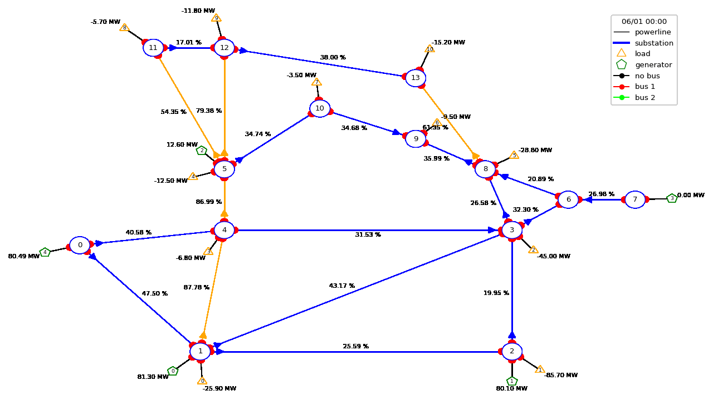

.. currentmodule:: grid2op.PlotGrid

Grid2Op Plotting capabilities (beta)
=====================================

Objectives
-----------
This module contrains all the plotting utilities of grid2op. These utilities can be used in different manners to serve
different purposes:

- :class:`PlotMatplot` allows a more in depth study, with a better overall layout. It uses the well-known
  matplotlib library to represent the powergrid on the screen.
- :class:`PlotPlotly` uses plotly library to represent the graph. As opposed to the others, plotly allows dynamic
  modifications such as zoom in / out. This makes this class particularly suited for in depth study of some
  powergrid state.

The class :class:`PlotMatplot` is also used by :class:`EpisodeReplay` that allows to look at the action taken by
the agent pretty easily, and allows easy saving into gif format.

.. code-block:: python3

    import os
    import warnings
    import grid2op
    from grid2op.Episode import EpisodeReplay
    from grid2op.Agent import GreedyAgent, RandomAgent
    from grid2op.Runner import Runner
    from tqdm import tqdm

    path_agents = "agent_pseudo_random"
    with warnings.catch_warnings():
        warnings.filterwarnings("ignore")
        env = grid2op.make("case14_realistic")

    class CustomRandom(RandomAgent):
        """
        This agent takes 1 random action every 10 time steps.
        """
        def __init__(self, action_space):
            RandomAgent.__init__(self, action_space)
            self.i = 0

        def my_act(self, transformed_observation, reward, done=False):
            if self.i % 10 != 0:
                res = 0
            else:
                res = self.action_space.sample()
            self.i += 1
            return res

    # execute this agent on 1 scenario, saving the results
    runner = Runner(**env.get_params_for_runner(), agentClass=CustomRandom)
    path_agent = os.path.join(path_agents, "RandomAgent")
    res = runner.run(nb_episode=1, path_save=path_agent, pbar=tqdm)
    # and now reload it and display the "movie" of this scenario
    plot_epi = EpisodeReplay(path_agent)
    plot_epi.replay_episode(res[0][1], max_fps=2, gif_name="episode")

An possible output will look like this:

|replaygif|

Detailed Documentation by class
--------------------------------
.. automodule:: grid2op.PlotGrid
    :members:
    :private-members:
    :special-members:
    :autosummary:

.. include:: final.rst
