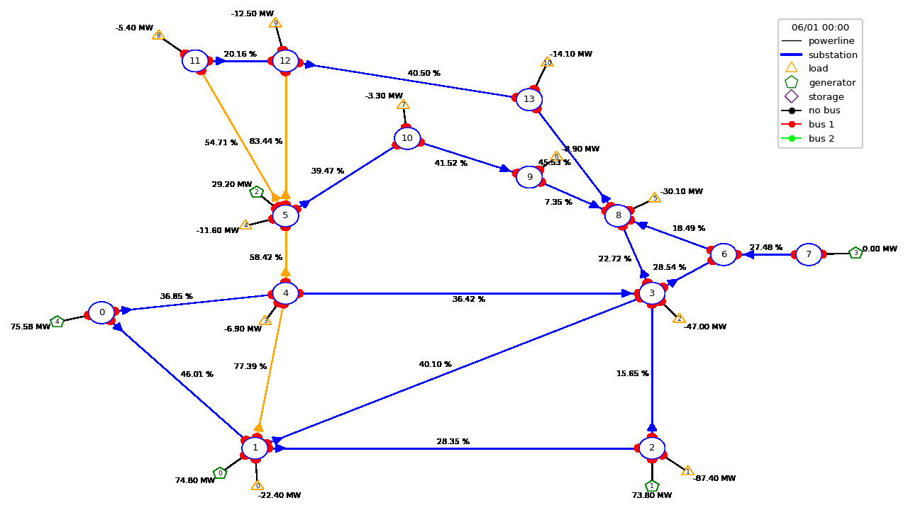
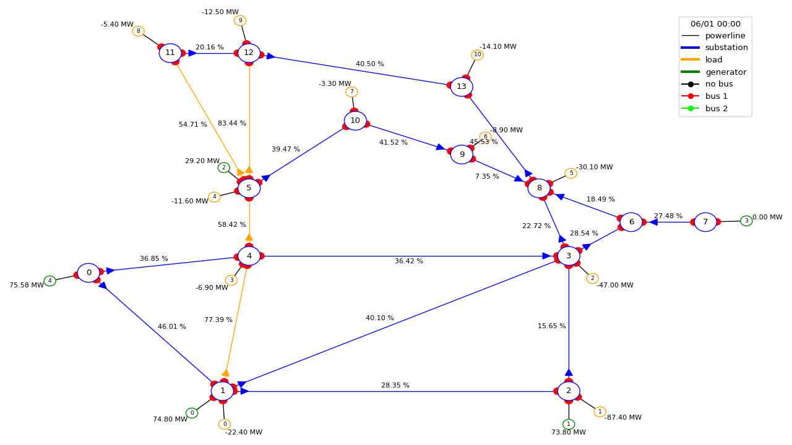
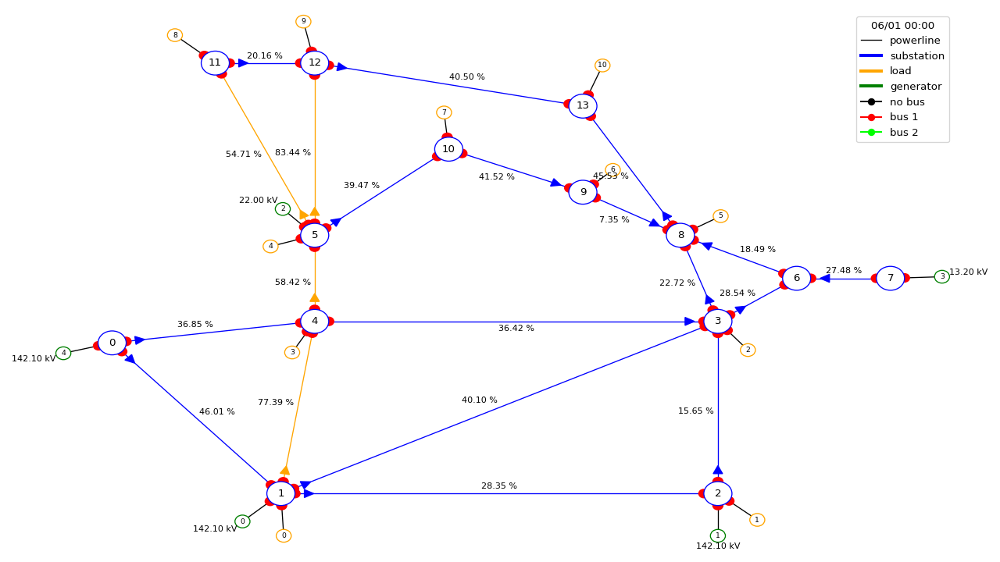

.. currentmodule:: grid2op.PlotGrid

.. |14bus_th_lim| image:: ./img/14bus_th_lim.png

.. _grid2op-plot-module:

Grid2Op Plotting capabilities (beta)
=====================================

This page is organized as follow:

.. contents:: Table of Contents
    :depth: 3

Objectives
-----------
This module contrains all the plotting utilities of grid2op. These utilities can be used in different manners to serve
different purposes:

- :class:`PlotMatplot` allows a more in depth study, with a better overall layout. It uses the well-known
  matplotlib library to represent the powergrid on the screen.
- :class:`PlotPlotly` uses plotly library to represent the graph. As opposed to the others, plotly allows dynamic
  modifications such as zoom in / out. This makes this class particularly suited for in depth study of some
  powergrid state.

The class :class:`PlotMatplot` is also used by :class:`EpisodeReplay` that allows to look at the action taken by
the agent pretty easily, and allows easy saving into gif format (see below for more information)

.. code-block:: python3

    import os
    import warnings
    import grid2op
    from grid2op.Episode import EpisodeReplay
    from grid2op.Agent import GreedyAgent, RandomAgent
    from grid2op.Runner import Runner
    from tqdm import tqdm

    path_agents = "agent_pseudo_random"
    with warnings.catch_warnings():
        warnings.filterwarnings("ignore")
        env = grid2op.make("l2rpn_case14_sandbox")

    class CustomRandom(RandomAgent):
        """
        This agent takes 1 random action every 10 time steps.
        """
        def __init__(self, action_space):
            RandomAgent.__init__(self, action_space)
            self.i = 0

        def my_act(self, transformed_observation, reward, done=False):
            if self.i % 10 != 0:
                res = 0
            else:
                res = self.action_space.sample()
            self.i += 1
            return res

    # execute this agent on 1 scenario, saving the results
    runner = Runner(**env.get_params_for_runner(), agentClass=CustomRandom)
    path_agent = os.path.join(path_agents, "RandomAgent")
    res = runner.run(nb_episode=1, path_save=path_agent, pbar=tqdm, agent_seeds=[0])
    # and now reload it and display the "movie" of this scenario
    plot_epi = EpisodeReplay(path_agent)
    plot_epi.replay_episode(res[0][1], gif_name="episode")

An possible output will look like this:

|replaygif|

Render the state of the grid
-----------------------------

During the gym loop
++++++++++++++++++++
In Grid2Op we also made available the possibility to render the state of the grid that your agent sees before taking
an action. This can be done with the provided environments following openAI gym interface like this:

.. code-block:: python

    import grid2op
    from grid2op.Agent import RandomAgent
    from grid2op.Episode import EpisodeReplay

    env = grid2op.make("l2rpn_case14_sandbox")
    agent = RandomAgent(env.action_space)
    nb_episode = 1
    for i in range(nb_episode):
        obs = env.reset()
        done = False
        reward = env.reward_range[0]
        while not done:
            _ = env.render()
            act = agent.act(obs, reward, done)
            obs, reward, done, info = env.step(act)

**NB** we don't recommend to use the renderer during the training of an Agent as it might slow down the training
significantly.

Offline, after the scenarios were played
++++++++++++++++++++++++++++++++++++++++
In Grid2Op, you can execute a :ref:`runner-module` to perform the "gym loops" and store the results
in a standardized manner. Once stored, the results can be loaded back and "replayed" using the appropriate
class. Here is how you can do this:

.. code-block:: python

    import grid2op
    from grid2op.Agent import RandomAgent
    from grid2op.Runner import Runner
    from grid2op.Episode import EpisodeReplay

    path_saved_data = "where_i_want_to_save_it"
    # create an environment and an agent
    env = grid2op.make("l2rpn_case14_sandbox")
    agent = RandomAgent(env.action_space)

    # create a runner
    runner = Runner(**env.get_params_for_runner(), agentClass=None, agentInstance=agent)

    # run and save the results
    res = runner.run(nb_episode=1, path_save=path_saved_data)

    # and now load it and play the "movie"
    plot_epi = EpisodeReplay(path_saved_data)
    plot_epi.replay_episode(res[0][1], gif_name="this_episode.gif")

    # and in `os.path.join(path_saved_data, res[0][1])` (or example "where_i_want_to_save_it/000")
    # a file named "this_episode.gif" has been created

Plot a given observation
++++++++++++++++++++++++
We also included some module to plot a given observation that can be customize depending on what you want to plot.

You can use them as follow:

.. code-block:: python

    import grid2op
    from grid2op.PlotGrid import PlotMatplot

    env = grid2op.make("l2rpn_case14_sandbox")
    plot_helper = PlotMatplot(env.observation_space)

    obs = env.reset()

    # if you want to plot all the observation
    fig = plot_helper.plot_obs(obs)
    fig.show()

    # you can also chose what to plot for each "object type"
    fig_custom = plot_helper.plot_obs(obs
                                      line_info="rho",
                                      load_info=None,  # i don't plot anything concerning the load
                                      gen_info="v"  # i draw the voltage setpoint of the generators
                                      )
    fig_custom.show()

See definition of :func:`BasePlot.plot_obs` for more information. The results of the above code is:

|14bus_1|

And the second image is

|14bus_2|

Plot data on the grid
++++++++++++++++++++++
For convenience, we also included a set of function that are able to plot some custom information and
"project" them into the graph of the grid. This can be interesting if you want to represent some properties
of the objects on the grid. The function showed here accept anything that can be converted to ``float`` that
have the same size of the number of objects (for example if you want to display something on the powerlines
you need this "something" to be vector that counts as many elements as the number of powerlines in the
powergrid).

In the example bellow, we plot the thermal limits (maximum current allowed on a powerline)
of the each powerline:

.. code-block:: python

    import grid2op
    from grid2op.PlotGrid import PlotMatplot

    env = grid2op.make("l2rpn_case14_sandbox")
    plot_helper = PlotMatplot(env.observation_space)

    # plot the thermal limits of each powerlines
    fig_info = plot_helper.plot_info(line_values=env.get_thermal_limit())
    fig_info.show()

The above code will output this image
|14bus_th_lim|

Of course you can also "project" on the grid all kind of variable and also for generators and loads, for example with

.. code-block:: python

    import grid2op
    from grid2op.PlotGrid import PlotMatplot

    env = grid2op.make("l2rpn_case14_sandbox")
    plot_helper = PlotMatplot(env.observation_space)

    # plot the thermal limits of each powerlines and the voltages magnitude of each load
    fig_info = plot_helper.plot_info(line_values=env.get_thermal_limit(), load_values=obs.load_v)
    fig_info.show()

    # plot only the generator pmax
    fig_info2 = plot_helper.plot_info(gen_values=env.gen_pmax)
    fig_info2.show()

More information is available in the description of the function :func:`BasePlot.plot_info`.

Detailed Documentation by class
--------------------------------
.. automodule:: grid2op.PlotGrid
    :members:
    :private-members:
    :special-members:
    :autosummary:

.. include:: final.rst
